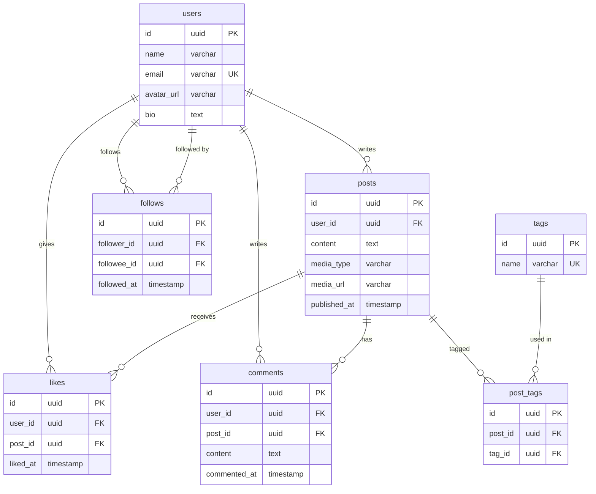
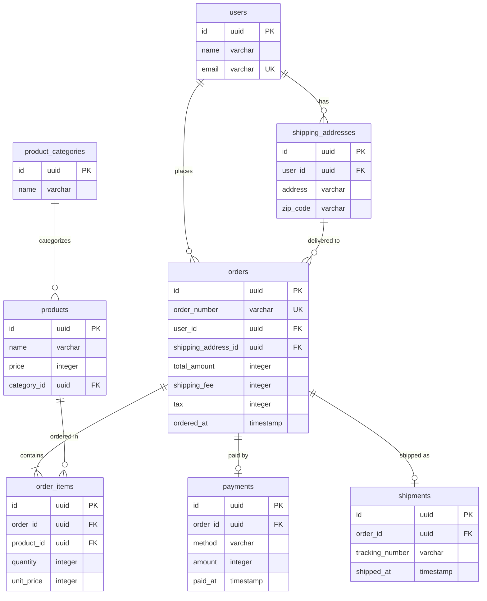

# フェーズ2: 正規化

## このフェーズで何をするか

- **ゴール**: フェーズ1で抽出したエンティティの属性を精査し、データの重複を排除してテーブル構造を整理する。同じ実体を指す別名のエンティティがあれば統合する。計算で求められる導出項目の保持/排除を判断する
- **インプット**: フェーズ1のエンティティ一覧（名前・種別・主要属性）
- **アウトプット**: 正規化されたエンティティ一覧と更新されたMermaid ERD

## 正規化とは何か

正規化は「1つの事実は1つの場所にだけ置く（One Fact in One Place）」を実現する作業。同じ情報が複数のテーブルに散らばっていると、更新時に片方だけ変わって不整合が起きる。これを防ぐために、データの重複を見つけて適切なテーブルに切り出していく。

### なぜこの作業が必要なのか

正規化しないと:
- 同じデータを複数箇所で更新する必要が生じる（更新漏れのリスク）
- ストレージの無駄遣い
- 「この値はどこが正（マスター）なのか」が曖昧になる

## 作業手順

> **サブセット（種別・区分によるテーブル分割）はフェーズ3で扱う。** このフェーズでは重複排除に集中する。

### ステップ1: エンティティをテーブルに変換する

フェーズ1の概念レベルのエンティティ一覧を、RDBのテーブル定義に変換し、Mermaid ERDとして出力する。このステップでエンティティ/属性からテーブル/カラムの語彙に切り替わる。

1. エンティティ名 → テーブル名（英語snake_case、複数形）
2. 属性名 → カラム名（英語snake_case）
3. 各属性に適切なカラム型を設定する
4. 各テーブルにサロゲートキー（`id`）を主キーとして追加する。`email`、`product_code`、`order_number` などの業務コードは主キーに使わない。業務コードはビジネスの都合で変更されうるため、主キーに使うとテーブル間の参照関係が壊れる。業務コードは属性として持ち、必要ならUNIQUE制約をつける
5. 参照属性を外部キー（`xxx_id`）カラムに変換する
6. 既存コードベースの命名規則（開始時に調査済み）に合わせる
7. 変換結果をMermaid ERD形式で出力する

### ステップ2: ヘッダ・ディテールを分離する

1回のアクションに対して複数の明細がある場合、「見出し（ヘッダ）」と「明細（ディテール）」の2テーブルに分ける。

**分ける基準**: 明細全体をまとめて扱う事実があるか（合計計算、一括値引き、送料加算など）

| ケース | 判断 | 理由 |
|---|---|---|
| ECの注文（複数商品、合計に送料加算） | 分ける | 注文全体に対する送料・税の計算がある |
| SNSの投稿（複数画像添付） | 分けない | 画像を一括して扱う計算・処理がない |
| 請求（複数明細に対して総額値引き） | 分ける | 総額に対する値引きという事実がある |

### ステップ3: 繰り返しデータを見つける

1つのレコードに同じ種類のデータが複数並んでいたら、別テーブルに切り出す。

| before | after | 理由 |
|---|---|---|
| 投稿テーブルに `tag1, tag2, tag3` カラム | 投稿タグ（中間テーブル）に分離 | タグの数が固定でない |
| 注文テーブルに `product1_id, product2_id` | 注文明細テーブルに分離 | 商品数が固定でない |

### ステップ4: 値の重複を見つける

複数のレコードに同じ値が出現する属性は、独立したテーブルに切り出す候補。

| before | after | 理由 |
|---|---|---|
| 投稿テーブルに `author_name, author_email` | ユーザーテーブルに分離し `user_id` で参照 | ユーザーが複数の投稿を持つたびに名前が重複 |
| 注文明細に `product_name, product_price` | 商品テーブルに分離し `product_id` で参照 | 同じ商品が何度も注文されるたびに重複 |

#### 「同じ項目名でも別の事実」なら分けて持つ

正規化で重複を排除する際、項目名が同じでも**ビジネス上の意味が異なるなら別の場所に持つ**。これは重複ではない。

| 一見重複に見える | 実際は別の事実 | 理由 |
|---|---|---|
| 商品の `price` と注文明細の `unit_price` | 別の事実 | 商品の現在価格と注文時点の価格は異なりうる。注文後に商品価格が変わっても、注文時の金額は変わらない |
| ユーザーの `name` と投稿の `author_name` | 非正規化の可能性あり | ユーザーが改名したとき投稿の表示名も変わるべきなら、投稿に `author_name` を持たせるのは重複。`user_id` で参照すべき |
| 配送先の `address` と注文の `shipping_address` | 判断が必要 | 注文後に配送先マスタが変更されても注文時のアドレスを保持したいなら、注文テーブルにコピーするのは正しい（スナップショット） |

**判断の原則**: 「この値が変わったとき、関連するデータも連動して変わるべきか？」を問う。
- 連動すべき → 参照（外部キー）にする
- 独立した事実 → それぞれ別に持つ

### ステップ5: リソースを統合する

同じ実体を指す別名のエンティティがないか確認し、1つに統合する。

**同じ概念か判定する問い:**
- 同じ実体（人、モノ、場所）を指しているか？
- 片方を変更したとき、もう片方も変わるべきか？

| 一見別のエンティティ | 判断 | 理由 |
|---|---|---|
| 「投稿者」と「コメント者」 | 統合 → ユーザー | 同じユーザーの別の行為 |
| 「注文者」と「配送先の人」 | 統合しない | 注文者≠受取人のケースがある |

### ステップ6: 導出項目を整理する

他の属性から計算・集計で求められる属性（導出項目）を特定し、テーブルに持たせるか排除するかを判断する。

#### なぜ整理が必要なのか

導出項目をテーブルに持たせると:
- 元データと導出値の不整合が起きるリスクがある（元データを更新したのに導出値の更新を忘れる）
- 更新時に複数箇所を書き換える必要が生じる

一方で、毎回計算すると:
- 集計クエリが重くなる場合がある（パフォーマンス）

このトレードオフを判断する。

#### 6-1. 導出項目の候補を洗い出す

各エンティティの属性を見て「他の属性から計算・集計で求められるか？」を問う。該当する属性を導出項目の候補としてリストアップする。

#### 6-2. 可逆性で保持/排除を判断する

各候補について「元データから常に正確に再現できるか？」を判断する。

**逆算できるなら排除する（可逆性あり）:**

| 導出項目 | 導出元 | 判断 |
|---|---|---|
| `age`（年齢） | `birth_date` と現在日時 | 排除 |
| `subtotal`（小計） | `unit_price × quantity` | 排除 |
| `duration`（利用期間） | `start_date` と `end_date` | 排除 |
| `like_count` | `likes` テーブルのCOUNT | 排除 |
| `follower_count` | `follows` テーブルのCOUNT | 排除 |

**逆算できないなら保持する（不可逆性あり）:**

値引き、丸め処理、外部要因などが入って元データから再現できない項目は、独立した事実としてテーブルに残す。

| 導出項目 | なぜ逆算できないか | 判断 |
|---|---|---|
| 値引き後の `amount` | 値引きロジックが入り `unit_price × quantity ≠ amount` | 保持 |
| 一括値引き後の `total_amount` | 明細の合算 ≠ 合計（一括値引き・クーポン適用がある） | 保持 |
| 注文時の `unit_price` | 商品マスタの `price` は後から変わりうる（スナップショット） | 保持 |
| ポイント付与額 | 付与ルールが複雑で変更されうる | 保持 |

#### 6-3. 排除した項目の代替手段を決める

テーブルから排除した導出項目をアプリケーションで使う方法を決定する。

| 方法 | いつ使うか | 例 |
|---|---|---|
| **ビュー（VIEW）** | SQLで導出ロジックを定義し、テーブルのように参照したい場合 | `CREATE VIEW order_summaries AS SELECT ..., unit_price * quantity AS subtotal ...` |
| **アプリケーション側で計算** | 表示時にのみ必要で、クエリで扱う必要がない場合 | フロントエンドで `age` を `birth_date` から計算 |
| **キャッシュカラム（非正規化）** | パフォーマンスが問題になる場合の妥協策 | `posts.like_count` をキャッシュとして持ち、非同期で更新。ただし「正式な値は `likes` テーブルのCOUNT」と明示する |

#### 複雑な計算ロジックはプログラムで表現する

単純な四則演算（`unit_price × quantity`）ならビューで十分だが、多段階料金制度やポイント計算のようにルール自体が複雑で将来変更されうるものは、データモデル（パラメータテーブル + ビュー）だけで表現しようとしない。プログラム（アルゴリズム）で表現する方が自然で応用が利く。

## 具体例: ウォークスルー

### toC例: SNSアプリの正規化

**フェーズ1で抽出したエンティティを精査する**

**ステップ1（テーブル変換）を適用:**
フェーズ1の概念ERDをテーブル定義に変換する:
- エンティティ名 → テーブル名: users, posts, likes, comments, follows, tags
- 属性 → カラム名+型: name → name varchar, email → email varchar, content → content text, published_at → published_at timestamp, liked_at → liked_at timestamp, commented_at → commented_at timestamp, followed_at → followed_at timestamp, avatar_url → avatar_url varchar, bio → bio text
- 各テーブルに id (uuid PK) を追加
- リレーションシップ → 外部キー: posts に user_id, likes に user_id + post_id, comments に user_id + post_id, follows に follower_id + followee_id

**ステップ2（ヘッダ・ディテール）を適用:**
- 該当なし

**ステップ3（繰り返し）を適用:**
- 投稿にタグを複数つけられる → `posts` に `tag1, tag2` とカラムを並べるのではなく、中間テーブル `post_tags` を導入

**ステップ4（値の重複）を適用:**
- `likes` テーブルの `user_id` は users を参照 → すでに正規化済み（フェーズ1で分離済み）
- 投稿に `author_name` を持たせていないか確認 → `user_id` で参照しているのでOK

**ステップ5（リソース統合）を適用:**
- `posts` の `user_id`、`likes` の `user_id`、`comments` の `user_id`、`follows` の `follower_id / followee_id` → すべて同じ `users` を参照 ✓

**ステップ6（導出項目）を適用:**
- 投稿のいいね数、コメント数 → COUNT集計で求められる → 導出候補
- ユーザーのフォロワー数、フォロー数、投稿数 → COUNT集計で求められる → 導出候補

| 候補 | 導出元 | 逆算可能か | 判断 |
|---|---|---|---|
| 投稿のいいね数 | `likes` テーブルのCOUNT | はい | 排除 |
| 投稿のコメント数 | `comments` テーブルのCOUNT | はい | 排除 |
| ユーザーのフォロワー数 | `follows` テーブルのCOUNT | はい | 排除 |
| ユーザーのフォロー数 | `follows` テーブルのCOUNT | はい | 排除 |
| ユーザーの投稿数 | `posts` テーブルのCOUNT | はい | 排除 |

代替手段: いいね数・フォロワー数はCOUNT集計で導出。パフォーマンスが問題になった場合はキャッシュカラムの導入を検討するが、初期段階では不要

**新たに浮上したエンティティ:**
- `post_tags`（中間テーブル）: 投稿とタグの多対多の関係を管理

**変更点:** ERDの構造に変更なし。導出項目をテーブルに持たせないことを確認。

### toB例: EC受注管理の正規化

**フェーズ1で抽出したエンティティを精査する**

**ステップ1（テーブル変換）を適用:**
フェーズ1の概念ERDをテーブル定義に変換する:
- エンティティ名 → テーブル名: users, products, product_categories, shipping_addresses, orders, order_items, payments, shipments
- 属性 → カラム名+型: name → name varchar, email → email varchar, price → price integer, address → address varchar, total_amount → total_amount integer, ordered_at → ordered_at timestamp, quantity → quantity integer, unit_price → unit_price integer, subtotal → subtotal integer, method → method varchar, amount → amount integer, paid_at → paid_at timestamp, tracking_number → tracking_number varchar, shipped_at → shipped_at timestamp
- 各テーブルに id (uuid PK) を追加
- リレーションシップ → 外部キー: products に category_id, shipping_addresses に user_id, orders に user_id + shipping_address_id, order_items に order_id + product_id, payments に order_id, shipments に order_id

**ステップ2（ヘッダ・ディテール）を適用:**
- 注文には複数の商品明細があり、合計に送料・消費税を加算する → 注文（ヘッダ）と注文明細（ディテール）に分ける

**ステップ3（繰り返し）を適用:**
- 注文に複数商品 → ステップ2でヘッダ・ディテールとして分離済み ✓

**ステップ4（値の重複）を適用:**
- 注文明細に `product_name` や `product_price` を直接持たせていないか？ → `product_id` で参照しているのでOK
- ただし `unit_price`（注文時点の単価）は注文明細に持たせる。商品マスタの `price` は現在価格であり、注文時点の価格とは別の事実

**ステップ5（リソース統合）を適用:**
- 「注文者」と「配送先の登録者」は同じ `users` → 統合済み ✓

**ステップ6（導出項目）を適用:**
- 注文明細の `subtotal`（小計）→ `unit_price × quantity` で求められる → 導出候補
- 注文の `total_amount`、`shipping_fee`、`tax` → 外部ロジックが絡む → 導出候補として検討
- 注文明細の `unit_price` → 商品マスタの `price` から導出可能に見える → 導出候補として検討

| 候補 | 導出元 | 逆算可能か | 判断 |
|---|---|---|---|
| 注文明細の `subtotal` | `unit_price × quantity` | はい | 排除 |
| 注文の `total_amount` | 明細の合算 + shipping_fee + tax | いいえ（一括値引き・クーポンがありうる） | 保持 |
| 注文の `shipping_fee` | — | いいえ（配送先・重量等で決まる外部ロジック） | 保持 |
| 注文の `tax` | — | いいえ（税率変更・軽減税率等がある） | 保持 |
| 注文明細の `unit_price` | 商品マスタの `price` | いいえ（注文時点のスナップショット） | 保持 |

代替手段: `subtotal` はビューで `unit_price × quantity` として計算する

**新たに浮上したエンティティ:**
- なし（フェーズ1で十分に分離されていた）

**変更点:** `order_items` から `subtotal` を削除。

## セルフレビュー

このフェーズの完了時に以下を確認する:

- [ ] テーブル名・カラム名が既存スキーマの命名規則と一致しているか
- [ ] 全テーブルにサロゲートキー（id）が主キーとして設定されているか
- [ ] 業務コード（email, order_number等）が主キーになっていないか（属性 + UNIQUE制約で持つ）
- [ ] 参照属性が外部キー（xxx_id）に変換されているか
- [ ] 1つのアクションに複数の内訳がある場合、ヘッダ・ディテール分離を検討したか
- [ ] 1つのカラムに複数の値を詰め込んでいないか（カンマ区切り、JSON配列など）
- [ ] 同じ値が複数レコードに繰り返し出現する属性を、独立したテーブルに切り出したか
- [ ] 「同じ項目名だが別の事実」（例: 現在価格 vs 注文時価格）を正しく区別しているか
- [ ] 正規化の過程で新たに浮上したリソース系エンティティ（中間テーブル含む）を一覧に追加したか
- [ ] 同じ実体を指す別名のエンティティが統合されているか
- [ ] 各属性について「他の属性から導出可能か」を検討したか
- [ ] 導出可能な項目について、可逆性（逆算できるか）を判断したか
- [ ] 排除した導出項目の代替手段（ビュー、アプリ計算、キャッシュ）を決定したか
- [ ] 「同じ名前だが別の事実」（例: 商品の現在価格 vs 注文時価格）を導出項目と混同していないか
- [ ] パフォーマンスのためのキャッシュカラムを導入する場合、正式な値の導出元を明示しているか
