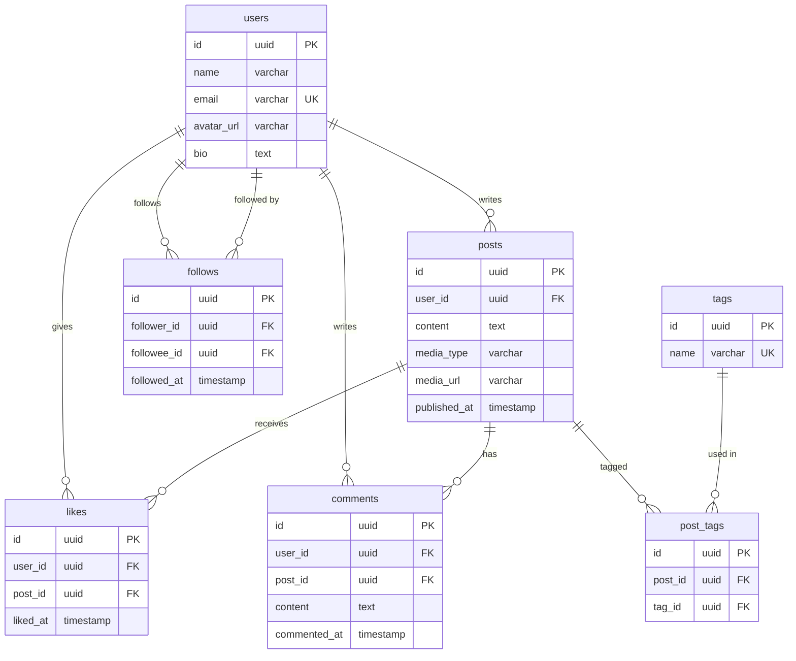
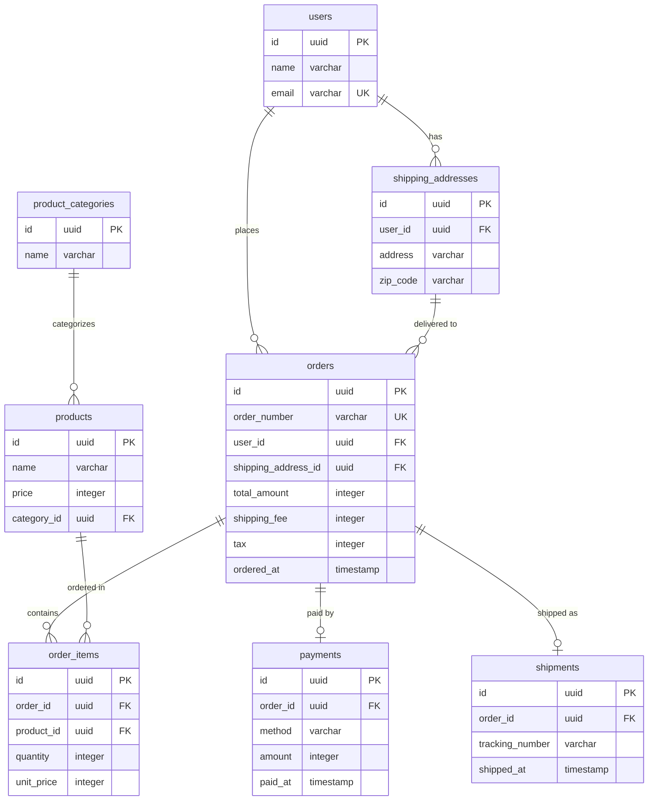

# フェーズ3: 表現方法の設計

## このフェーズで何をするか

- **ゴール**: エンティティに種別・区分がある場合のテーブル分割方針と、属性の変更パターンに対する表現方法を決定する
- **インプット**: フェーズ2の正規化済みエンティティ一覧とMermaid ERD
- **アウトプット**: 種別・変更パターンの表現方法が決定されたERDと設計判断サマリー

## フェーズ2（正規化）との違い

フェーズ2は「データの重複を排除する」ための機械的な操作。このフェーズは「種別や変更をどう表現するか」を要件に基づいて判断する。

- フェーズ2: 「同じデータが2箇所にある → 1つにまとめる」 → 正解が客観的に決まる
- フェーズ3: 「種別をテーブルで分けるか区分カラムにするか」 → 要件・将来の拡張性に依存する

## 表現方法の制約

- **NULLableカラムの検討**: NULLableカラムの種類によって対処法が異なる:
  1. **NULLableな日時カラム**（`xxx_at`）→ イベントテーブルに分離する。これはNULL回避ではなくUPDATE回避の観点（例: `read_at` → `readings`テーブル）
  2. **NULLableなFK**（関連先が未確定）→ 交差エンティティ（中間テーブル）に分離する。フェーズ4で検討する
  3. **NULLableな属性** → 以下の3点チェックで判断する:
     - **3値論理**: WHERE句・JOIN条件・サブクエリの述語に使われるカラムか？ → 3値論理の複雑さが問題になる
     - **NULL伝播**: 四則演算・集計関数に使われるカラムか？ → 計算結果にNULLが伝播する
     - **パフォーマンス**: IS NULLでの検索が頻繁に行われるカラムか？
     - いずれも該当しない → NULLableを許容する
     - 該当する → サブセットテーブルに分離する
  4. **ALL or NOTHINGの属性群** → 複数カラムが「すべて値があるか、すべてNULL」の関係にある場合、サブセットテーブルに分離する（例: 配送先の住所・市区町村・郵便番号）
  - 参考: https://mickindex.sakura.ne.jp/database/db_getout_null.html（NULLの害の説明は的確だが、デフォルト値による回避は採用しない。理由はtable-design-rules.mdのセンチネル値禁止を参照）
- **UPDATE/DELETE回避**: UPDATE/DELETEによる更新が前提となるような属性/カラムの設計は原則避ける。UPDATE/DELETEは履歴などのデータを欠損させる操作であり、将来的なシステムの拡張性を損なう。実装が不可能なほどクエリが複雑化する、致命的なレベルでシステムのパフォーマンスを低下させるなど、やむを得ない事情がある場合に限り採用する

## 作業手順

### ステップ1: サブセットの判断

リソース系エンティティに種別・区分がある場合、別テーブルに分けるか区分カラムで済ませるかを決定する。

#### サブセットとは何か

リソース系エンティティに種別がある場合（例: 投稿のメディアタイプ、決済方法）、その種別をどう表現するかを決める必要がある。

| パターン | 構造 |
|---|---|
| **別テーブル（サブタイプ）** | 共通属性を親テーブルに、種別固有の属性を子テーブルに持たせる |
| **区分カラム** | 同じテーブルに `type` カラムを持たせ、種別によって使わないカラムはNULLにする |

#### なぜこの判断が必要なのか

- サブセットの扱いを誤ると、プログラム側にIF文が増えて複雑になる
- 区分カラムで済ませるとNULLableカラムが増え、テーブルが肥大化する
- 別テーブルにしすぎるとテーブル数が増え、管理対象が多くなる

#### 作業手順

**1-1. 種別・区分のあるエンティティを特定する**

各リソース系エンティティについて、以下の問いで種別の有無を確認する:

- このエンティティに「〜の種類」「〜タイプ」「〜区分」はあるか？
- 同じエンティティだが、属性が異なるバリエーションがあるか？

**1-2. 別テーブルか区分カラムか判断する**

**判断の問い — 迷ったら別テーブルにする:**

別テーブルにすべき状況:
- 種別ごとに固有の属性がある、または将来出てくる可能性がある
- 1つの実体が複数の種別を同時に持ちうる（例: 法人の社長が個人顧客でもある）
- 種別ごとに異なるバリデーションや処理が必要になりそう
- 種別が今後増える可能性がある

区分カラムで十分な状況:
- 種別間で属性の違いがなく、単なるラベルやフィルター条件でしかない
- 将来的にも属性の差が出る見込みがない

| 例 | 判断 | 理由 |
|---|---|---|
| 投稿のメディアタイプ（テキスト/画像/動画） | 別テーブル | 画像には解像度・サイズ、動画には再生時間・サムネイルなど固有属性がある |
| 商品の販売ステータス（販売中/販売停止） | 区分カラム | 単なるフラグで、属性の差がない |
| 決済方法（クレジット/銀行振込/コンビニ） | 別テーブル | 方法ごとに必要な情報が異なる（カード番号、振込先口座など） |
| ユーザーの表示テーマ（ライト/ダーク） | 区分カラム | 単なる設定値 |

### ステップ2: 変更モデルの設計

各属性について以下の手順で分類する:

1. **変更・削除の有無を確認**: 「この値は変更・削除されることがあるか？」
2. **変更がある場合、確認チェック**: 以下に1つでも該当すればイベントテーブル分離を検討する
   - 過去の値を参照する画面・帳票・分析はないか？
   - 監査やコンプライアンスで変更履歴が求められないか？
   - 変更のタイミングや理由を後から確認したいケースはないか？
   - 変更が他のエンティティの状態に影響しないか？
   - 将来の要件変更で履歴が必要になる可能性が高くないか？
3. **ユーザーに判断を委ねる**: 確認チェックをすべてクリアした場合でも、将来イベントテーブルが必要になる具体的なシナリオと、後からの移行可能性を提示する

## 具体例: ウォークスルー

### toC例: SNSアプリの表現方法設計

**フェーズ2のERDを精査する**

**ステップ1（サブセット判断）を適用:**
- 投稿: メディアタイプ（テキスト/画像/動画）がある → 種別あり
- ユーザー、タグ: 種別なし
- 投稿のメディアタイプ → 画像には `image_url, width, height`、動画には `video_url, duration, thumbnail_url` など固有属性がある → 別テーブル `post_images`, `post_videos` を検討
- ここではシンプルに `posts` に `media_type` + `media_url` で対応し、メディア固有の属性が増えてきたら別テーブルに分離する方針とする（ユーザーに確認）

**ステップ2（変更モデル設計）を適用:**
- ユーザーの name, bio → 変更あり。プロフィール表示用で過去値の参照要件なし → UPDATE管理の候補。ユーザーに「プロフィール変更履歴が必要になるシナリオはあるか？」を確認
- フォローの解除 → DELETE管理の候補。ユーザーに「過去のフォロー履歴を分析に使うシナリオはあるか？」を確認

**変更点:** メディアタイプの扱い方を決定。`posts` テーブルに `media_type` と `media_url` カラムを追加する方針（フェーズ2のERDから変更なし。サブセット判断の結果、区分カラム方式を採用）

### toB例: EC受注管理の表現方法設計

**フェーズ2のERDを精査する**

**ステップ1（サブセット判断）を適用:**
- 決済: 決済方法（クレジット/銀行振込/コンビニ）がある → 種別あり
- ユーザー、商品、配送先、注文: 種別なし
- 決済方法 → 方法ごとに固有の属性が異なる → 将来の拡張を考え、`payments` の `method` に加えて `payment_details` テーブルを別途用意する設計も検討。ここではシンプルに `payments` テーブルに `method` + `metadata` で対応し、複雑になったら分離する方針とする（ユーザーに確認）

**ステップ2（変更モデル設計）を適用:**
- 商品の price → 変更あり。注文明細に `unit_price`（注文時点の価格）を持つなら商品マスタの price はUPDATEで問題ないか？ユーザーに「価格改定履歴を分析に使うシナリオはあるか？」を確認
- 注文の status → 変更あり。注文→決済→出荷と遷移する。各遷移を個別イベント（payments, shipments）として切り出し済みか確認

**変更点:** サブセット判断の結果、決済方法は `payments` テーブル内の `method` カラムで区分管理する方針を決定。変更モデルについては、商品価格のUPDATE管理と注文ステータスのイベント分離についてユーザーに確認済み（フェーズ2のERDから構造変更なし）

## セルフレビュー

このフェーズの完了時に以下を確認する:

- [ ] NULLableな日時カラムはイベントテーブルに分離したか（UPDATE回避）
- [ ] NULLableなFKはフェーズ4の交差エンティティ検討に回したか
- [ ] NULLableな属性カラムに3点チェック（3値論理・NULL伝播・パフォーマンス）を実施し、問題があればサブセットテーブルに分離したか
- [ ] UPDATE/DELETEで管理するカラムについて、以下を確認したか:
  - 変更履歴が必要になる将来シナリオを具体的に提示した
  - ユーザーが履歴不要であることを確認した
  - 将来履歴が必要になった場合に既存データとの互換性を保てることを評価した
- [ ] サブセット（種別・区分）の扱いが決定されているか（将来の拡張性を考慮したか）
- [ ] 別テーブルにした場合、共通属性と固有属性の分離が適切か
- [ ] 区分カラムにした場合、NULLableカラムが過剰に増えていないか
- [ ] 設計判断（なぜこの表現方法を選んだか）をドキュメントに記録したか
