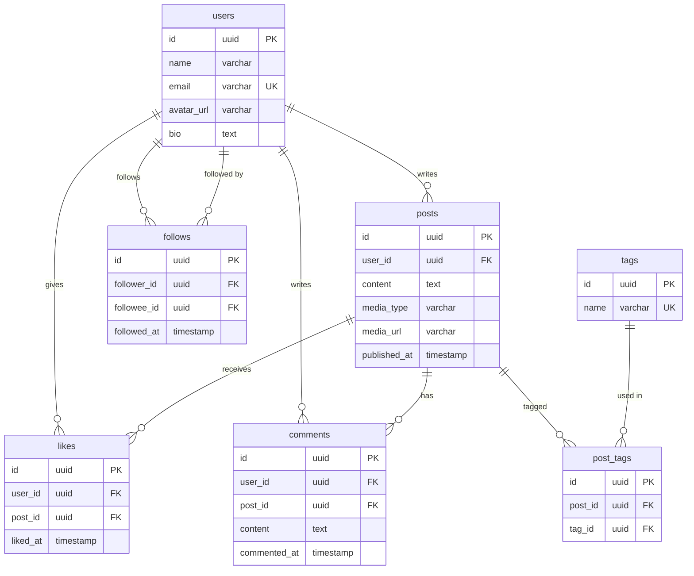
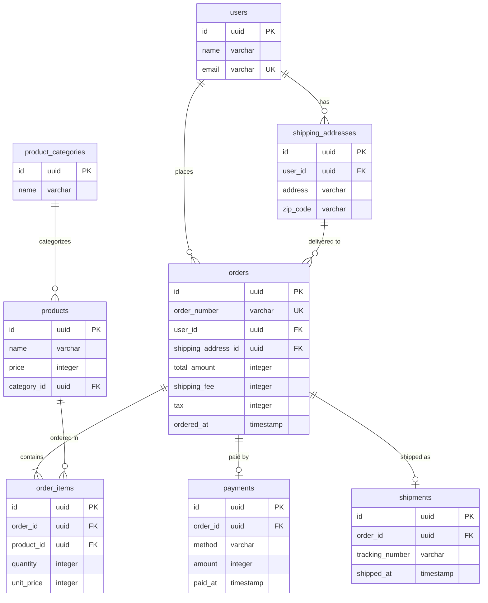

# フェーズ4: リレーションシップ整理

## このフェーズで何をするか

- **ゴール**: エンティティ間の多重度（1:1, 1:N, N:M）を確定し、主キーを設計する。フェーズ1〜3でテーブル構成が確定した後に行うことで、手戻りを防ぐ
- **インプット**: フェーズ3の導出項目整理済みエンティティ一覧とMermaid ERD
- **アウトプット**: 多重度が確定し、主キーが設計されたMermaid ERD

## 前提知識

リレーションシップが正しくないと、以下のような不都合が生じる。

- JOINで意図しない結果が返る
- 多対多の関係を中間テーブルなしで表現しようとすると、データの整合性が壊れる

フェーズ2（テーブル構造の精査）でエンティティが統合・分離され、フェーズ3（導出項目）でカラムが整理される。テーブル構成が確定した後にリレーションシップを整理することで、テーブル追加・削除による手戻りを防ぐためにこの段階で整理する。

## 作業手順

### ステップ1: 多重度を確定する

2つのエンティティの関係を、以下の問いで判定する:
- 「Aから見てBは複数存在するか？」
- 「Bから見てAは複数存在するか？」

| Aから見てB | Bから見てA | 多重度 | 実装 |
|---|---|---|---|
| 1つだけ | 1つだけ | 1:1 | 片方にFKを持たせる |
| 複数 | 1つだけ | 1:N | N側にFKを持たせる |
| 複数 | 複数 | N:M | 中間テーブルを作る |

**Mermaid ERD記号の使い分け:**

| 記号 | 意味 | 使い分け |
|---|---|---|
| `\|\|--o{` | 1対0以上（オプショナル） | N側のレコードが0件でもよい場合（例: ユーザー → 投稿） |
| `\|\|--\|{` | 1対1以上（必須） | N側のレコードが必ず1件以上ある場合（例: 注文 → 注文明細） |
| `\|\|--o\|` | 1対0または1 | 任意の1:1関係（例: 注文 → 決済、未決済の注文がありうる） |
| `\|\|--\|\|` | 1対1（必須） | 必須の1:1関係 |

### ステップ2: 中間テーブルを導入する

**N:Mが出現したら中間テーブル（交差エンティティ）を導入する。** 中間テーブルは両方のIDを外部キーとして持ち、関係の事実を管理する。

| 関係 | 中間テーブル | 持たせる属性の例 |
|---|---|---|
| 投稿 ↔ タグ | post_tags | （なし、または表示順） |
| 商品 ↔ カテゴリ（複数カテゴリ対応） | product_categories_map | is_primary |
| ユーザー ↔ ロール | user_roles | granted_at, expires_at |

**中間テーブルの利点:**
- ユニーク制約の付け方で1:1にも1:NにもN:Mにも柔軟に変更できる
- 日付属性を追加すれば関係の履歴を管理できる（例: 開始日・終了日）
- 同じテーブル同士の関係も表現できる（例: 親カテゴリ↔子カテゴリ）

中間テーブルは通常2つの別テーブルを参照するが、**同じテーブルを2回参照する**ケースもある:

| 関係 | 中間テーブル | 参照先 |
|---|---|---|
| 投稿 ↔ タグ | post_tags | `post_id → posts`, `tag_id → tags`（別テーブル） |
| ユーザー ↔ ユーザー（フォロー） | follows | `follower_id → users`, `followee_id → users`（同じテーブル） |
| カテゴリの親子関係 | category_hierarchies | `parent_id → categories`, `child_id → categories`（同じテーブル） |

構造は同じ。違いは参照先が同一テーブルかどうかだけ。

### ステップ3: 非依存リレーションシップを検討する

1:Nの関係であっても、両者の間に依存関係がない場合は、FKを直接持たせるとNULLableになる問題が起きうる。

**依存関係の判定**:
- 「Aが存在しなくてもBは存在できるか？」
- 「BがAに紐づかない状態はありうるか？」

両方YESなら非依存。非依存リレーションシップでは、N側にFKを直接持たせると、関連が未確定の期間にFKがNULLになる。

**非依存リレーションシップの場合の対処**:
- 交差エンティティ（中間テーブル）を間に置く
- 1:Nを維持する場合は、中間テーブルのFK一方にユニーク制約を付与する
- 将来N:Mに変更する場合はユニーク制約を外すだけで対応できる

| 例 | 依存関係 | 対処 |
|---|---|---|
| 部門-社員 | 非依存（配属前の社員、どの部門にも属さない役員がいる） | 「所属」交差エンティティを置く |
| 注文-注文明細 | 依存（明細は注文なしに存在しない） | FKを直接持たせてよい |
| 記事-著者 | 非依存（著者未定の下書き記事がありうる） | 「執筆」交差エンティティを置く |

参考:
- イミュータブルデータモデル Step5: https://scrapbox.io/kawasima/イミュータブルデータモデル
- 1:Nでも中間テーブルを検討する: https://zenn.dev/praha/articles/65afb28caacd0b

## 具体例: ウォークスルー

### toC例: SNSアプリのリレーションシップ整理

**フェーズ3のERDを精査する**

**多重度を確定する:**

| 関係 | Aから見てB | Bから見てA | 判定 |
|---|---|---|---|
| ユーザー → 投稿 | 1人が複数投稿 | 1投稿に1著者 | 1:N |
| 投稿 → いいね | 1投稿に複数いいね | 1いいねは1投稿に | 1:N |
| 投稿 → コメント | 1投稿に複数コメント | 1コメントは1投稿に | 1:N |
| ユーザー ↔ ユーザー（フォロー） | 1人が複数をフォロー | 1人が複数からフォローされる | N:M（自己参照）→ `follows` が中間テーブル |
| 投稿 ��� タグ | 1投稿に複数タグ | 1タグが複数投稿に | N:M → `post_tags` 中間テーブル |

**変更点:** 多重度をERDに明示。

### toB例: EC受注管理のリレーションシップ整理

**フェーズ3のERDを精査する**

**多重度を確定する:**

| 関係 | Aから見てB | Bから見てA | 判定 |
|---|---|---|---|
| ユーザー → 注文 | 1人が複数注文 | 1注文に1注文者 | 1:N |
| ユーザー → 配送先 | 1人が複数配送先 | 1配送先は1人の | 1:N |
| 注文 → 注文明細 | 1注文に複数明細 | 1明細は1注文に | 1:N |
| 注文 → 決済 | 1注文に1決済 | 1決済は1注文に | 1:1 |
| 注文 → 出荷 | 1注文に1出荷 | 1出荷は1注文に | 1:1（分割出荷なら1:Nだがここでは1:1と仮定） |
| カテゴリ → 商品 | 1カテゴリに複数商品 | 1商品に1カテゴリ | 1:N |
| 商品 → 注文明細 | 1商品が複数明細に | 1明細に1商品 | 1:N |

**変更点:** 多重度をERDに明示。

## セルフレビュー

このフェーズの完了時に以下を確認する:

- [ ] すべてのリレーションシップに多重度（1:1, 1:N, N:M）が明示されているか
- [ ] N:Mの関係に中間テーブルが導入されているか
- [ ] 自己参照の多対多（フォロー、親子関係など）が正しく表現されているか
- [ ] 中間テーブルに必要な属性（日時、順序など）が検討されているか
- [ ] 孤立したエンティティ（どこからも参照されない）がないか
- [ ] ユーザーに確認が必要な判断（多重度の曖昧さ等）を記録したか
- [ ] 1:Nのリレーションシップについて、両者の依存関係を確認したか
- [ ] 非依存リレーションシップでFKがNULLableになるケースはないか
- [ ] 非依存リレーションシップに交差エンティティを検討したか
