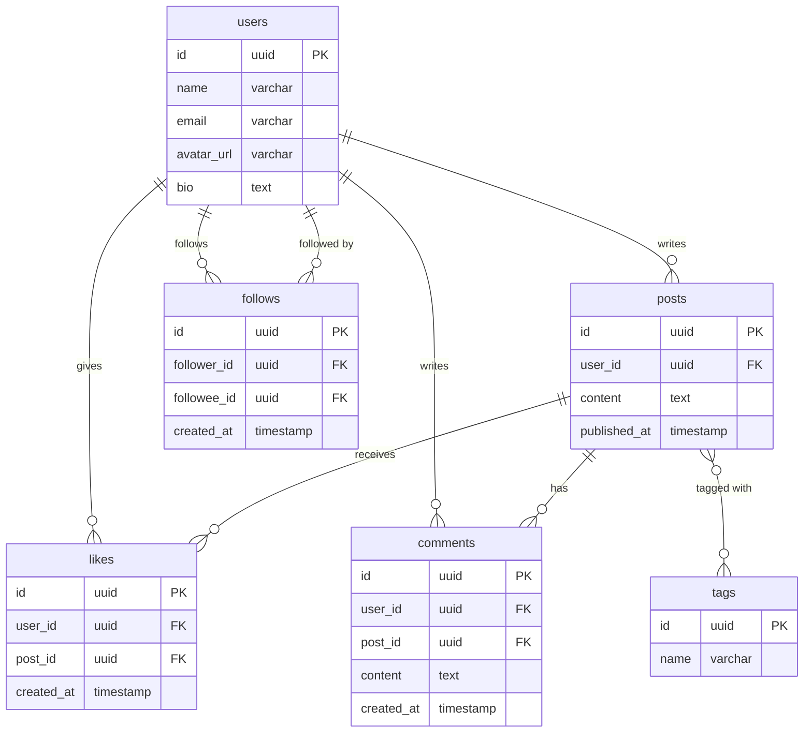
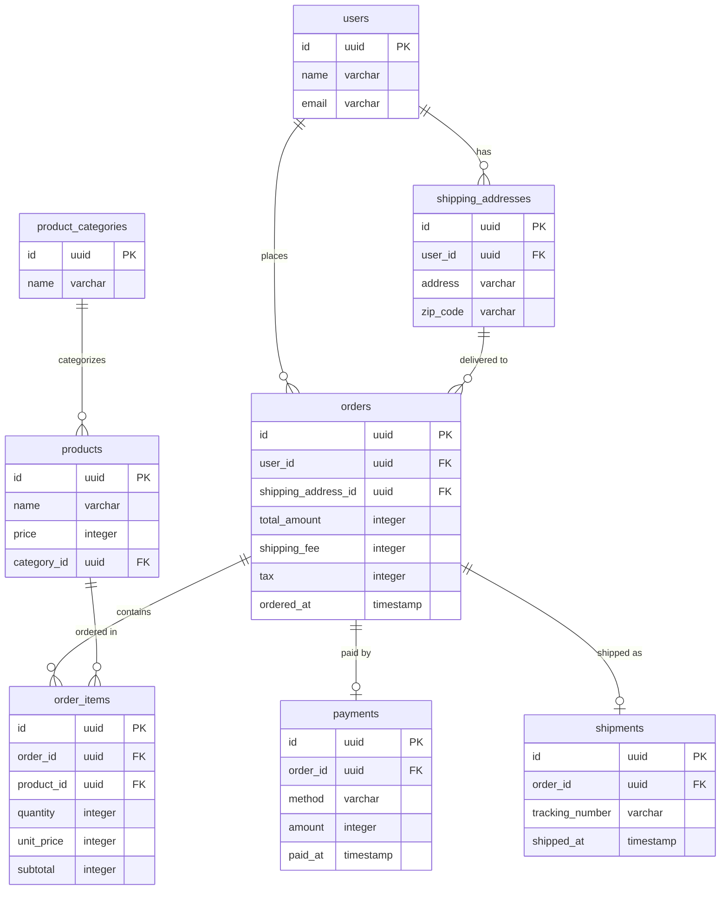

# ステップ1: エンティティ抽出

## このステップで何をするか

- **ゴール**: システムが管理すべき「データのまとまり」を洗い出し、テーブルの候補を特定する
- **インプット**: 要件（画面仕様、ユースケース、既存のデータソースなど）
- **アウトプット**: エンティティの一覧（名前・種別・主要属性）と、エンティティ間の大まかな関係を示すMermaid ERD

## エンティティとは何か

エンティティは「システムが記録・管理する必要があるデータのまとまり」。最終的にRDBのテーブルになるもの。

エンティティには2種類ある:

| | イベント系 | リソース系 |
|---|---|---|
| **何を表すか** | 「起きたこと」の記録 | 「存在するもの」の情報 |
| **特徴** | 動詞で表現できる。発生日時を持つ | 名詞で表現できる。名前を持つ |
| **例（EC）** | 注文、出荷、返品、決済 | ユーザー、商品、配送先 |
| **例（SNS）** | 投稿、いいね、フォロー、通報 | ユーザー、コミュニティ、タグ |
| **例（フィットネス）** | ワークアウト記録、体重測定 | ユーザー、エクササイズ種目、プラン |

### なぜ2種類に分けるのか

イベント系から先に抽出する。理由:
- イベント系は要件（「ユーザーが何をするか」）から直接見つけやすい
- リソース系はイベントを整理する過程で自然に浮かび上がる（「誰が」「何を」「どこで」）
- リソースから始めると、実際には使われないテーブルを作りがち

## 判断基準

### イベント系かリソース系かの判別

迷ったら以下のテストを使う:

**テスト1: 「〜する」が成立するか**
- 「注文する」「投稿する」「フォローする」→ 成立 → **イベント系**
- 「ユーザーする」「商品する」→ 不自然 → **リソース系**

**テスト2: 「〜日」が成立するか**
- 「注文日」「投稿日」「フォロー日」→ 成立 → **イベント系**
- 「ユーザー日」→ 不自然 → **リソース系**

**テスト3: 「〜名」が成立するか**
- 「ユーザー名」「商品名」「カテゴリ名」→ 成立 → **リソース系**
- 「注文名」「いいね名」→ 不自然 → **イベント系**

### エンティティ候補の見つけ方

要件から以下の問いで洗い出す:

| 問い | 見つかるもの | 例（toC: SNS） | 例（toB: EC管理） |
|---|---|---|---|
| ユーザーは何をするか？ | イベント系 | 投稿する、いいねする、フォローする | 注文する、出荷する、返品処理する |
| 誰が関わるか？ | リソース系 | ユーザー | ユーザー、管理者、配送業者 |
| 何に対して行うか？ | リソース系 | 投稿（※リソースにもなる）、コメント | 商品、注文 |
| どんな種別・区分があるか？ | リソース系（マスタ） | タグ、カテゴリ | 商品カテゴリ、配送方法 |

### 1つのアクションに複数の内訳があるか（ヘッダ・ディテール）

1回のアクションに対して複数の明細がある場合、「見出し（ヘッダ）」と「明細（ディテール）」の2テーブルに分ける。

**分ける基準**: 明細全体をまとめて扱う事実があるか（合計計算、一括値引き、送料加算など）

| ケース | 判断 | 理由 |
|---|---|---|
| ECの注文（複数商品、合計に送料加算） | 分ける | 注文全体に対する送料・税の計算がある |
| SNSの投稿（複数画像添付） | 分けない | 画像を一括して扱う計算・処理がない |
| 請求（複数明細に対して総額値引き） | 分ける | 総額に対する値引きという事実がある |

### 属性の列挙

エンティティを見つけたら、以下の観点で主要な属性をリストアップする。ここでは網羅性を重視し、属性の重複排除・精査はステップ2で行う。

| 観点 | 属性の種類 | 例 |
|---|---|---|
| いつ？ | 日時 | created_at, ordered_at, published_at |
| いくつ？ | 数量 | quantity, view_count, like_count |
| いくら？ | 金額 | price, total_amount, discount |
| なぜ？ | 理由・ステータス | reason, status, cancel_reason |
| 誰が・何を？ | 他エンティティへの参照 | user_id, product_id, post_id |

### イベントの漏れを検出する

抽出したイベント系エンティティの漏れを以下の手法で検出する:

**入力と出力の対を確認する**:
- 「入金」があるなら「出金」は？
- 「フォロー」があるなら「アンフォロー」は？
- 「注文」があるなら「キャンセル」は？

**状態遷移を追いかける**:
- EC: 注文 → 決済 → 出荷 → 配達完了 → （返品）
- SNS: 下書き保存 → 投稿 → （編集） → （削除）
- 採用: 応募 → 書類選考 → 面接 → 内定 → 入社

各状態を個別のイベントとして切り出す。「ステータスフラグ」1つで済ませると、状態ごとに必要な属性を見落とす。

**前後に隠れたイベントを想像する**:
- 「予約」があるなら、後続に「予約の実行（チェックイン等）」があるはず
- 「訂正」があるなら、先行に「訂正対象を作ったイベント」があるはず

## 具体例: ウォークスルー

### toC例: SNSアプリ

**要件**: ユーザーがテキスト・画像付きの投稿ができる。他のユーザーをフォローでき、投稿にいいね・コメントができる。

**ステップ1: ユーザーのアクションを列挙する**
- 投稿する、いいねする、コメントする、フォローする、プロフィールを編集する

**ステップ2: イベント系を特定する**（「〜する」「〜日」テスト）
- 投稿（投稿する ✓、投稿日 ✓）→ イベント系
- いいね（いいねする ✓、いいね日 ✓）→ イベント系
- コメント（コメントする ✓、コメント日 ✓）→ イベント系
- フォロー（フォローする ✓、フォロー日 ✓）→ イベント系

**ステップ3: リソース系を浮上させる**（「誰が」「何に」）
- ユーザー（誰が投稿するか、誰がフォローするか）
- タグ/カテゴリ（投稿の分類）

**ステップ4: 属性を列挙する**

| エンティティ | 種別 | 主要属性 |
|---|---|---|
| ユーザー | リソース | name, email, avatar_url, bio |
| 投稿 | イベント | content, image_urls, published_at, user_id |
| いいね | イベント | created_at, user_id, post_id |
| コメント | イベント | content, created_at, user_id, post_id |
| フォロー | イベント | created_at, follower_id, followee_id |
| タグ | リソース | name |

**ステップ5: 漏れを検出する**
- フォロー ↔ アンフォロー？ → フォローの削除で表現するか、別イベントにするかはユーザーに確認
- 投稿の編集・削除は？ → 要件次第で追加

**ステップ6: Mermaid ERDを出力する**

### toB例: EC受注管理

**要件**: 顧客が商品を注文する。1回の注文で複数商品を購入でき、合計に送料と消費税が加算される。

**ステップ1: ユーザーのアクションを列挙する**
- 商品を注文する、決済する、出荷する、返品する

**ステップ2: イベント系を特定する**（「〜する」「〜日」テスト）
- 注文（注文する ✓、注文日 ✓）→ イベント系
- 決済（決済する ✓、決済日 ✓）→ イベント系
- 出荷（出荷する ✓、出荷日 ✓）→ イベント系
- 返品（返品する ✓、返品日 ✓）→ イベント系

**ステップ3: リソース系を浮上させる**（「誰が」「何を」）
- ユーザー（誰が注文するか）
- 商品（何を注文するか）
- 商品カテゴリ（商品の分類）
- 配送先（どこに届けるか）

**ステップ4: ヘッダ・ディテールを判断する**
- 注文には複数の商品明細があり、合計に送料・消費税を加算する → 注文（ヘッダ）と注文明細（ディテール）に分ける

**ステップ5: 属性を列挙する**

| エンティティ | 種別 | 主要属性 |
|---|---|---|
| ユーザー | リソース | name, email |
| 商品 | リソース | name, price, category_id |
| 商品カテゴリ | リソース | name |
| 配送先 | リソース | user_id, address, zip_code |
| 注文 | イベント（ヘッダ） | user_id, shipping_address_id, total_amount, shipping_fee, tax, ordered_at |
| 注文明細 | イベント（ディテール） | order_id, product_id, quantity, unit_price, subtotal |
| 決済 | イベント | order_id, method, amount, paid_at |
| 出荷 | イベント | order_id, tracking_number, shipped_at |

**ステップ6: 漏れを検出する**
- 注文 → 決済 → 出荷 → 配達完了の流れで「配達完了」が未抽出 → 要件次第で追加
- 返品があるなら「返金」は？ → ユーザーに確認

**ステップ7: Mermaid ERDを出力する**

## セルフレビュー

このステップの完了時に以下を確認する:

- [ ] すべてのユースケース/画面に対応するイベントが抽出されているか
- [ ] 各イベント系エンティティに日時属性（〜_at）があるか
- [ ] イベントの対（作成↔削除、入↔出）に漏れがないか
- [ ] 状態遷移がフラグではなく個別イベントで表現されているか
- [ ] リソース系がイベント系の「誰が」「何を」から浮上しているか（リソースから始めていないか）
- [ ] 1つのアクションに複数の内訳がある場合、ヘッダ・ディテール分離を検討したか
- [ ] 同じ概念を別名で重複抽出していないか
