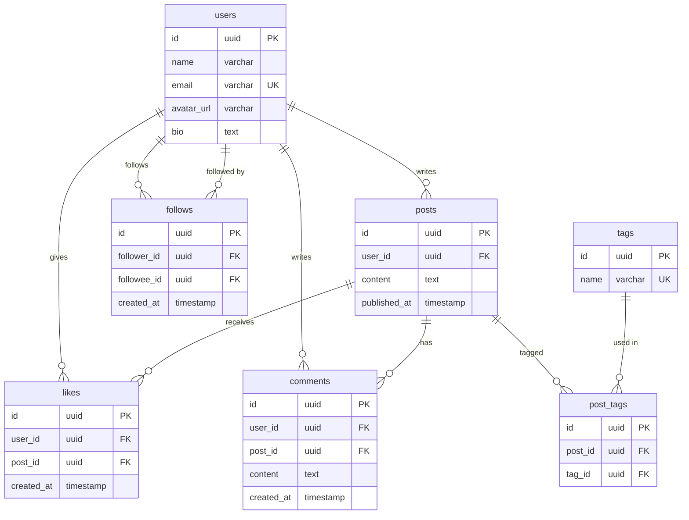
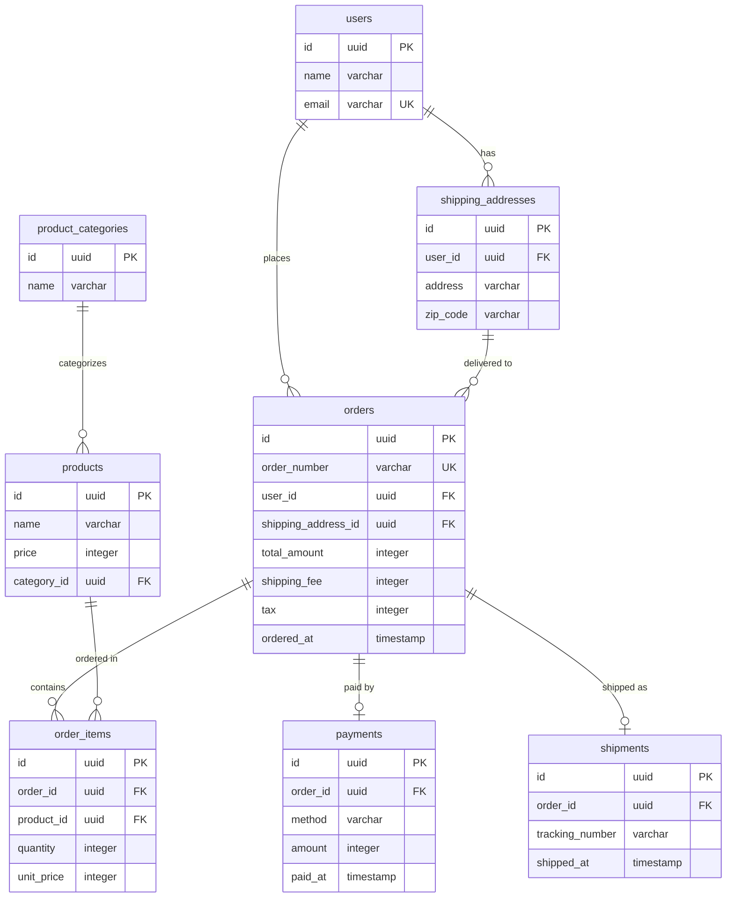

# ステップ2: 正規化

## このステップで何をするか

- **ゴール**: ステップ1で抽出したエンティティの属性を精査し、データの重複を排除してテーブル構造を整理する。この過程で新たなリソース系エンティティが浮上する
- **インプット**: ステップ1のエンティティ一覧とMermaid ERD
- **アウトプット**: 正規化されたエンティティ一覧と更新されたMermaid ERD

## 正規化とは何か

正規化は「1つの事実は1つの場所にだけ置く（One Fact in One Place）」を実現する作業。同じ情報が複数のテーブルに散らばっていると、更新時に片方だけ変わって不整合が起きる。これを防ぐために、データの重複を見つけて適切なテーブルに切り出していく。

### なぜこの作業が必要なのか

正規化しないと:
- 同じデータを複数箇所で更新する必要が生じる（更新漏れのリスク）
- ストレージの無駄遣い
- 「この値はどこが正（マスター）なのか」が曖昧になる

## 判断基準

### 手順: 2つの問いで重複を見つける

各エンティティの属性に対して、以下の2つの問いを順に適用する。

**問い1: 繰り返しているデータはないか？**

1つのレコードに同じ種類のデータが複数並んでいたら、別テーブルに切り出す。

| before | after | 理由 |
|---|---|---|
| 投稿テーブルに `tag1, tag2, tag3` カラム | 投稿タグ（中間テーブル）に分離 | タグの数が固定でない |
| 注文テーブルに `product1_id, product2_id` | 注文明細テーブルに分離 | 商品数が固定でない |

**問い2: 別のレコードでも同じ値が繰り返されていないか？**

複数のレコードに同じ値が出現する属性は、独立したテーブルに切り出す候補。

| before | after | 理由 |
|---|---|---|
| 投稿テーブルに `author_name, author_email` | ユーザーテーブルに分離し `user_id` で参照 | ユーザーが複数の投稿を持つたびに名前が重複 |
| 注文明細に `product_name, product_price` | 商品テーブルに分離し `product_id` で参照 | 同じ商品が何度も注文されるたびに重複 |

> **導出項目（他の属性から計算で求められる項目）の判断は Step 4 で扱う。** このステップでは繰り返しと値の重複の排除に集中する。

### 重要: 「同じ項目名でも別の事実」なら分けて持つ

正規化で重複を排除する際、項目名が同じでも**ビジネス上の意味が異なるなら別の場所に持つ**。これは重複ではない。

| 一見重複に見える | 実際は別の事実 | 理由 |
|---|---|---|
| 商品の `price` と注文明細の `unit_price` | 別の事実 | 商品の現在価格と注文時点の価格は異なりうる。注文後に商品価格が変わっても、注文時の金額は変わらない |
| ユーザーの `name` と投稿の `author_name` | 非正規化の可能性あり | ユーザーが改名したとき投稿の表示名も変わるべきなら、投稿に `author_name` を持たせるのは重複。`user_id` で参照すべき |
| 配送先の `address` と注文の `shipping_address` | 判断が必要 | 注文後に配送先マスタが変更されても注文時のアドレスを保持したいなら、注文テーブルにコピーするのは正しい（スナップショット） |

**判断の原則**: 「この値が変わったとき、関連するデータも連動して変わるべきか？」を問う。
- 連動すべき → 参照（外部キー）にする
- 独立した事実 → それぞれ別に持つ

### 主キーの設計

各テーブルには業務的な意味を持たない**サロゲートキー（ID）**を主キーとして設定する。

- **使う**: `id`（UUID や連番）
- **使わない**: `email`、`product_code`、`order_number` などの業務コード

業務コードはビジネスの都合で変更されうる。主キーに使うとテーブル間の参照関係まで壊れる。業務コードは属性として持ち、必要ならUNIQUE制約をつける。

## 具体例: ウォークスルー

### toC例: SNSアプリの正規化

**ステップ1で抽出したエンティティを精査する**

**問い1（繰り返し）を適用:**
- 投稿にタグを複数つけられる → `posts` に `tag1, tag2` とカラムを並べるのではなく、中間テーブル `post_tags` を導入

**問い2（値の重複）を適用:**
- `likes` テーブルの `user_id` は users を参照 → すでに正規化済み（ステップ1で分離済み）
- 投稿に `author_name` を持たせていないか確認 → `user_id` で参照しているのでOK

**新たに浮上したエンティティ:**
- `post_tags`（中間テーブル）: 投稿とタグの多対多の関係を管理

**主キーの確認:**
- 全テーブルに `id` (UUID) を主キーとして設定済み ✓
- `email` を主キーにしていないか確認 → `users.email` は属性としてUNIQUE制約 ✓

### toB例: EC受注管理の正規化

**ステップ1で抽出したエンティティを精査する**

**問い1（繰り返し）を適用:**
- 注文に複数商品 → ステップ1で注文明細に分離済み ✓

**問い2（値の重複）を適用:**
- 注文明細に `product_name` や `product_price` を直接持たせていないか？ → `product_id` で参照しているのでOK
- ただし `unit_price`（注文時点の単価）は注文明細に持たせる。商品マスタの `price` は現在価格であり、注文時点の価格とは別の事実

**新たに浮上したエンティティ:**
- なし（ステップ1で十分に分離されていた）

**主キーの確認:**
- 全テーブルに `id` (UUID) を主キーとして設定済み ✓
- `order_number`（注文番号）を主キーにしていないか確認 → 属性としてUNIQUE制約で持たせる

## セルフレビュー

このステップの完了時に以下を確認する:

- [ ] 1つのカラムに複数の値を詰め込んでいないか（カンマ区切り、JSON配列など）
- [ ] 同じ値が複数レコードに繰り返し出現する属性を、独立したテーブルに切り出したか
- [ ] 「同じ項目名だが別の事実」（例: 現在価格 vs 注文時価格）を正しく区別しているか
- [ ] 全テーブルに業務的意味のないID（サロゲートキー）が主キーとして設定されているか
- [ ] 業務コード（email, order_number等）が主キーになっていないか（属性 + UNIQUE制約で持つ）
- [ ] 正規化の過程で新たに浮上したリソース系エンティティ（中間テーブル含む）を一覧に追加したか
