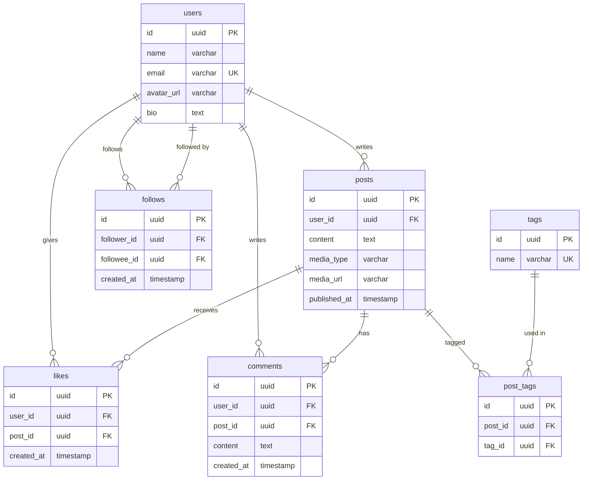
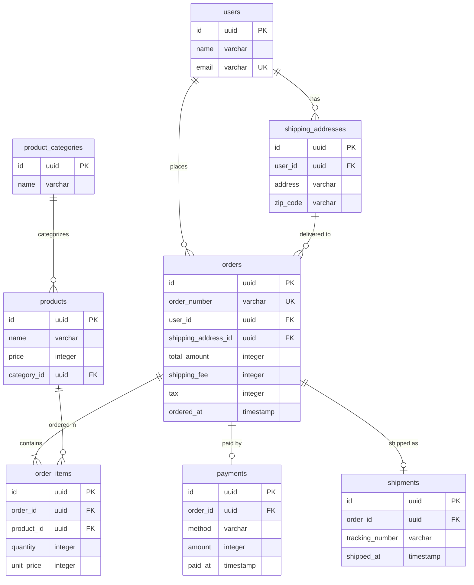

# ステップ3: リソース統合とリレーションシップ整理

## このステップで何をするか

- **ゴール**: リソース系エンティティの重複を統合し、エンティティ間の多重度（1:1, 1:N, N:M）を確定する。サブセット（種別・区分）の扱いを決定する
- **インプット**: ステップ2の正規化済みエンティティ一覧とMermaid ERD
- **アウトプット**: 統合済みのエンティティ一覧、多重度が確定したMermaid ERD

## このステップで何をするのか

ステップ1〜2では個々のエンティティとその属性を整理した。このステップでは、エンティティ同士の**関係**を正確に定義する。具体的には:

1. **リソースの統合**: 同じ実体を指す別名のエンティティがないか確認し、1つに統合する
2. **多重度の確定**: エンティティ間が「1対1」「1対多」「多対多」のどれかを判定し、多対多なら中間テーブルを導入する
3. **サブセットの判断**: 種別・区分があるエンティティを、別テーブルに分けるか区分カラムで済ませるかを決める

### なぜこの作業が必要なのか

- リレーションシップが正しくないと、JOINで意図しない結果が返る
- 多対多の関係を中間テーブルなしで表現しようとすると、データの整合性が壊れる
- サブセットの扱いを誤ると、プログラム側にIF文が増えて複雑になる
- 大規模なシステムでは、複数のサブシステムに散らばった同じリソースを統合する作業がDB設計の最大の山場になる

## 判断基準

### リソースの統合

**同じ概念か判定する問い:**
- 同じ実体（人、モノ、場所）を指しているか？
- 片方を変更したとき、もう片方も変わるべきか？

| 一見別のエンティティ | 判断 | 理由 |
|---|---|---|
| 「投稿者」と「コメント者」 | 統合 → ユーザー | 同じユーザーの別の行為 |
| 「注文者」と「配送先の人」 | 統合しない | 注文者≠受取人のケースがある |

### 多重度の確定

2つのエンティティの関係を、以下の問いで判定する:
- 「Aから見てBは複数存在するか？」
- 「Bから見てAは複数存在するか？」

| Aから見てB | Bから見てA | 多重度 | 実装 |
|---|---|---|---|
| 1つだけ | 1つだけ | 1:1 | 片方にFKを持たせる |
| 複数 | 1つだけ | 1:N | N側にFKを持たせる |
| 複数 | 複数 | N:M | 中間テーブルを作る |

**Mermaid ERD記号の使い分け:**

| 記号 | 意味 | 使い分け |
|---|---|---|
| `\|\|--o{` | 1対0以上（オプショナル） | N側のレコードが0件でもよい場合（例: ユーザー → 投稿） |
| `\|\|--\|{` | 1対1以上（必須） | N側のレコードが必ず1件以上ある場合（例: 注文 → 注文明細） |
| `\|\|--o\|` | 1対0または1 | 任意の1:1関係（例: 注文 → 決済、未決済の注文がありうる） |
| `\|\|--\|\|` | 1対1（必須） | 必須の1:1関係 |

**N:Mが出現したら中間テーブル（交差エンティティ）を導入する。** 中間テーブルは両方のIDを外部キーとして持ち、関係の事実を管理する。

| 関係 | 中間テーブル | 持たせる属性の例 |
|---|---|---|
| 投稿 ↔ タグ | post_tags | （なし、または表示順） |
| 商品 ↔ カテゴリ（複数カテゴリ対応） | product_categories_map | is_primary |
| ユーザー ↔ ロール | user_roles | granted_at, expires_at |

**中間テーブルの利点:**
- ユニーク制約の付け方で1:1にも1:NにもN:Mにも柔軟に変更できる
- 日付属性を追加すれば関係の履歴を管理できる（例: 開始日・終了日）
- 同じテーブル同士の関係も表現できる（例: 親カテゴリ↔子カテゴリ）

中間テーブルは通常2つの別テーブルを参照するが、**同じテーブルを2回参照する**ケースもある:

| 関係 | 中間テーブル | 参照先 |
|---|---|---|
| 投稿 ↔ タグ | post_tags | `post_id → posts`, `tag_id → tags`（別テーブル） |
| ユーザー ↔ ユーザー（フォロー） | follows | `follower_id → users`, `followee_id → users`（同じテーブル） |
| カテゴリの親子関係 | category_hierarchies | `parent_id → categories`, `child_id → categories`（同じテーブル） |

構造は同じ。違いは参照先が同一テーブルかどうかだけ。

### サブセット（種別・区分）の扱い

リソース系エンティティに種別がある場合、2つのパターンから選ぶ:

| パターン | 構造 |
|---|---|
| **別テーブル（サブタイプ）** | 共通属性を親テーブルに、種別固有の属性を子テーブルに持たせる |
| **区分カラム** | 同じテーブルに `type` カラムを持たせ、種別によって使わないカラムはNULLにする |

**判断の問い — 迷ったら別テーブルにする:**

別テーブルにすべき状況:
- 種別ごとに固有の属性がある、または将来出てくる可能性がある
- 1つの実体が複数の種別を同時に持ちうる（例: 法人の社長が個人顧客でもある）
- 種別ごとに異なるバリデーションや処理が必要になりそう
- 種別が今後増える可能性がある

区分カラムで十分な状況:
- 種別間で属性の違いがなく、単なるラベルやフィルター条件でしかない
- 将来的にも属性の差が出る見込みがない

**実装コストも考慮する:**
- 別テーブルにするとJOIN数が増え、クエリが複雑になる。種別が多い場合（5種以上）はテーブル数の爆発に注意
- 区分カラムにすると、種別固有の属性がNULLableカラムとして増え、テーブルが肥大化する
- 迷ったら「現時点で固有属性があるか」で判断し、将来の変更は発生時に対応する

| 例 | 判断 | 理由 |
|---|---|---|
| 投稿のメディアタイプ（テキスト/画像/動画） | 別テーブル | 画像には解像度・サイズ、動画には再生時間・サムネイルなど固有属性がある |
| 商品の販売ステータス（販売中/販売停止） | 区分カラム | 単なるフラグで、属性の差がない |
| 決済方法（クレジット/銀行振込/コンビニ） | 別テーブル | 方法ごとに必要な情報が異なる（カード番号、振込先口座など） |
| ユーザーの表示テーマ（ライト/ダーク） | 区分カラム | 単なる設定値 |

## 具体例: ウォークスルー

### toC例: SNSアプリのリソース統合

**ステップ2のERDを精査する**

**多重度を確定する:**

| 関係 | Aから見てB | Bから見てA | 判定 |
|---|---|---|---|
| ユーザー → 投稿 | 1人が複数投稿 | 1投稿に1著者 | 1:N |
| 投稿 → いいね | 1投稿に複数いいね | 1いいねは1投稿に | 1:N |
| 投稿 → コメント | 1投稿に複数コメント | 1コメントは1投稿に | 1:N |
| ユーザー ↔ ユーザー（フォロー） | 1人が複数をフォロー | 1人が複数からフォローされる | N:M（自己参照）→ `follows` が中間テーブル |
| 投稿 ↔ タグ | 1投稿に複数タグ | 1タグが複数投稿に | N:M → `post_tags` 中間テーブル |

**サブセットを確認する:**
- 投稿のメディアタイプ（テキスト/画像/動画）→ 画像には `image_url, width, height`、動画には `video_url, duration, thumbnail_url` など固有属性がある → 別テーブル `post_images`, `post_videos` を検討
- ここではシンプルに `posts` に `media_type` + `media_url` で対応し、メディア固有の属性が増えてきたら別テーブルに分離する方針とする（ユーザーに確認）

**リソースの統合を確認:**
- `posts` の `user_id`、`likes` の `user_id`、`comments` の `user_id`、`follows` の `follower_id / followee_id` → すべて同じ `users` を参照 ✓

**変更点:** 多重度をERDに明示。サブセットの判断をユーザーと合意。

### toB例: EC受注管理のリソース統合

**ステップ2のERDを精査する**

**多重度を確定する:**

| 関係 | Aから見てB | Bから見てA | 判定 |
|---|---|---|---|
| ユーザー → 注文 | 1人が複数注文 | 1注文に1注文者 | 1:N |
| ユーザー → 配送先 | 1人が複数配送先 | 1配送先は1人の | 1:N |
| 注文 → 注文明細 | 1注文に複数明細 | 1明細は1注文に | 1:N |
| 注文 → 決済 | 1注文に1決済 | 1決済は1注文に | 1:1 |
| 注文 → 出荷 | 1注文に1出荷 | 1出荷は1注文に | 1:1（分割出荷なら1:Nだがここでは1:1と仮定） |
| カテゴリ → 商品 | 1カテゴリに複数商品 | 1商品に1カテゴリ | 1:N |
| 商品 → 注文明細 | 1商品が複数明細に | 1明細に1商品 | 1:N |

**サブセットを確認する:**
- 決済方法（クレジット/銀行振込/コンビニ）→ 方法ごとに固有の属性が異なる → 将来の拡張を考え、`payments` の `method` に加えて `payment_details` テーブルを別途用意する設計も検討。ここではシンプルに `payments` テーブルに `method` + `metadata` で対応し、複雑になったら分離する方針とする（ユーザーに確認）

**リソースの統合を確認:**
- 「注文者」と「配送先の登録者」は同じ `users` → 統合済み ✓

**変更点:** 多重度をERDに明示。サブセットの判断をユーザーと合意。

## セルフレビュー

このステップの完了時に以下を確認する:

- [ ] 同じ実体を指す別名のエンティティが統合されているか
- [ ] すべてのリレーションシップに多重度（1:1, 1:N, N:M）が明示されているか
- [ ] N:Mの関係に中間テーブルが導入されているか
- [ ] 自己参照の多対多（フォロー、親子関係など）が正しく表現されているか
- [ ] サブセット（種別・区分）の扱いが決定されているか（将来の拡張性を考慮したか）
- [ ] 中間テーブルに必要な属性（日時、順序など）が検討されているか
- [ ] 孤立したエンティティ（どこからも参照されない）がないか
- [ ] ユーザーに確認が必要な判断（多重度の曖昧さ、サブセットの方針等）を記録したか
