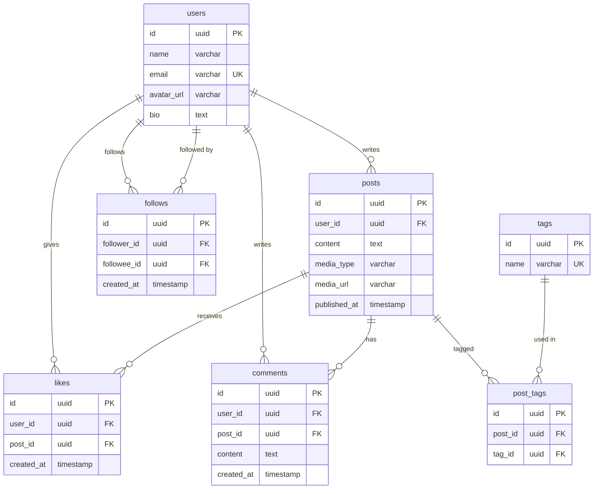
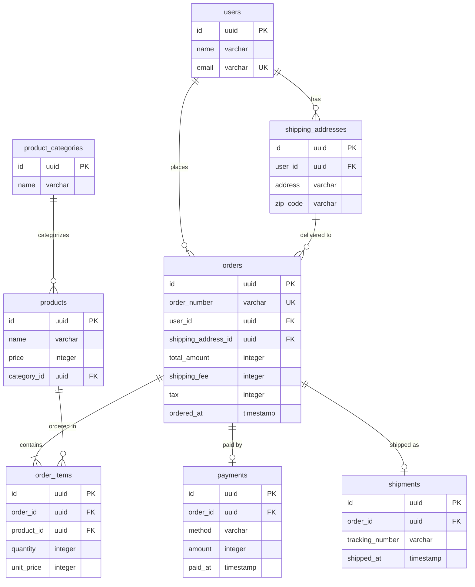

# ステップ4: 導出項目の整理

## このステップで何をするか

- **ゴール**: 他の属性から計算で求められる項目（導出項目）を特定し、テーブルに持たせるか排除するかを判断する
- **インプット**: ステップ3の統合済みエンティティ一覧とMermaid ERD
- **アウトプット**: 導出項目が整理された最終ERDと設計判断サマリー

## 導出項目とは何か

導出項目は「他の属性やテーブルから計算・集計で求められる属性」。たとえば `subtotal = unit_price × quantity` の `subtotal` や、`likes` テーブルのCOUNTで求められる `like_count` がこれに当たる。

### なぜ整理が必要なのか

導出項目をテーブルに持たせると:
- 元データと導出値の不整合が起きるリスクがある（元データを更新したのに導出値の更新を忘れる）
- 更新時に複数箇所を書き換える必要が生じる

一方で、毎回計算すると:
- 集計クエリが重くなる場合がある（パフォーマンス）

このトレードオフを判断するのがこのステップの目的。

## 判断基準

### 基本原則: 可逆性で判断する

**逆算できるなら排除する（可逆性あり）:**

元データから常に正確に再現でき、逆算も可能な項目はテーブルに持たせない。

| 導出項目 | 導出元 | 判断 |
|---|---|---|
| `age`（年齢） | `birth_date` と現在日時 | 排除 |
| `subtotal`（小計） | `unit_price × quantity` | 排除 |
| `duration`（利用期間） | `start_date` と `end_date` | 排除 |
| `like_count` | `likes` テーブルのCOUNT | 排除 |
| `follower_count` | `follows` テーブルのCOUNT | 排除 |

**逆算できないなら保持する（不可逆性あり）:**

値引き、丸め処理、外部要因などが入って元データから再現できない項目は、独立した事実としてテーブルに残す。

| 導出項目 | なぜ逆算できないか | 判断 |
|---|---|---|
| 値引き後の `amount` | 値引きロジックが入り `unit_price × quantity ≠ amount` | 保持 |
| 一括値引き後の `total_amount` | 明細の合算 ≠ 合計（一括値引き・クーポン適用がある） | 保持 |
| 注文時の `unit_price` | 商品マスタの `price` は後から変わりうる（スナップショット） | 保持 |
| ポイント付与額 | 付与ルールが複雑で変更されうる | 保持 |

### 排除した導出項目の扱い

テーブルから排除した導出項目をアプリケーションで使う方法:

| 方法 | いつ使うか | 例 |
|---|---|---|
| **ビュー（VIEW）** | SQLで導出ロジックを定義し、テーブルのように参照したい場合 | `CREATE VIEW order_summaries AS SELECT ..., unit_price * quantity AS subtotal ...` |
| **アプリケーション側で計算** | 表示時にのみ必要で、クエリで扱う必要がない場合 | フロントエンドで `age` を `birth_date` から計算 |
| **キャッシュカラム（非正規化）** | パフォーマンスが問題になる場合の妥協策 | `posts.like_count` をキャッシュとして持ち、非同期で更新。ただし「正式な値は `likes` テーブルのCOUNT」と明示する |

### 複雑な計算ロジックはプログラムで表現する

単純な四則演算（`unit_price × quantity`）ならビューで十分だが、多段階料金制度やポイント計算のようにルール自体が複雑で将来変更されうるものは、データモデル（パラメータテーブル + ビュー）だけで表現しようとしない。プログラム（アルゴリズム）で表現する方が自然で応用が利く。

## 具体例: ウォークスルー

### toC例: SNSアプリの導出項目整理

**ステップ3のERDから導出項目を洗い出す**

| 候補 | 導出元 | 逆算可能か | 判断 |
|---|---|---|---|
| 投稿のいいね数 | `likes` テーブルのCOUNT | はい | 排除（パフォーマンスが問題になったらキャッシュカラムを検討） |
| 投稿のコメント数 | `comments` テーブルのCOUNT | はい | 排除（同上） |
| ユーザーのフォロワー数 | `follows` テーブルのCOUNT | はい | 排除（同上） |
| ユーザーのフォロー数 | `follows` テーブルのCOUNT | はい | 排除（同上） |
| ユーザーの投稿数 | `posts` テーブルのCOUNT | はい | 排除 |

**変更点:** ERDの構造に変更なし。導出項目をテーブルに持たせないことを確認。

**設計判断の記録:**
- いいね数・フォロワー数はCOUNT集計で導出。パフォーマンスが問題になった場合はキャッシュカラムの導入を検討するが、初期段階では不要

### toB例: EC受注管理の導出項目整理

**ステップ3のERDから導出項目を洗い出す**

| 候補 | 導出元 | 逆算可能か | 判断 |
|---|---|---|---|
| 注文明細の `subtotal` | `unit_price × quantity` | はい | 排除（ビューで計算） |
| 注文の `total_amount` | 明細の合算 + shipping_fee + tax | いいえ（一括値引き・クーポンがありうる） | 保持 |
| 注文の `shipping_fee` | — | いいえ（配送先・重量等で決まる外部ロジック） | 保持 |
| 注文の `tax` | — | いいえ（税率変更・軽減税率等がある） | 保持 |
| 注文明細の `unit_price` | 商品マスタの `price` | いいえ（注文時点のスナップショット） | 保持 |

**変更点:** `order_items` から `subtotal` を削除（ステップ2で検討済みだった項目を確定）。

**設計判断の記録:**
- `subtotal` はビューで `unit_price × quantity` として計算する
- `total_amount`, `shipping_fee`, `tax` は一括値引きや外部ロジックが絡むため独立した事実として保持
- `unit_price` は注文時点のスナップショットであり、商品マスタの `price` とは別の事実

## セルフレビュー

このステップの完了時に以下を確認する:

- [ ] 各属性について「他の属性から導出可能か」を検討したか
- [ ] 導出可能な項目について、可逆性（逆算できるか）を判断したか
- [ ] 排除した導出項目の代替手段（ビュー、アプリ計算、キャッシュ）を決定したか
- [ ] 「同じ名前だが別の事実」（例: 商品の現在価格 vs 注文時価格）を導出項目と混同していないか
- [ ] 複雑な計算ロジックをデータモデルだけで表現しようとしていないか
- [ ] パフォーマンスのためのキャッシュカラムを導入する場合、正式な値の導出元を明示しているか
- [ ] 設計判断（なぜ保持/排除したか）をドキュメントに記録したか
