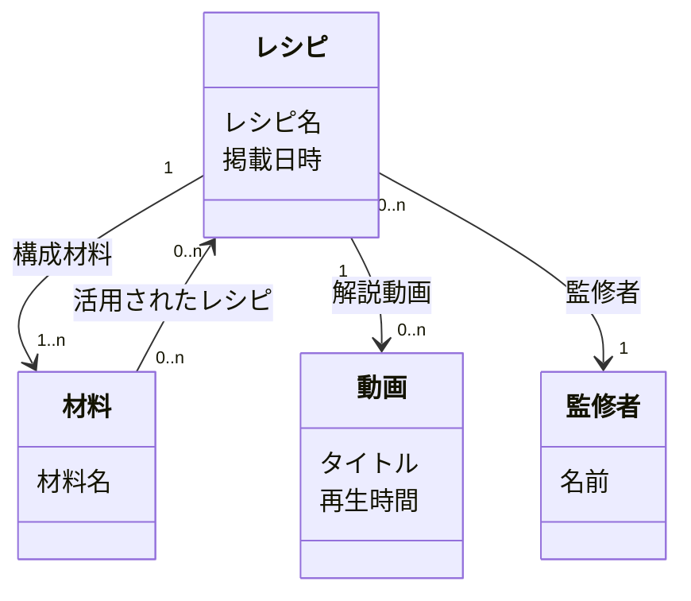

# フェーズ3: コンテンツ構造設計

## 概要

UIの「中身」の構造を定義するフェーズ。概念オブジェクトを抽出し、それらの関連性と多重度を設定することで、コンテンツ全体の構造を明らかにする。

このモデルはDB設計（ER図）とは異なり、UIとしてどう表現するかを決めるための土台である。

## インプット

- **必須**: ユースケース一覧（Phase 1）、タスク表（Phase 2）
- **参考**: 行動シナリオ

## アウトプット

- **概念オブジェクト一覧**（マークダウンテーブル）
- **コンテンツ構造図**（Mermaid classDiagram）
- 出力ファイルの「Phase 3: コンテンツ構造」セクションに記録

## 前提知識

### 概念オブジェクトとは

ユーザーの関心の対象や操作対象となる「名詞で表せる概念単位」。ミュージックアプリの「トラック」「アルバム」、料理アプリの「レシピ」「材料」など。

### 妥当性の判定基準

抽出した候補が概念オブジェクトとして適切かの要件:
- 名詞で表せる「もの」であること
- コマンド（アクション）やジェスチャーそのものではないこと
- 認知や操作の対象となり得ること
- 同様の性質を有したものが複数個存在し得ること
- プリミティブ（単なる文字列・数値）ではないこと

### 多重度の4パターン

| 表記 | 意味 | UI上の示唆 |
|------|------|-----------|
| `0..1` | 0もしくは単数 | 空表示の考慮＋単体表示 |
| `1` | 単数 | 単体表示（必ず存在） |
| `0..n` | 0以上（単数もしくは複数） | 空表示の考慮＋一覧表示 |
| `1..n` | 単数もしくは複数 | 一覧表示（必ず1つ以上存在） |

### ER図との違い

| 観点 | コンテンツ構造 | ER図 |
|------|-------------|------|
| 目的 | UIの表現可能性を広げる | データの正規化と整合性 |
| 命名 | ユーザー言語・メタファー | テーブル名・カラム名 |
| 関連の意味 | ナビゲーション経路候補 | リレーショナル構造 |
| 多重度の活用 | UI展開パターンの判断材料 | 参照整合性の制約 |

## 作業手順

1. **概念オブジェクト候補を抽出する**:
   - ユースケース一覧の〈何〉（目的語）から候補を拾う
   - タスク表の操作対象（名詞）から候補を拾う
   - 行動シナリオの名詞・目的語から候補を拾う
2. **妥当性を判定する**: 上記の判定基準で候補をフィルタリングする
3. **名寄せする**: 候補リストの中に同じ概念を指す異なる呼称（同義語・重複呼称）がないか検出する。発見した場合はユーザーに正規名を確認し、1つの名前に統合する
4. **命名する**:
   - ユーザーが理解しやすい表現やメタファーを使う
   - 実装用語（DBテーブル名、クラス名等）は使わない
   - 拡張性のある名前を検討する（例: 「料理研究家」→「監修者」）
5. **関連性を設定する**:
   - オブジェクト間の関連を双方向の視点で考える（AからBの認識、BからAの認識）
   - 属性名をラベルとして付与する（例: レシピから見て材料は「構成材料」）
   - 片方向のみの関連もある（例: レシピ→動画はあるが、動画→レシピは不要）
6. **多重度を設定する**:
   - 各関連に `0..1`、`1`、`0..n`、`1..n` のいずれかを付与する
   - 具体的数値（`0..2` 等）は使わない
   - 「このオブジェクトにとって、相手はいくつ存在するか？」と問いかける
7. **各概念オブジェクトの一覧/詳細の有無を確認する**: 多重度から導出したUIパターンをもとに、各オブジェクトが一覧表示・詳細表示・空表示のどれを必要とするか明示する。ユーザーに確認し、出力テーブルに記録する
8. **プロパティを追記する（必要な場合のみ）**: 名前・関連・多重度だけでは情報が足りない場合にのみ追記する。粒度を細かくしすぎない
9. **コンテンツ構造図をMermaidで記述する**

### Mermaid classDiagram での表記例

## 戻りフロー

- **条件**: 概念設計中にタスク表に不足や誤りを発見した場合
- **手順**: Phase 2のタスク表を拡充・修正する → コンテンツ構造との対応を再確認する
- **記録**: タスク表の変更内容と理由を設計判断ログに記録する

## アンチパターン

- **実装用語の使用**: DBテーブル名やクラス名を概念オブジェクト名にする
- **具体的数値の多重度**: `0..2`、`3..5` 等。表現の可能性を閉ざす
- **プロパティの過剰定義**: モデルを作ること自体が目的になる
- **プリミティブの概念オブジェクト化**: 単なる文字列・数値をオブジェクトにする
- **根拠のないオブジェクト**: ユースケースにもタスクにも登場しないオブジェクトを含める

## チェックリスト

- [ ] すべての概念オブジェクトが名詞で、実装用語を使っていないか
- [ ] 多重度が `0..1`、`1`、`0..n`、`1..n` の4パターンのみか
- [ ] 多重度からUIパターン（空表示/一覧/単体）を導出したか
- [ ] プリミティブが概念オブジェクトに含まれていないか
- [ ] すべてのオブジェクトがユースケースまたはタスクに根拠があるか
- [ ] 関連の属性名が両方向の視点で設定されているか（該当する場合）
- [ ] Mermaid classDiagramで構造図が記述されているか
