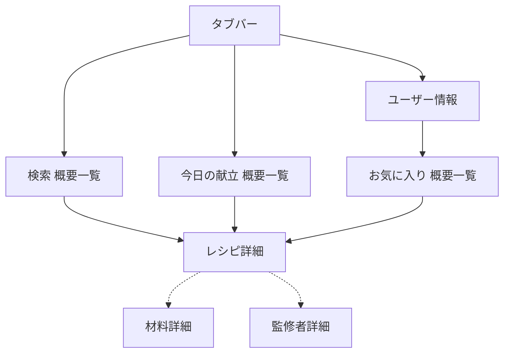

# フェーズ5: ナビゲーション構造設計

## 概要

ユーザーを目的のコンテンツまで導く経路を設計するフェーズ。

ボトムアップ式とトップダウン式の二方向から設計し、「挟み込み戦術」で統合する。

## インプット

- **必須**: コンテンツ構造（Phase 3、特に多重度）、フレーム構造（Phase 4）、ユースケース一覧（Phase 1）、コンセプト定義（Phase 4）
- **参考**: タスク表（Phase 2）

## アウトプット

- **ナビゲーション構造図**（Mermaid flowchart）
- **ボトムアップ設計メモ**
- **トップダウン設計メモ**
- **挟み込み統合結果**
- 出力ファイルの「Phase 5: ナビゲーション構造」セクションに記録

## 前提知識

### 基本構造パターン

- **概要一覧・詳細表示（List-Detail）**: 情報の詳細化方向と一致する最も基本のパターン。まず概要一覧から詳細表示に向かう経路を設計する
- **兄弟間ナビゲーション**: 同レベルの並列コンテンツ間を直接移動するパターン。回遊性を高める補完用途として追加する

### 表現パターンと選択基準

| パターン | 適する場面 | 注意点 |
|---------|-----------|--------|
| タブバー | 小規模、モバイル基本 | 最大5つ（できれば3つ）。「設定」タブ禁止 |
| サイドバー | 小〜中規模、広い画面向け | タブ数が多い場合や複雑なナビに |
| ルートリスト/メニュー | コンパクト、コンテンツ優先 | 画面リソースを別用途で活用したい場合 |
| ランチャ | OS向け | 一般アプリでは避ける |
| ドリルダウン | ツリー階層の深掘り | モバイルは1列全画面、デスクトップはカラム表示 |
| ステップ型（ウィザード） | 順次的提示 | 過度使用禁止、スキップ手段必須 |
| ピラミッド型 | 上下＋横移動の組み合わせ | 一覧に戻る手間を省く回遊 |

### 情報構造パターン

- **階層構造**: 親子が連なる。人間が直感的にイメージしやすい
- **入れ子構造（コンポジット）**: 階層内に同じ構造がネスト。全体と局所で同じアプローチが可能
- **ツリー構造**: 親が必ず1つ。わかりやすいが柔軟性に欠ける
- **セミラティス構造**: 親が複数（タグ等）。柔軟だが全体像把握しづらい

ツリー構造のみで構築しようとしない。セミラティス構造も補い柔軟性を確保する。

### ボトムアップ式とトップダウン式

- **ボトムアップ式**: 詳細表示（目標地点）から入り口に向かって逆順に経路を探る
- **トップダウン式**: グローバルナビゲーション（入り口）から詳細表示に向かって経路を探る

### 挟み込み戦術

両方向から作った設計図を重ね合わせ、差異を解消する:
- **共通部分**: 確実な構造として維持
- **差異**: ANDではなくOR思考で採用判断
- **大きな矛盾**: その部分を最初から作り直す

## スコープ

このフェーズでの決定は**候補レベル**である。遷移モード（push/modal/sheet）やプラットフォーム固有のインタラクションの確定は、後続のプラットフォーム適合フェーズで行う。

## 作業手順

1. **多重度からベースパターンを導出する**:
   - nを含む関連 → 概要一覧が必要
   - 最大1の関連 → 詳細表示のみ
   - 0を含む → 空表示の考慮
2. **ボトムアップ式で設計する**:
   - 主要概念オブジェクトの詳細表示（目標地点）を置く
   - ユースケースと照合して必要な概要一覧パターンを検討する（検索結果、おすすめ、お気に入り等）
   - 不足するユースケースがあれば追加定義する
   - 設計図を記録する
3. **トップダウン式で設計する**:
   - グローバルナビゲーション表現パターンを1つ決定する
   - 第2階層以降のナビゲーションを検討する
   - 終着地点（詳細表示）に向かって動線を接続する
   - 設計図を記録する
4. **挟み込み戦術で統合する**:
   - 両方の設計図を重ね合わせる
   - 共通部分を確認する
   - 差異を解消する（OR思考で判断）
   - 大きな矛盾があればその部分を作り直す
   - 統合結果を記録する
5. **兄弟間ナビゲーションを検討する**: 正方向のナビゲーションが出来上がってから、回遊性を高める補完として追加する
6. **Mermaid flowchartで構造図を記述する**

### Mermaid flowchart での表記例

## 戻りフロー

- **条件**: ナビゲーション経路の検討で、既存ユースケースにない概要一覧パターンが必要になった場合
- **手順**: Phase 1に戻りユースケースを追加定義する → ナビゲーション設計に戻り経路に反映する

- **条件**: 挟み込みで大きな矛盾が発生した場合
- **手順**: 矛盾部分を最初から作り直す

- **記録**: 追加ユースケースのID、矛盾の内容と解消方法を設計判断ログに記録する

## アンチパターン

- **レイアウト先行**: UIの見た目を決めてからナビゲーションを設計する（手戻りが甚大）
- **「画面」「ページ」単位の設計**: 指し示す範囲が曖昧。「ビュー」で捉える
- **ステップ型の過度使用**: ユーザーの自由を奪い退屈にする
- **ランチャや独自タブバーの再発明**: OS標準の仕組みがあるのに独自に作る
- **縦割り構造**: 特定コンテンツが特定タブにしか存在できない
- **タブジャンプ**: 操作中に意図せず別タブに切り替わる
- **ナビバーの不要な隠蔽**: 画面を広く使いたいだけの理由でナビを隠す
- **モーダル詳細表示**: 一覧→詳細をフルスクリーンモーダルで展開する
- **タブ6つ以上 / 「設定」タブ**: モバイルのタブは最大5つ。「設定」は動線の無駄
- **非線形ナビゲーション**: ハイパーリンクで縦横無尽に飛ぶ構造は一般アプリに不向き

## チェックリスト

- [ ] ボトムアップ式とトップダウン式の両方で設計したか
- [ ] 挟み込み戦術で差異を解消したか
- [ ] グローバルナビが1つのみか
- [ ] 縦割り構造になっていないか
- [ ] タブジャンプが起こらないか
- [ ] モバイルタブが5つ以下か（「設定」タブがないか）
- [ ] 詳細表示がモーダルでブロックされていないか
- [ ] ナビバーが不要に隠れていないか
- [ ] 多重度に基づく一覧/詳細/空表示が適切に反映されているか
- [ ] 未接続のノード（どこからも到達できないビュー）がないか
- [ ] 循環遷移（意図しないループ）がないか
- [ ] すべてのビューに入口と戻り先が明示されているか
- [ ] Mermaid flowchartで構造図が記述されているか
