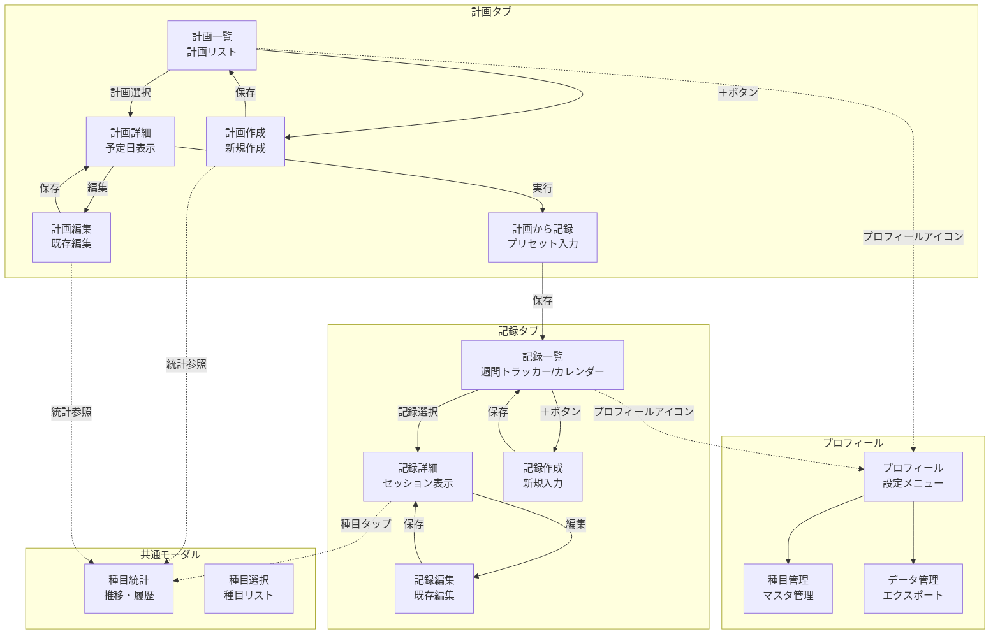

# フレーム構造

steering/03-conceptual-design.mdの内容をもとに、フレーム構造設計を行います。

## 恒常領域

- **下部タブバー**: 記録 | 計画（常時表示）
- **右上プロフィールアイコン**: アカウント/設定へのアクセス

## 単位ビュー一覧

### 記録タブ

#### V1: 記録一覧

- **役割**: トレーニング記録の一覧表示
- **関連オブジェクト**: トレーニング記録
- **ナビゲーション**: 記録選択で詳細へ、＋ボタンで作成へ、表示切替アイコンでビュー変更
- **レイアウト**: 週間トラッカー付きリスト/カレンダービューを切替可能
- **備考**: メイン画面、初期表示、習慣化の視覚的サポート

#### V2: 記録詳細

- **役割**: 選択した記録のセッション表示
- **関連オブジェクト**: トレーニング記録、セッション、セット
- **ナビゲーション**: 種目名タップで統計へ、編集ボタンで編集へ
- **レイアウト**: ヘッダー（日付・メモ）、セッションカードのリスト
- **備考**: 種目へのドリルダウンポイント

#### V4: 記録作成

- **役割**: 新規トレーニング記録の作成
- **関連オブジェクト**: トレーニング記録、セッション、セット
- **ナビゲーション**: 種目選択モーダル、保存で一覧へ
- **レイアウト**: 日付入力、種目追加ボタン、セット入力フォーム
- **備考**: 疲労時でも操作しやすいUI重要

#### V5: 記録編集

- **役割**: 既存トレーニング記録の編集
- **関連オブジェクト**: トレーニング記録、セッション、セット
- **ナビゲーション**: 保存/キャンセルで詳細へ
- **レイアウト**: V4と同様
- **備考**: 削除機能も含む

#### V6: 計画から記録作成

- **役割**: 計画をベースにした記録入力
- **関連オブジェクト**: トレーニング計画、トレーニング記録
- **ナビゲーション**: 保存で記録一覧へ
- **レイアウト**: プリセットされた種目とセット
- **備考**: 計画タブからも遷移可能

### 計画タブ

#### V7: 計画一覧

- **役割**: トレーニング計画の一覧表示
- **関連オブジェクト**: トレーニング計画
- **ナビゲーション**: 計画選択で詳細へ、＋ボタンで作成へ
- **レイアウト**: カード形式のリスト
- **備考**: アクティブな計画を強調

#### V8: 計画詳細

- **役割**: 選択した計画の予定日表示
- **関連オブジェクト**: トレーニング計画、予定日
- **ナビゲーション**: 編集ボタンで編集へ、実行ボタンで記録作成へ
- **レイアウト**: ヘッダー（計画名）、予定日のリスト
- **備考**: 進捗状況の可視化

#### V9: 計画作成

- **役割**: 新規トレーニング計画の作成
- **関連オブジェクト**: トレーニング計画、予定日
- **ナビゲーション**: 保存で一覧へ、種目選択時に統計参照可能
- **レイアウト**: 計画名入力、予定日追加フォーム、種目統計参照ボタン
- **備考**: テンプレート機能検討、種目統計を参考に重量・回数決定

#### V10: 計画編集

- **役割**: 既存トレーニング計画の編集
- **関連オブジェクト**: トレーニング計画、予定日
- **ナビゲーション**: 保存/キャンセルで詳細へ、種目選択時に統計参照可能
- **レイアウト**: V9と同様
- **備考**: 削除機能も含む、種目統計を参考に重量・回数調整

#### V11: 計画から記録作成

- **役割**: V6と同一（計画タブからのエントリー）
- **関連オブジェクト**: V6と同一
- **ナビゲーション**: V6と同一
- **レイアウト**: V6と同一
- **備考**: V6と同一

### プロフィール（右上アイコンから）

#### V12: プロフィール

- **役割**: アカウント情報と設定メニュー
- **関連オブジェクト**: アカウント、トレーニー
- **ナビゲーション**: 各設定項目へのリンク
- **レイアウト**: プロフィール情報、メニューリスト
- **備考**: ログアウト機能含む

#### V13: 種目管理

- **役割**: 種目マスターの管理
- **関連オブジェクト**: 種目
- **ナビゲーション**: 種目の追加・編集・削除
- **レイアウト**: 種目リスト、検索バー
- **備考**: プリセット種目の編集

#### V14: データ管理

- **役割**: データのエクスポート・バックアップ
- **関連オブジェクト**: トレーニング記録、トレーニング計画
- **ナビゲーション**: 各種エクスポート機能
- **レイアウト**: 機能ボタンのリスト
- **備考**: AI分析用データ出力

### 共通モーダル

#### V3: 種目統計

- **役割**: 種目の成長推移と履歴表示
- **関連オブジェクト**: 種目、セッション
- **ナビゲーション**: 閉じるボタンで呼び出し元へ戻る
- **レイアウト**: グラフエリア、統計サマリー、セッション履歴リスト
- **備考**: モチベーション管理の要、記録詳細・計画作成/編集から呼び出し可能

#### V15: 種目選択

- **役割**: 記録作成時の種目選択
- **関連オブジェクト**: 種目
- **ナビゲーション**: 選択で元画面へ戻る
- **レイアウト**: 検索バー、種目リスト
- **備考**: 最近使った種目を上位表示

## フレーム間の流れ

### 記録タブ内

- from: 記録一覧 → trigger: 記録選択 → to: 記録詳細 → 戻り先: 記録一覧
- from: 記録一覧 → trigger: ＋ボタン → to: 記録作成 → 戻り先: 記録一覧
- from: 記録詳細 → trigger: 種目名タップ → to: 種目統計（モーダル）→ 戻り先: 記録詳細
- from: 記録詳細 → trigger: 編集ボタン → to: 記録編集 → 戻り先: 記録詳細
- from: 記録作成 → trigger: 種目追加 → to: 種目選択モーダル → 戻り先: 記録作成

### 計画タブ内

- from: 計画一覧 → trigger: 計画選択 → to: 計画詳細 → 戻り先: 計画一覧
- from: 計画一覧 → trigger: ＋ボタン → to: 計画作成 → 戻り先: 計画一覧
- from: 計画詳細 → trigger: 編集ボタン → to: 計画編集 → 戻り先: 計画詳細
- from: 計画詳細 → trigger: 実行ボタン → to: 計画から記録作成 → 戻り先: 記録一覧
- from: 計画作成/編集 → trigger: 種目の統計参照 → to: 種目統計（モーダル）→ 戻り先: 計画作成/編集

### タブ間・その他

- from: 任意のビュー → trigger: プロフィールアイコン → to: プロフィール → 戻り先: 元のビュー
- from: プロフィール → trigger: 種目管理 → to: 種目管理 → 戻り先: プロフィール
- from: プロフィール → trigger: データ管理 → to: データ管理 → 戻り先: プロフィール

## ワイヤーフレーム（Mermaid）

