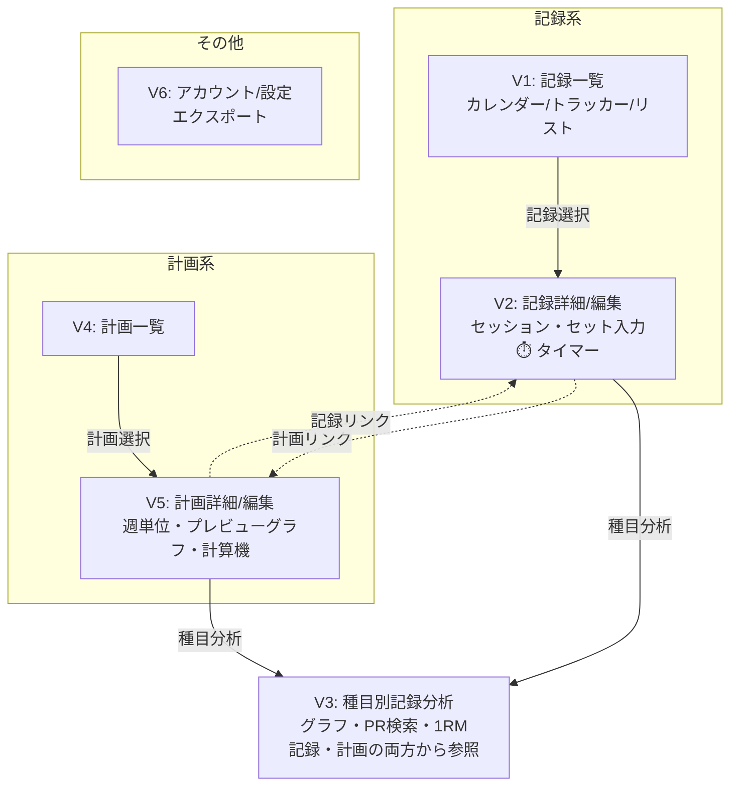

# フレーム構造

## 恒常領域

### グローバルナビゲーション

- **モバイル（iOS/Webモバイル）**: タブバー形式
  - 記録
  - 計画
- **大画面（Web）**: サイドバー形式
  - 同様の構成をサイドバーに配置

### ユーザーアイコン領域

- 画面右上にユーザーアイコン配置
- タップで設定メニューへ遷移

### レストタイマー（フローティング）

- V2（記録詳細/編集）で画面下部に常設
- 未使用時：小さいボタン
- 使用時：展開して時間選択・カウントダウン表示
- トレーニング中に頻繁に使用するため独立配置

## 単位ビュー一覧

### V1: トレーニング記録一覧

- **目的**: トレーニング記録の閲覧、選択
- **表示対象**: トレーニング記録（複数）
- **構成**: 併置（セグメントコントロールで表示形式を切り替え）
  - カレンダー形式：月表示で記録の有無を確認
  - トラッカー形式：1週間単位の習慣トラッカー表示
  - リスト形式：無限スクロールの時系列一覧
- **モード**: モードレス
- **遷移候補**: 記録選択でV2（記録詳細/編集）へ
- **備考**: 同じコンテンツ（トレーニング記録）を異なる視点で表示

### V2: トレーニング記録詳細/編集

- **目的**: トレーニング記録の参照・作成・編集
- **表示対象**: 1つのトレーニング記録、含まれるセッション・セット
- **構成**: 併置（モードレス、フィールドごとに自動保存）
  - 日付、メモ（常に編集可能）
  - セッション一覧（全展開、折りたたみなし）
  - セッション追加：コンボボックス（最近実施した種目を候補表示）
  - セット入力：カード形式（モバイルで操作しやすい）
  - 前回実施情報表示（参考として）
  - 計画リンク：「💡 計画名」を控えめに表示、タップで計画詳細へ
- **モード**: モードレス（表示/編集モードの切り替えなし）
- **遷移候補**: V1から遷移、V3（種目別記録分析）へのリンク、V5（計画詳細）へのリンク
- **フローティング要素**: レストタイマー（画面下部）
- **備考**: 疲労状態での操作を考慮し、極力シンプルな入力UI

### V3: 種目別記録分析

- **目的**: 特定種目の記録推移の分析、計画立案の支援
- **表示対象**: 種目、記録推移、1RM、PR条件
- **構成**: 併置
  - 種目選択（コンボボックス）
  - 実測1RM表示/編集（手動入力可能、上回る記録があれば自動更新）
  - PR条件検索：重量・回数を入力して過去記録とPR条件を表示
  - 推移グラフ
    - ボリューム（セッション単位の合計）
    - 強度（セッション内の最大値、1RMに対する%）
    - 8週単位でページネーション、カスタム期間選択可能
  - 記録一覧
- **モード**: モードレス
- **遷移候補**: V2（記録詳細）、V5（計画詳細）から遷移
- **備考**: 記録参照と計画立案の両方から参照される共通ビュー、グローバルナビゲーションには含まれない

### V4: トレーニング計画一覧

- **目的**: トレーニング計画の閲覧、選択
- **表示対象**: トレーニング計画（複数）
- **構成**: リスト/カード形式
  - 計画名、期間、進捗状況を表示
- **モード**: モードレス
- **遷移候補**: 計画選択でV5（計画詳細/編集）へ

### V5: トレーニング計画詳細/編集

- **目的**: トレーニング計画の参照・作成・編集
- **表示対象**: 1つのトレーニング計画、予定日、セッション構成
- **構成**: 併置（モードレス、フィールドごとに自動保存）
  - 計画名、期間、メモ（常に編集可能）
  - 予定日一覧（週ごとにグループ化）
  - 各予定日のセッション構成
  - セッション追加：コンボボックス
  - 種目データ参照：ボタン押下で表示
    - モバイル：ポップアップ/ダイアログ
    - Web大画面：サイドパネル
    - 内容：V3の簡易版（前回記録、1RM、簡易グラフ、PR検索）
    - 「詳細を見る」でV3へ遷移可能
  - 計画プレビューグラフ
    - 種目選択可能
    - X軸：セッション単位
    - ボリューム：週ごとの合計
    - 強度：週ごとの最大値
  - 重量×%計算機（控えめ配置、実測1RMを基準に計算、2.5kg単位に切り捨て）
  - 実施記録リンク：この計画を元に作成された記録一覧を控えめ表示
- **モード**: モードレス
- **遷移候補**: V4から遷移、V3（種目別記録分析）へ、V2（記録詳細）へ
- **備考**: 計画作成時に必要なデータ（種目分析、計算機）へのアクセスを重視

### V6: アカウント/設定

- **目的**: アカウント情報の確認、アプリ設定の変更
- **表示対象**: アカウント情報、各種設定項目
- **構成**: リスト形式
  - ユーザー情報
  - アプリ設定
  - データエクスポート（小さく配置）
  - ログアウト
- **モード**: モードレス
- **遷移候補**: グローバルナビゲーション（ユーザーアイコン）から

## ワイヤーフレーム（Mermaid）

## 補足事項

### 実測1RMの扱い

- 手動入力/編集可能
- 1回レップの記録が保存された際、現在の実測1RMを上回る場合は自動更新
- 「入力値を上回る記録が保存された場合、自動で更新されます」という注意書きを表示
- 種目ごとにキャッシュ

### ボリューム・強度の計算

- **セッションボリューム**: `Σ(各セットの重量 × 回数)`
- **週間ボリューム**: `Σ(週内の各セッションボリューム)`
- **セッション強度**: セッション内の最大重量（1RMに対する%）

### 計画と記録の関連付け

- 記録作成時に計画を選択可能（任意）
- 記録詳細：元にした計画を控えめ表示、タップで計画詳細へ
- 計画詳細：この計画を元に作成された記録一覧を控えめ表示

### プラットフォームによる違い

- **モバイル（iOS/Webモバイル）**
  - タブバー形式のナビゲーション
  - 種目データ参照：ポップアップ/ダイアログ
- **大画面（Web）**
  - サイドバー形式のナビゲーション
  - 種目データ参照：サイドパネル
