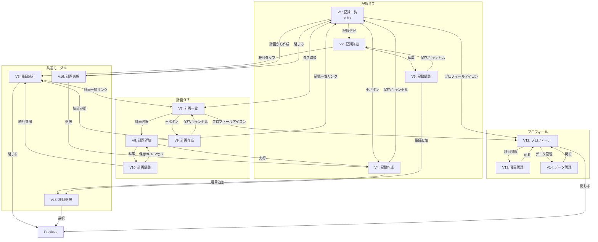

# ナビゲーション構造

## 概要

フレーム構造で定義された単位ビュー間の遷移関係を定義します。入口・目標地点・戻り動作・例外経路を整理し、アプリ全体のナビゲーションフローを明確化します。

## 設計方針

- **入口**: V1記録一覧（初期表示）
- **目標地点**: V4記録作成の保存完了、V9計画作成の保存完了
- **コンセプト適合**:「疲労した状態でも迷わず・間違いなく記録できる体験」「計画を立てるべきかに没頭できる体験」を実現する遷移設計

## ビュー定義

```yaml
views:
  # 記録タブ
  - id: v1-workout-record-list
    label: 記録一覧
    entry: true
    returns: null
    states:
      - empty?  # 記録が0件
      - filtered?  # 計画詳細からのフィルター付き遷移

  - id: v2-workout-record-detail
    label: 記録詳細
    returns: v1-workout-record-list

  - id: v4-workout-record-create
    label: 記録作成
    returns: v1-workout-record-list
    states:
      - with-plan?  # 計画選択または計画詳細から遷移
      - blank?  # 新規作成

  - id: v5-workout-record-edit
    label: 記録編集
    returns: v2-workout-record-detail

  # 計画タブ
  - id: v7-workout-plan-list
    label: 計画一覧
    returns: null
    states:
      - empty?  # 計画が0件
      - filtered?  # 種目統計からのフィルター付き遷移

  - id: v8-workout-plan-detail
    label: 計画詳細
    returns: v7-workout-plan-list

  - id: v9-workout-plan-create
    label: 計画作成
    returns: v7-workout-plan-list

  - id: v10-workout-plan-edit
    label: 計画編集
    returns: v8-workout-plan-detail

  # プロフィール
  - id: v12-profile
    label: プロフィール
    returns: previous  # 呼び出し元に戻る

  - id: v13-exercise-management
    label: 種目管理
    returns: v12-profile

  - id: v14-data-management
    label: データ管理
    returns: v12-profile

  # 共通モーダル
  - id: v3-exercise-statistics
    label: 種目統計
    returns: previous  # 呼び出し元に戻る
    mode?: modal

  - id: v15-exercise-selection
    label: 種目選択
    returns: previous  # 呼び出し元に戻る
    mode?: modal

  - id: v16-plan-selection
    label: 計画選択
    returns: v1-workout-record-list
    mode?: modal
```

## 遷移定義

```yaml
transitions:
  # 記録タブ内
  - from: v1-workout-record-list
    to: v2-workout-record-detail
    trigger: 記録選択
    mode?: push

  - from: v1-workout-record-list
    to: v4-workout-record-create
    trigger: ＋ボタン
    mode?: push
    effect?: blank状態で初期化

  - from: v1-workout-record-list
    to: v16-plan-selection
    trigger: 計画から作成ボタン
    mode?: modal

  - from: v16-plan-selection
    to: v4-workout-record-create
    trigger: 計画選択
    mode?: push
    effect?: 選択した計画データで初期化

  - from: v16-plan-selection
    to: v1-workout-record-list
    trigger: 閉じる
    mode?: dismiss

  - from: v2-workout-record-detail
    to: v5-workout-record-edit
    trigger: 編集ボタン
    mode?: push

  - from: v2-workout-record-detail
    to: v3-exercise-statistics
    trigger: 種目名タップ
    mode?: modal

  - from: v4-workout-record-create
    to: v15-exercise-selection
    trigger: 種目追加
    mode?: modal

  - from: v4-workout-record-create
    to: v1-workout-record-list
    trigger: 保存
    mode?: pop
    effect?: データ保存

  - from: v4-workout-record-create
    to: v1-workout-record-list
    trigger: キャンセル
    mode?: pop
    guard?: 未保存データ確認ダイアログ

  - from: v5-workout-record-edit
    to: v15-exercise-selection
    trigger: 種目追加
    mode?: modal

  - from: v5-workout-record-edit
    to: v2-workout-record-detail
    trigger: 保存
    mode?: pop
    effect?: データ更新

  - from: v5-workout-record-edit
    to: v2-workout-record-detail
    trigger: キャンセル
    mode?: pop
    guard?: 未保存データ確認ダイアログ

  - from: v15-exercise-selection
    to: previous
    trigger: 種目選択
    mode?: dismiss
    effect?: 選択種目を呼び出し元に渡す

  # 計画タブ内
  - from: v7-workout-plan-list
    to: v8-workout-plan-detail
    trigger: 計画選択
    mode?: push

  - from: v7-workout-plan-list
    to: v9-workout-plan-create
    trigger: ＋ボタン
    mode?: push

  - from: v8-workout-plan-detail
    to: v10-workout-plan-edit
    trigger: 編集ボタン
    mode?: push

  - from: v8-workout-plan-detail
    to: v4-workout-record-create
    trigger: 実行ボタン
    mode?: push
    effect?: 計画データで初期化、タブを記録に切替

  - from: v8-workout-plan-detail
    to: v1-workout-record-list
    trigger: 記録一覧リンク
    mode?: push
    effect?: この計画に基づく記録でフィルター、タブを記録に切替

  - from: v9-workout-plan-create
    to: v3-exercise-statistics
    trigger: 種目の統計参照
    mode?: modal

  - from: v9-workout-plan-create
    to: v7-workout-plan-list
    trigger: 保存
    mode?: pop
    effect?: データ保存

  - from: v9-workout-plan-create
    to: v7-workout-plan-list
    trigger: キャンセル
    mode?: pop
    guard?: 未保存データ確認ダイアログ

  - from: v10-workout-plan-edit
    to: v3-exercise-statistics
    trigger: 種目の統計参照
    mode?: modal

  - from: v10-workout-plan-edit
    to: v8-workout-plan-detail
    trigger: 保存
    mode?: pop
    effect?: データ更新

  - from: v10-workout-plan-edit
    to: v8-workout-plan-detail
    trigger: キャンセル
    mode?: pop
    guard?: 未保存データ確認ダイアログ

  - from: v3-exercise-statistics
    to: v7-workout-plan-list
    trigger: 計画一覧リンク
    mode?: push
    effect?: この種目を含む計画でフィルター

  - from: v3-exercise-statistics
    to: previous
    trigger: 閉じる
    mode?: dismiss

  # タブ間
  - from: v1-workout-record-list
    to: v7-workout-plan-list
    trigger: タブ切替（計画）
    mode?: tab-switch

  - from: v7-workout-plan-list
    to: v1-workout-record-list
    trigger: タブ切替（記録）
    mode?: tab-switch

  # プロフィール
  - from: v1-workout-record-list
    to: v12-profile
    trigger: プロフィールアイコン
    mode?: modal

  - from: v7-workout-plan-list
    to: v12-profile
    trigger: プロフィールアイコン
    mode?: modal

  - from: v12-profile
    to: v13-exercise-management
    trigger: 種目管理選択
    mode?: push

  - from: v12-profile
    to: v14-data-management
    trigger: データ管理選択
    mode?: push

  - from: v12-profile
    to: previous
    trigger: 閉じる
    mode?: dismiss

  - from: v13-exercise-management
    to: v12-profile
    trigger: 戻る
    mode?: pop

  - from: v14-data-management
    to: v12-profile
    trigger: 戻る
    mode?: pop
```

## 例外経路

認証については既存のBetter Authが処理するため、ナビゲーション構造では考慮しません。

### データが空の場合

- **v1-workout-record-list (empty)**: 空状態メッセージ表示 + ＋ボタンへの誘導
- **v7-workout-plan-list (empty)**: 空状態メッセージ表示 + ＋ボタンへの誘導

### データ読込エラー

各ビューで個別にエラーハンドリング（詳細はインタラクション設計フェーズで決定）

## ナビゲーション図（Mermaid）



## 検証結果

### 入口・目標地点の到達性

- ✅ V1（入口）→ V4（記録作成保存）: 最短2ステップ
- ✅ V1（入口）→ タブ切替 → V7 → V9（計画作成保存）: 最短3ステップ

### 未接続ノード

なし（全ビューが接続されています）

### 循環遷移

以下の循環は想定内:

- V1 ⇄ V7（タブ切替）
- V8 → V4 → V1（計画実行 → 記録作成 → 記録一覧）
- V8 → V1（計画詳細 → 記録一覧フィルター）
- V3 → V7（種目統計 → 計画一覧フィルター）

## 備考

- **mode?**, **guard?**, **effect?** の "?" は候補レベルの属性を示します
- 確定は終盤フェーズ（プラットフォーム適合／インタラクション設計）で行います
- **previous** は呼び出し元ビューへの動的な戻り先を示します
