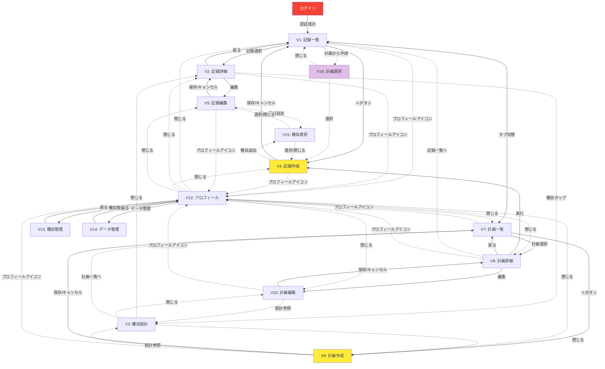

# ナビゲーション構造

steering/04-navigation-structure-design.mdの内容をもとに、ナビゲーション構造設計を行います。

## メタ情報

- **バージョン**: 1.0
- **最終更新**: 2025-10-05
- **対象アプリ**: iOS, Web

## 入口と目標地点

- **入口**: Login
- **メインランディング**: V1（記録一覧）
- **目標地点**:
  - V4（記録作成）
  - V9（計画作成）

## ノード定義

### 認証

#### Login: ログイン

- **タイプ**: screen
- **状態候補**: なし

### 記録タブ

#### V1: 記録一覧

- **タイプ**: screen
- **状態候補**: empty?, loading?

#### V2: 記録詳細

- **タイプ**: screen
- **状態候補**: loading?, error?

#### V4: 記録作成

- **タイプ**: screen
- **状態候補**: なし

#### V5: 記録編集

- **タイプ**: screen
- **状態候補**: なし

### 計画タブ

#### V7: 計画一覧

- **タイプ**: screen
- **状態候補**: empty?, loading?

#### V8: 計画詳細

- **タイプ**: screen
- **状態候補**: loading?, error?

#### V9: 計画作成

- **タイプ**: screen
- **状態候補**: なし

#### V10: 計画編集

- **タイプ**: screen
- **状態候補**: なし

### プロフィール

#### V12: プロフィール

- **タイプ**: screen
- **状態候補**: なし

#### V13: 種目管理

- **タイプ**: screen
- **状態候補**: empty?, loading?

#### V14: データ管理

- **タイプ**: screen
- **状態候補**: なし

### モーダル

#### V3: 種目統計

- **タイプ**: modal
- **状態候補**: empty?, loading?, error?

#### V15: 種目選択

- **タイプ**: modal
- **状態候補**: loading?

#### V16: 計画選択

- **タイプ**: modal
- **状態候補**: empty?, loading?

## エッジ定義（遷移）

### 認証フロー

#### E1: Login → V1（認証成功）

- **トリガー**: 認証成功
- **戻り先**: なし
- **条件候補**: 認証済み
- **モード候補**: replace?
- **副作用候補**: なし

### 記録タブ内

#### E2: V1 → V2（記録選択）

- **トリガー**: 記録選択
- **戻り先**: V1
- **条件候補**: 記録が存在する？
- **モード候補**: push?
- **副作用候補**: なし

#### E3: V1 → V4（＋ボタン）

- **トリガー**: ＋ボタン
- **戻り先**: V1
- **条件候補**: なし
- **モード候補**: push?
- **副作用候補**: なし

#### E4: V1 → V16（計画から作成）

- **トリガー**: 計画から作成
- **戻り先**: V1
- **条件候補**: 計画が存在する？
- **モード候補**: modal?
- **副作用候補**: なし

#### E5: V16 → V4（計画選択）

- **トリガー**: 計画選択
- **戻り先**: V1
- **条件候補**: なし
- **モード候補**: なし
- **副作用候補**: 計画データを初期値として設定？

#### E6: V2 → V5（編集）

- **トリガー**: 編集
- **戻り先**: V2
- **条件候補**: なし
- **モード候補**: push?
- **副作用候補**: なし

#### E7: V4 → V15（種目追加）

- **トリガー**: 種目追加
- **戻り先**: V4
- **条件候補**: なし
- **モード候補**: modal?
- **副作用候補**: なし

#### E8: V5 → V15（種目追加）

- **トリガー**: 種目追加
- **戻り先**: V5
- **条件候補**: なし
- **モード候補**: modal?
- **副作用候補**: なし

#### E9: V4 → V1（保存/キャンセル）

- **トリガー**: 保存/キャンセル
- **戻り先**: なし
- **条件候補**: なし
- **モード候補**: pop?
- **副作用候補**: 保存時はデータ永続化？

#### E10: V5 → V2（保存/キャンセル）

- **トリガー**: 保存/キャンセル
- **戻り先**: なし
- **条件候補**: なし
- **モード候補**: pop?
- **副作用候補**: 保存時はデータ永続化？

### 計画タブ内

#### E11: V7 → V8（計画選択）

- **トリガー**: 計画選択
- **戻り先**: V7
- **条件候補**: 計画が存在する？
- **モード候補**: push?
- **副作用候補**: なし

#### E12: V7 → V9（＋ボタン）

- **トリガー**: ＋ボタン
- **戻り先**: V7
- **条件候補**: なし
- **モード候補**: push?
- **副作用候補**: なし

#### E13: V8 → V10（編集）

- **トリガー**: 編集
- **戻り先**: V8
- **条件候補**: なし
- **モード候補**: push?
- **副作用候補**: なし

#### E14: V8 → V4（実行）

- **トリガー**: 実行
- **戻り先**: V1
- **条件候補**: なし
- **モード候補**: push?
- **副作用候補**: 計画データを初期値として設定？

#### E15: V8 → V1（記録一覧へ）

- **トリガー**: 記録一覧へ
- **戻り先**: なし
- **条件候補**: なし
- **モード候補**: なし
- **副作用候補**: この計画に基づく記録でフィルター？

#### E16: V9 → V3（統計参照）

- **トリガー**: 統計参照
- **戻り先**: V9
- **条件候補**: 種目が選択済み？
- **モード候補**: modal?
- **副作用候補**: なし

#### E17: V10 → V3（統計参照）

- **トリガー**: 統計参照
- **戻り先**: V10
- **条件候補**: 種目が選択済み？
- **モード候補**: modal?
- **副作用候補**: なし

#### E18: V9 → V7（保存/キャンセル）

- **トリガー**: 保存/キャンセル
- **戻り先**: なし
- **条件候補**: なし
- **モード候補**: pop?
- **副作用候補**: 保存時はデータ永続化？

#### E19: V10 → V8（保存/キャンセル）

- **トリガー**: 保存/キャンセル
- **戻り先**: なし
- **条件候補**: なし
- **モード候補**: pop?
- **副作用候補**: 保存時はデータ永続化？

### タブ切替

#### E20: V1 → V7（タブ切替）

- **トリガー**: タブ切替
- **戻り先**: なし
- **条件候補**: なし
- **モード候補**: なし
- **副作用候補**: なし

#### E21: V7 → V1（タブ切替）

- **トリガー**: タブ切替
- **戻り先**: なし
- **条件候補**: なし
- **モード候補**: なし
- **副作用候補**: なし

### 種目統計モーダル

#### E22: V2 → V3（種目タップ）

- **トリガー**: 種目タップ
- **戻り先**: V2
- **条件候補**: なし
- **モード候補**: modal?
- **副作用候補**: なし

#### E23: V3 → V7（計画一覧へ）

- **トリガー**: 計画一覧へ
- **戻り先**: なし
- **条件候補**: なし
- **モード候補**: なし
- **副作用候補**: この種目を含む計画でフィルター？

### プロフィール

#### E24: 任意のビュー → V12（プロフィールアイコン）

- **from**: V1, V2, V4, V5, V7, V8, V9, V10
- **トリガー**: プロフィールアイコン
- **戻り先**: 元のビュー
- **条件候補**: なし
- **モード候補**: modal?/overlay?
- **副作用候補**: なし

#### E25: V12 → V13（種目管理）

- **トリガー**: 種目管理
- **戻り先**: V12
- **条件候補**: なし
- **モード候補**: push?
- **副作用候補**: なし

#### E26: V12 → V14（データ管理）

- **トリガー**: データ管理
- **戻り先**: V12
- **条件候補**: なし
- **モード候補**: push?
- **副作用候補**: なし

## 例外経路（候補）

### セッション切れ

- **from**: 任意のビュー
- **to**: Login
- **条件**: セッション切れ
- **モード候補**: replace?

### 空状態の誘導

#### V1（記録一覧）が空の場合

- **アクション候補**: オンボーディング表示？

#### V7（計画一覧）が空の場合

- **アクション候補**: 計画作成を促す？

#### V16（計画選択）が空の場合

- **アクション候補**: 計画作成への誘導？

## ナビゲーション図（Mermaid）

## 備考

### V6/V11（計画から記録作成）について

- V6/V11は**独立したビューではなく、V4（記録作成）の初期値設定パターン**として扱う
- フレーム構造の修正が必要:
  - V6/V11の削除
  - V16（計画選択モーダル）の追加

### 候補属性について

- 状態候補（states）、条件候補（guard）、モード候補（mode）、副作用候補（effect）は**候補レベル**で付記
- 確定は終盤フェーズ（プラットフォーム適合／インタラクション設計）で行う

### 未接続ノードチェック

- 全ノードがLoginからV1経由で到達可能であることを確認済み
