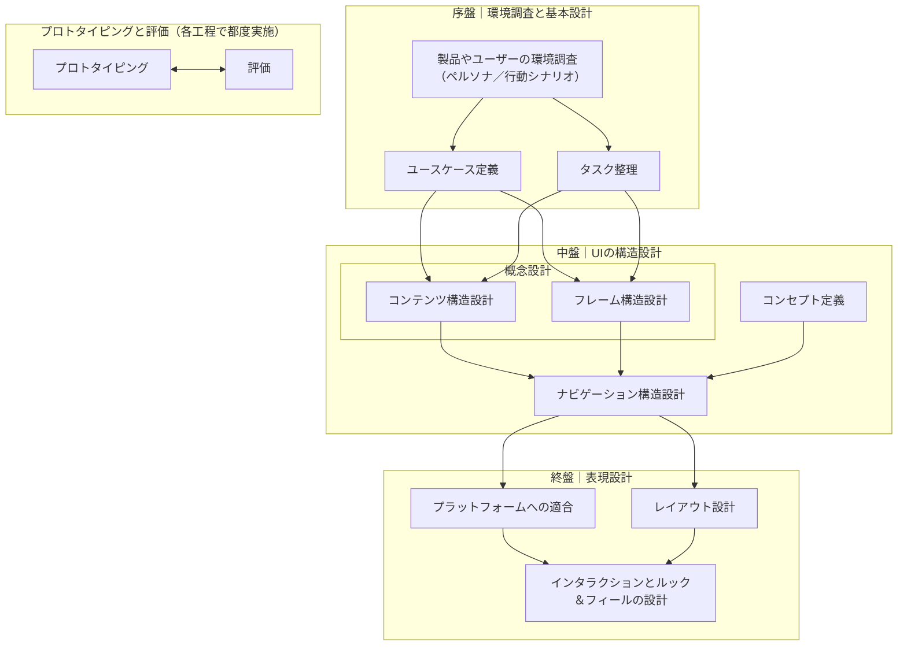

# モデルベースUIデザイン

モデルベースUIデザイン（Model-Based UI Design: MBUD）は、ロジカルに設計を重ねながら必要な成果物を形作っていき、矛盾のないUI構成を目指します。

## ワークフロー

基本方針：画面ではなく**モデル**から設計する。序盤は必要に応じて**往復**し、独立できるところは**並行**で進める。

  
### 並行が推奨される組み合わせ

- **ユースケース定義 ⇄ タスク整理**：相互に気づきを与えるので序盤から並行。
- **コンテンツ構造 ⇄ フレーム構造**：中身と枠はセットで検討。
- **プラットフォームへの適合 ⇄ インタラクションとルック＆フィールの設計**：作法と触り心地は相互依存。

### 典型的な往復トリガー

- ユースケース定義に「目的語の曖昧さ」や「例外の抜け」が見つかった
- タスク整理のCRUD粒度が実行感と合わない
- コンセプトの定義が重複/過不足（集合と要素の混同など）
- ナビゲーションで回遊に詰まり（入口/帰着点/戻るの設計不備）
- プラットフォーム適合とイディオムに反して操作が冗長
- 評価で“迷い・待ち・誤操作”が顕在化
