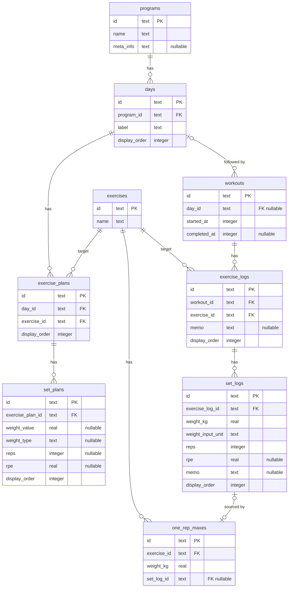
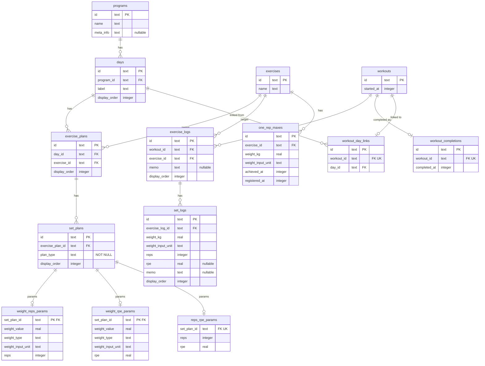
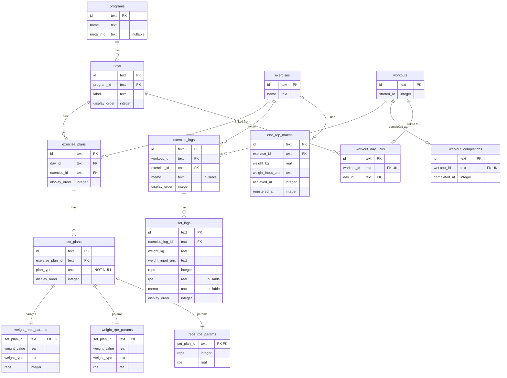

# ERD設計: Next Lift（システム全体）

## ステータス

- 状態: 完了
- 現在のフェーズ: 5/5（完了）
- 最終更新: 2026-04-16

## 要件サマリー

- 対象: Next Lift - トレーニング記録・管理システム全体
- 要件ドキュメント: docs/project/ui-design/（UI設計ドキュメント一式）
  - docs/project/ui-design/domain-model.md: ドメインモデル（ユースケース27件、概念オブジェクト9種）
  - docs/project/ui-design/behavioral-scenarios.md: 行動シナリオ
  - docs/project/ui-design/views-and-navigation.md: ビューとナビゲーション
- 補足事項:
  - Per-User Database構成のため、各テーブルにuser_idカラムは不要（DB自体がユーザーに紐づく）
  - 認証関連テーブル（user, account, session, verification, per_user_database）はBetter Authが管理する認証DBに配置済み。本ERDのスコープ外
  - 既存のPer-User DBスキーマは仮（testTable）のみ。本格設計はこれから
  - 既存の命名規則: snake_case、タイムスタンプはms精度（timestamp_ms）
  - ORM: Drizzle ORM（sqlite-core）

## 外部サービス依存

| 領域 | サービス | ERDへの影響 |
| --- | --- | --- |
| 認証 | Better Auth | 認証DBで管理。Per-User DBのスコープ外 |
| DB | Turso（Per-User Database） | ユーザーごとに独立したSQLite DB。user_idカラム不要 |
| 決済 | なし（現時点） | - |
| ファイルストレージ | なし（現時点） | - |
| 通知 | なし（現時点） | - |

## フェーズ1: エンティティの抽出

### エンティティ一覧

| エンティティ名 | 種別 | 主要属性 |
| --- | --- | --- |
| プログラム | リソース | プログラム名、メタ情報（任意） |
| Day | リソース | ラベル、表示順 |
| 種目計画 | リソース | 表示順 |
| セット計画 | リソース | 重量指定（kg値 or %1RM値）、重量指定方法（kg / %1RM）、回数、RPE、表示順 |
| ワークアウト | イベント | 実施日時、完了日時（任意） |
| 種目記録 | イベント | メモ（任意）、表示順 |
| セット記録 | イベント | 重量(kg)、回数、RPE（任意）、メモ（任意）、表示順 |
| 種目 | リソース | 種目名 |
| 1RM | リソース | 重量値(kg) |

### 議論ログ

#### ステップ1: エンティティの洗い出し

**イベント系の特定（「〜する」「〜日」テスト）:**

| 候補 | 「〜する」 | 「〜日」 | 判定 |
| --- | --- | --- | --- |
| ワークアウト | ワークアウトする △ | ワークアウト日 ✓ | イベント: ジム1回分の実行記録 |
| 種目記録 | 種目を記録する ✓ | 記録日 ✓ | イベント: ワークアウト内の1種目分の記録群 |
| セット記録 | セットを記録する ✓ | 記録日 ✓ | イベント: 1セット分の実績 |

**リソース系の浮上（イベント系の「誰が」「何を」「どこで」から）:**

| 候補 | 浮上元 | 「〜名」 | 判定 |
| --- | --- | --- | --- |
| プログラム | ワークアウトの「何のプログラムに沿って」 | プログラム名 ✓ | リソース: トレーニング計画の単位 |
| Day | ワークアウトの「どのDayを実施」 | Dayラベル ✓ | リソース: プログラム内の1日分の計画単位 |
| 種目計画 | セット計画の「どの種目の計画群」 | - | リソース: Day内の1種目分のセット群（計画側） |
| セット計画 | 種目計画の「各セットのパラメータ」 | - | リソース: 1セット分のパラメータ |
| 種目 | 種目計画/種目記録の「対象種目」 | 種目名 ✓ | リソース: トレーニングで行う動作の種類 |
| 1RM | 種目の「現在の最大挙上重量」 | - | リソース: 種目ごとの最大挙上重量 |

**Per-User DB構成により除外:**
- トレーニー（ユーザー）: DB自体がユーザーに紐づくため、Per-User DB内にユーザーテーブルは不要

#### ステップ2: 属性の列挙

**プログラム（リソース）:**
- プログラム名: 識別用の名前
- メタ情報: 漸進ルール等のフリーテキスト（任意）。UC_A_5

**Day（リソース）:**
- ラベル: Day識別用の名称（必須、デフォルト値あり "Day 1"等）。設計判断#15
- 表示順: プログラム内でのDayの並び順

**種目計画（リソース）:**
- 表示順: Day内での種目の並び順
- （参照: 種目、Day）

**セット計画（リソース）:**
- 重量指定: kg値または%1RM値。設計判断#18
- 重量指定方法: kgか%1RMかの区分。設計判断#18
- 回数: レップ数
- RPE: 主観的運動強度。設計判断#6
- 表示順: 種目計画内でのセットの並び順
- ※3パラメータのうち2つを指定（重量+回数 / 重量+RPE / 回数+RPE）。設計判断#18

**ワークアウト（イベント）:**
- 実施日時: トレーニングの実施日時
- 完了日時: ワークアウト完了の日時（任意）。UC_B_5
- （参照: Day（任意）。設計判断#20）

**種目記録（イベント）:**
- メモ: 種目に対するメモ（任意）。設計判断#16
- 表示順: ワークアウト内での種目の並び順
- （参照: 種目、ワークアウト）

**セット記録（イベント）:**
- 重量: 実際に使用した重量(kg)
- 回数: 実際のレップ数
- RPE: 主観的運動強度（任意）。UC_B_4
- メモ: セットに対するメモ（任意）。UC_B_4
- 表示順: 種目記録内でのセットの並び順
- （参照: 種目記録）

**種目（リソース）:**
- 種目名: 種目の名称。UC_A_9

**1RM（リソース）:**
- 重量値: 最大挙上重量(kg)。UC_D_1
- （参照: 種目、セット記録（任意）。設計判断#22）

#### ステップ3: イベントの漏れ検出

**入力と出力の対:**
- プログラム作成(UC_A_1) ↔ プログラム削除(UC_A_7) ✓
- 種目登録(UC_A_10) ↔ 種目削除(UC_A_11) ✓
- 1RM登録(UC_D_1) ↔ 1RM削除(UC_D_3) ✓
- ワークアウト開始 ↔ ワークアウト完了(UC_B_5) ✓ ワークアウト完了は状態遷移として扱い、完了日時の属性で表現
- ワークアウト記録 ↔ ワークアウト削除(UC_B_6) ✓

**状態遷移の確認:**
- ワークアウト: 進行中 → 完了。完了日時がnullなら進行中、値があれば完了。「あるときだけ値が入る」パターンに該当。完了を独立イベントにするかフラグで表現するかの判断はフェーズ3で扱う

**「あるときだけ値が入る」属性:**
- ワークアウトの完了日時: 進行中のときはnull → 「ワークアウト完了」イベントが隠れている。ただし、ワークアウト完了(UC_B_5)は既に識別済みで、表現方法はフェーズ3で扱う
- 1RMのセット記録参照: アプリ外申告時はnull → これは属性の任意性であり隠れたイベントではない
- セット計画のパラメータ: 3つのうち2つを指定するため、1つは常にnull → ドメインルールに基づく属性の任意性

**前後に隠れたイベント:**
- プログラム複製(UC_A_2)は新規作成の一形態であり、独立エンティティではない
- e1RM算出(UC_E_1)は導出ビュー（設計判断#19）であり、エンティティではない

**導出ビューの除外確認（設計判断#19に基づき、以下はエンティティとしない）:**
- e1RM: セット記録から算出される導出値
- %1RM: セット記録の重量 / 1RMで算出
- ボリューム: セット記録の重量×回数で算出
- 計画実績比較: セット計画とセット記録の対比で導出
- 重量推移: セット記録の時系列集計で導出

## フェーズ2: 正規化

### 変更点

- フェーズ1の9エンティティをRDBテーブル定義に変換（エンティティ名→テーブル名、属性→カラム名+型）
- 全テーブルにサロゲートキー `id` (text PK) を追加
- 参照属性を外部キー (`xxx_id`) に変換
- 導出項目の検討を実施（排除対象なし）
- 繰り返しデータ・ヘッダディテール分離・値の重複・リソース統合の検討を実施（変更なし）

### Mermaid ERD

### 議論ログ

#### ステップ1: エンティティをテーブルに変換する

**テーブル名の変換:**

| エンティティ名（日本語） | テーブル名（英語snake_case） | 備考 |
| --- | --- | --- |
| プログラム | programs | 複数形 |
| Day | days | 複数形 |
| 種目計画 | exercise_plans | 複数形 |
| セット計画 | set_plans | 複数形 |
| ワークアウト | workouts | 複数形 |
| 種目記録 | exercise_logs | 「記録」= log。複数形 |
| セット記録 | set_logs | 「記録」= log。複数形 |
| 種目 | exercises | 複数形 |
| 1RM | one_rep_maxes | 「1 Rep Max」の略。複数形 |

**テーブル名の複数形/単数形の設計判断:**

既存の認証DBテーブルはBetter Authの規約に従い単数形（`user`, `session`, `account`）を使用している。Per-User DBのテーブル名は独立して命名規則を決定できる。

- Pros(複数形): テーブルが「レコードの集合」であることを表現する。SQLの慣習として広く使われる。Drizzle ORMの公式ドキュメントも複数形を採用
- Pros(単数形): 認証DBとの一貫性。Better Authの規約に合わせられる
- 判断: **複数形を採用**。認証DBはBetter Authの自動生成であり命名規則の先例としない。Per-User DBは独自のドメインスキーマであり、SQL慣習に従う

**カラム名・型の変換:**

| カラム | 型 | 備考 |
| --- | --- | --- |
| id | text PK | サロゲートキー。既存コードベースに合わせてtext型 |
| name, label, memo | text | テキスト属性 |
| meta_info | text (nullable) | フリーテキスト。任意項目 |
| display_order | integer | 表示順 |
| weight_value | real (nullable) | セット計画の重量指定値（kg値 or %1RM値）。小数を扱うためreal型 |
| weight_type | text (nullable) | 重量指定方法（"kg" / "percent_1rm"）。enum/CHECK制約なし |
| reps | integer (nullable) | 回数 |
| rpe | real (nullable) | RPE。小数（7.5等）を扱うためreal型 |
| weight_kg | real | 重量(kg)。セット記録は実績値のため必須。1RMも必須 |
| started_at | integer | ワークアウト実施日時。ms精度timestamp |
| completed_at | integer (nullable) | ワークアウト完了日時。進行中はnull |
| xxx_id | text FK | 外部キー |

**タイムスタンプ命名の検討（テーブル設計ルール準拠）:**

- ワークアウトの「実施日時」→ `started_at`: トレーニングを開始した事実を記録。`created_at`ではなく、ドメインの事実に即した名前
- ワークアウトの「完了日時」→ `completed_at`: ワークアウトを完了した事実を記録
- ~~`created_at` / `updated_at`は使用しない~~: 各テーブルに一律で付与する汎用タイムスタンプは不要。ドメインイベントの日時が必要な箇所にのみ、事実に即した名前で追加

**セット計画のカラム設計（設計判断#18対応）:**

セット計画は「3パラメータのうち2つを指定」するルール。3パターン:
1. 重量+回数: weight_value, weight_type, reps を設定。rpeはnull
2. 重量+RPE: weight_value, weight_type, rpe を設定。repsはnull
3. 回数+RPE: reps, rpe を設定。weight_value, weight_typeはnull

4カラム（weight_value, weight_type, reps, rpe）をすべてnullableにし、アプリ側のバリデーションで「2つ以上指定」を強制する。DB側にCHECK制約は設けない（プロジェクトルール: enum/CHECK制約禁止）。

**1RMテーブルの設計:**

1RMは「種目ごとに0または1つ」の関係（コンテンツ構造図の多重度: 種目 1→0..1 1RM）。設計選択肢:
- (a) exercisesテーブルに `one_rep_max_kg` カラムを追加: 1RMのセット記録参照を持てない
- (b) one_rep_maxes テーブルとして独立: セット記録への参照を持てる。設計判断#22で参照を持たせることが決定済み

→ **(b)を採用**。`one_rep_maxes` テーブルに `exercise_id` (FK), `weight_kg`, `set_log_id` (FK nullable) を持たせる。

#### ステップ2: ヘッダ・ディテール分離の検討

**確認対象:**

| 候補 | 判断 | 理由 |
| --- | --- | --- |
| ワークアウト→種目記録→セット記録 | 分離不要 | すでにフェーズ1で3層に分離済み。ワークアウトがヘッダ、種目記録が中間層、セット記録がディテールに相当する構造。明細全体をまとめて扱う計算（合計ボリューム等）は導出ビューで算出する方針（設計判断#4） |
| プログラム→Day→種目計画→セット計画 | 分離不要 | 同上。すでに4層に分離済み |

#### ステップ3: 繰り返しデータの確認

各テーブルのカラムに、同じ種類のデータが複数並んでいるケースがないか確認:

| テーブル | 確認結果 |
| --- | --- |
| programs | 繰り返しなし |
| days | 繰り返しなし。program_idで親参照 |
| exercise_plans | 繰り返しなし。day_id + exercise_idで参照 |
| set_plans | 繰り返しなし。exercise_plan_idで親参照 |
| exercises | 繰り返しなし |
| one_rep_maxes | 繰り返しなし |
| workouts | 繰り返しなし |
| exercise_logs | 繰り返しなし |
| set_logs | 繰り返しなし |

フェーズ1のドメインモデリングで適切に分離されており、繰り返しデータは検出されなかった。

#### ステップ4: 値の重複の確認

| 確認箇所 | 結果 | 理由 |
| --- | --- | --- |
| exercise_plans.exercise_id → exercises | OK | 種目名はexercisesテーブルで管理。exercise_plansに種目名を持たせていない |
| exercise_logs.exercise_id → exercises | OK | 同上 |
| set_plans の weight_value と set_logs の weight_kg | 別の事実 | set_plansの重量は「計画値」、set_logsの重量は「実績値」。計画と実績は独立した事実であり、同じ値であっても別に持つのが正しい（正規化の原則: 「この値が変わったとき、関連するデータも連動して変わるべきか？」→ 連動しない）|
| set_plans の reps と set_logs の reps | 別の事実 | 同上。計画レップ数と実績レップ数は独立 |
| one_rep_maxes の weight_kg と set_logs の weight_kg | 別の事実 | 1RMは「現在の最大挙上重量」、set_logsの重量は「そのセットで使用した重量」。1RM更新後もセット記録の値は変わらない |

#### ステップ5: リソース統合の確認

同じ実体を指す別名のエンティティがないか確認:

| 候補ペア | 判断 | 理由 |
| --- | --- | --- |
| exercise_plans と exercise_logs | 統合しない | 「計画」と「記録」は異なる種別のエンティティ（リソースとイベント）。同じ種目を対象とするが、計画は事前のパラメータ定義、記録は事後の実績記録であり、ライフサイクルが異なる |
| set_plans と set_logs | 統合しない | 同上。計画パラメータと実績記録は独立した事実 |
| programs の name と exercises の name | 異なる属性 | プログラム名と種目名は別の実体の属性 |

フェーズ1のドメインモデリングで概念オブジェクトが適切に識別されており、別名の重複エンティティは検出されなかった。

#### ステップ6: 導出項目の整理

**6-1. 導出項目の候補洗い出し:**

| 候補 | テーブル | 導出元 |
| --- | --- | --- |
| セットのボリューム（重量 x 回数） | set_logs | weight_kg × reps |
| 種目のボリューム合計 | exercise_logs | SUM(set_logs.weight_kg × set_logs.reps) |
| ワークアウトの総ボリューム | workouts | SUM(全set_logsのweight_kg × reps) |
| e1RM（推定1RM） | set_logs | Epley公式等で算出（weight_kg × (1 + reps / 30)） |
| %1RM | set_logs + one_rep_maxes | set_logs.weight_kg / one_rep_maxes.weight_kg × 100 |

**6-2. 可逆性の判断:**

| 候補 | 逆算可能か | 判断 | 理由 |
| --- | --- | --- | --- |
| セットのボリューム | はい | 排除 | weight_kg × repsの単純計算で常に再現可能 |
| 種目のボリューム合計 | はい | 排除 | set_logsのSUM集計で常に再現可能 |
| ワークアウトの総ボリューム | はい | 排除 | set_logsのSUM集計で常に再現可能 |
| e1RM | はい | 排除 | 公式による計算で常に再現可能（設計判断#19で導出ビュー方針確定済み） |
| %1RM | はい | 排除 | 除算で常に再現可能 |

全候補が逆算可能であり、テーブルに持たせる導出項目はない。

**6-3. 排除した導出項目の代替手段:**

| 導出項目 | 代替手段 | 理由 |
| --- | --- | --- |
| セットのボリューム | アプリケーション側で計算 | 表示時にのみ必要。`weight_kg * reps` の単純計算 |
| 種目/ワークアウトのボリューム合計 | アプリケーション側で計算またはビュー | 集計が必要だがパーソナルユースでデータ量が限定的 |
| e1RM | アプリケーション側で計算 | Epley公式等のアルゴリズムをプログラムで表現する方が自然（設計判断#19） |
| %1RM | アプリケーション側で計算 | 除算のみ。1RM未設定時は計算不可 |

パーソナルユースのため、パフォーマンスのためのキャッシュカラムは初期段階では不要。将来パフォーマンス問題が顕在化した場合にのみ検討する。

## フェーズ3: 表現方法の設計

### 変更点

- workoutsテーブルのcompleted_atカラムを削除し、workout_completionsテーブルに分離（NULLable日時カラムのイベントテーブル分離）
- one_rep_maxesテーブルをイベント化（INSERT only）。registered_atカラムを追加し、最新レコードが「現在の1RM」を表す
- set_plansを基底テーブル + 3パラメータテーブルに分割（weight_reps_params, weight_rpe_params, reps_rpe_params）。nullable完全排除
- workouts.day_idを削除し、workout_day_linksテーブルに分離（nullable FK排除）
- one_rep_maxes.set_log_idを削除し、achieved_atカラムを追加（set_logsとの結合度低減、nullable FK排除）
- nullable FKを全廃達成

### 設計判断

| 対象 | 種別/変更パターン | 判断 | 理由 |
| --- | --- | --- | --- |
| set_plans.weight_type（kg/%1RM） | サブセット | 区分カラムで維持 | 種別間で属性の差がなく、単なるラベル。weight_valueの解釈が異なるだけ。将来VBT等が追加されてもweight_typeの値追加で対応可能 |
| one_rep_maxes の出どころ | サブセット | 明示的な区分カラム不要 | set_log_idを削除したため暗黙的な区別は不要に。1RMは全てユーザーが達成日時と共に入力する値として統一。属性の差がない |
| programs, days, exercise_plans, set_plans のUPDATE | 変更モデル | UPDATE管理 | 計画データの「現在の状態」のみが重要。変更履歴の要件なし。将来必要になった場合はイベントソーシングテーブルを追加可能 |
| exercises.name のUPDATE | 変更モデル | UPDATE管理 | 名前変更はIDベースの参照に影響しない。変更履歴の要件なし |
| workouts.completed_at | NULLable日時 → イベントテーブル分離 | workout_completionsテーブルに分離 | UPDATE回避。「ワークアウト完了」イベントが独立テーブルとして明示される。将来「完了メモ」等の属性追加が容易。完了の取り消しも行の削除で表現可能 |
| one_rep_maxes のUPDATE | 変更モデル | イベント化（INSERT only + registered_at） | 1RMはトレーニーにとって重要な指標。推移追跡（過去の1RMがいつ何kgだったか）のシナリオがありうる。UPDATE回避 |
| set_logs, exercise_logs のUPDATE | 変更モデル | UPDATE管理 | 入力ミスの訂正が主目的。修正履歴の追跡は不要（パーソナルアプリ）|
| 各テーブルの物理DELETE | 変更モデル | 物理DELETE管理 | パーソナルアプリで論理削除の必要性なし。計画削除後もワークアウト記録は独立して残る |
| set_plans の「2 of 3」パラメータ | サブタイプテーブル分割 | 基底テーブル + 3パラメータテーブルに分割 | nullableカラムを完全排除。plan_typeで組み合わせを明示し、各パラメータテーブルは全カラムNOT NULL。「2 of 3」制約を構造的に表現 |
| workouts.day_id（nullable FK） | nullable FK → リンクテーブル分離 | workout_day_linksテーブルに分離 | nullable FK排除。Dayに紐づかないワークアウトはリンク行が存在しないことで表現 |
| one_rep_maxes.set_log_id → achieved_at | nullable FK削除 + 属性追加 | set_log_idを削除しachieved_atを追加 | set_logsとの結合度を下げる。nullable FK排除。achieved_atはユーザー入力の達成日時（推移グラフのX軸） |
| exercise_logs.memo, set_logs.rpe/memo | nullable属性 | nullable維持 | 「入力しなかった」= 該当なしの意味でNULLの用途が明確。RPE検索はWHERE rpe IS NOT NULL AND rpe >= 8で対応可能。set_logsは最もクエリ頻度が高いテーブルのため不要なLEFT JOINを避ける |
| lbs対応 | 初期スコープ | weight_input_unitカラムを4テーブルに追加 | 内部kg統一 + 表示層変換。per-record単位保存で種目別デフォルト単位を実現。ジム内kg/lbs混在・複数ジム利用に対応 |
| 種目カテゴリ | 将来拡張 | 現時点でERD変更なし | exercisesへのカラム追加やリンクテーブルで後方互換対応可能。カテゴリの軸（部位/器具/動作パターン）が未定のため早期の構造決定は避ける |

### Mermaid ERD

### 議論ログ

#### ステップ1: サブセットの判断

**1-1. 種別・区分のあるエンティティの特定:**

| エンティティ | 種別の有無 | 分析 |
| --- | --- | --- |
| programs | なし | プログラムに種別はない |
| days | なし | Dayに種別はない |
| exercise_plans | なし | 種目計画に種別はない |
| set_plans | あり（weight_type: kg/%1RM） | 重量指定方法の区分。種別間で属性の差がなく、単なるラベル |
| exercises | なし | 部位カテゴリ等の種別を持たない方針（行動シナリオ設計判断） |
| one_rep_maxes | 検討 | set_log_idの有無で暗黙的に出どころを区別。明示的な区分不要 |

**1-2. 判断:**

- set_plans.weight_type → 区分カラムで十分。属性の差がない
- one_rep_maxes の出どころ → 区分カラム不要。set_log_idの有無で区別可能

結論: サブセット分割が必要なエンティティはなし。

#### ステップ2: 変更モデルの設計

**NULLableカラムの精査:**

| テーブル | カラム | NULLableの種類 | 3点チェック | 判断 |
| --- | --- | --- | --- | --- |
| programs | meta_info | NULLable属性 | 3値論理: 非該当、NULL伝播: 非該当、パフォーマンス: 非該当 | NULLable許容 |
| set_plans | weight_value, weight_type, reps, rpe | 「2 of 3」属性群 | - | サブタイプテーブル分割（weight_reps_params, weight_rpe_params, reps_rpe_params）。nullable完全排除 |
| workouts | completed_at | NULLable日時 | - | イベントテーブルに分離 → workout_completions |
| workouts | day_id | NULLable FK | - | workout_day_linksテーブルに分離。nullable FK排除 |
| exercise_logs | memo | NULLable属性 | 全て非該当 | NULLable許容 |
| set_logs | rpe, memo | NULLable属性 | 全て非該当 | NULLable許容 |
| one_rep_maxes | set_log_id | NULLable FK | - | 削除。achieved_atを追加。set_logsとの結合度低減、nullable FK排除 |

**workouts.completed_at のイベントテーブル分離:**

- 選択肢: (a) workout_completionsテーブルに分離 vs (b) 現状維持（completed_atカラム）
- Pros(a): UPDATE回避。完了イベントが明示的。将来の属性追加が容易。完了取り消しが行の削除で表現可能
- Pros(b): テーブル構造がシンプル。JOINなしで状態判定可能
- Cons(a): テーブル数増加。JOINが必要（ただしテーブル設計ルールで理由にならない）
- Cons(b): UPDATE操作が発生。完了履歴を追跡不可
- 判断: **(a) workout_completionsテーブルに分離**

**one_rep_maxes のイベント化:**

- 選択肢: (a) INSERT only + registered_at vs (b) 現状維持（UPDATE管理）
- Pros(a): 1RM推移の追跡が可能。UPDATE回避。「1RM登録」イベントが明示的
- Pros(b): 構造がシンプル。最新の1RMをJOINなしで取得可能
- Cons(a): 最新の1RM取得にサブクエリが必要
- Cons(b): 過去の1RM値が失われる。将来1RM推移が必要な場合に履歴テーブルの追加が必要
- 判断: **(a) イベント化**。1RMはトレーニーにとって重要な指標であり、推移追跡のシナリオがありうる

**1RM削除（UC_D_3）の表現:**

イベント化した場合の1RM削除の表現方法を検討:
- (a-1) weight_kg = nullの行を挿入 → weight_kgがnullableになるのが不自然
- (a-2) 該当exercise_idの全レコードを物理DELETE → DELETE操作だが「未設定に戻す」操作として許容
- (a-3) cleared_atカラム追加 → カラム追加で複雑化
- (a-4) current_one_rep_maxポインタテーブル → テーブル数増加
- 暫定判断: **(a-2) 物理DELETE**。「未設定に戻す」操作であり、削除履歴の保持は不要。⚠️ 要確認

**UPDATE/DELETEカラムの精査:**

| グループ | 対象 | 判断 | 理由 |
| --- | --- | --- | --- |
| プログラム計画系 | programs, days, exercise_plans, set_plans | UPDATE管理 | 「現在の状態」のみ重要。変更履歴の要件なし |
| 種目名 | exercises.name | UPDATE管理 | IDベースの参照に影響しない。変更履歴不要 |
| セット記録 | set_logs | UPDATE管理 | 入力ミスの訂正。修正履歴不要 |
| 種目記録 | exercise_logs | UPDATE管理 | 同上 |
| 各テーブルのDELETE | 全テーブル | 物理DELETE | パーソナルアプリで論理削除不要 |

#### ユーザーフィードバック対応

フェーズ3完了後のユーザーフィードバックに基づき、以下の変更を実施した。

**F1: lbs対応 → 初期スコープに組み込み。weight_input_unit カラムを追加**

内部kg統一 + 表示層変換の方針は維持。ジム内でkg/lbs機器が混在するケースや複数ジム利用のケースがあり、グローバル設定の表示単位だけでは不足するため、per-recordでの入力単位保存が必要。「この種目は前回lbsで入力したから、デフォルトでlbsをプリセットする」という種目別デフォルト単位の機能を初期スコープで実装する。

追加カラム:
- set_logs: weight_input_unit text NOT NULL（実績の入力単位。"kg" / "lbs"）
- one_rep_maxes: weight_input_unit text NOT NULL（1RMの入力単位）
- weight_reps_params: weight_input_unit text NOT NULL（計画の入力単位。weight_type="percent_1rm"時は無関係だがNOT NULLで統一）
- weight_rpe_params: weight_input_unit text NOT NULL（同上）

種目別デフォルト単位の導出: `SELECT sl.weight_input_unit FROM set_logs sl JOIN exercise_logs el ON sl.exercise_log_id = el.id WHERE el.exercise_id = ? ORDER BY sl.id DESC LIMIT 1`

**F2-1: workouts.day_id → workout_day_linksテーブルに分離**

nullable FKを排除するため、workoutsからday_idカラムを削除し、workout_day_links（id, workout_id FK UK, day_id FK）テーブルを新設。Dayに紐づかないワークアウト（フリートレーニング）はリンク行が存在しないことで表現する。workout_idにUK制約を付与し、1ワークアウト = 最大1 Dayの関係を維持。

**F2-2: set_plans → サブタイプテーブル分割**

set_plansの「3パラメータのうち2つを指定」ルールにより発生していたnullableカラム（weight_value, weight_type, reps, rpe）を完全排除するため、基底テーブル + 3パラメータテーブルに分割。

- set_plans: id, exercise_plan_id FK, plan_type text NOT NULL ("weight_reps" / "weight_rpe" / "reps_rpe"), display_order
- weight_reps_params: set_plan_id FK UK, weight_value real, weight_type text, reps integer（全NOT NULL）
- weight_rpe_params: set_plan_id FK UK, weight_value real, weight_type text, rpe real（全NOT NULL）
- reps_rpe_params: set_plan_id FK UK, reps integer, rpe real（全NOT NULL）

plan_typeで組み合わせを明示し、「2 of 3」制約を構造的に表現。weightsの共通テーブル化は不要と判断（weightは独立エンティティではなく、セット計画に埋め込まれた値オブジェクト）。

**F2-3: memo/rpe → nullable維持**

exercise_logs.memo, set_logs.rpe, set_logs.memoのnullableは維持。「入力しなかった」= 該当なしの意味でNULLの用途が明確。RPE検索は `WHERE rpe IS NOT NULL AND rpe >= 8` で対応可能。set_logsは最もクエリ頻度が高いテーブルのため、不要なLEFT JOINを避ける。

**F3: 種目カテゴリ → 現時点で変更不要**

exercisesテーブルへのカラム追加やリンクテーブル追加で後方互換対応可能。カテゴリの軸（部位/器具/動作パターン）が未定のため早期の構造決定は避ける。

**F4: one_rep_maxes → set_log_id削除、achieved_at追加**

one_rep_maxesからset_log_idカラムを削除し、achieved_at integer NOT NULLを追加。変更後: one_rep_maxes（id, exercise_id FK, weight_kg, achieved_at, registered_at）。

- set_logsとの結合度が下がり、ワークアウト削除時の影響処理が不要に
- achieved_at: ユーザーが入力する達成日時（推移グラフのX軸）
- registered_at: システム自動設定の登録日時（維持）
- set_logs |o--o| one_rep_maxes の関係線を削除
- 具体的なセット記録が必要な場合は検索で到達可能（achieved_at + exercise_id で期間を絞り、set_logsを検索）

**F5-1: ワークアウト完了取り消し**

workout_completions行の物理DELETEで対応。既にworkout_completionsテーブルに分離済みの構造であり、追加の変更は不要。

**F5-2: 1RM削除（UC_D_3）**

該当exercise_idの全レコードを物理DELETE。「クリア」= 完全リセットの意味。暫定判断(a-2)を確定。

#### weight_type + weight_value 方式の検証

set_plansのサブタイプテーブル（weight_reps_params, weight_rpe_params）で採用している weight_value (real) + weight_type (text) の方式について、安全性と将来拡張性を検証した。

**weight_type の意味の整理:**

weight_type は「単位」ではなく「重量指定の種類」を表す区分値:
- "kg": 絶対重量指定（値はkg単位で保存。lbs入力時もkgに変換して保存する）
- "percent_1rm": 1RMに対する相対指定（値は%。実重量への解決は表示時に1RMを参照して行う）

lbs対応は weight_type の値追加ではなく、表示層での変換 + per-record の weight_input_unit カラムで対応する。weight_input_unitは初期スコープでset_logs, one_rep_maxes, weight_reps_params, weight_rpe_paramsに追加済み。

**リスク分析:**

| リスク | 深刻度 | 理由 |
| --- | --- | --- |
| 型安全性: weight_value=80 が 80kg か 80% か weight_type に依存 | 低 | plan_type も同パターン。プロジェクト全体でアプリ側バリデーション方針 |
| 値の範囲: kg(0〜500) と %(0〜200) が同一カラムに混在 | 低 | weight_type ごとにアプリ側で範囲検証 |
| 横断クエリ: 「重量100kg以上のセット計画」を型横断で検索困難 | 低 | 計画の重量横断検索は現要件にない |
| %1RM解決不能: 1RM未設定/削除時に実重量へ変換できない | なし | 設計判断#47で対応済み（%1RM指定保持+UI警告） |
| 将来の重量指定方式: single-value で表現できない方式の可能性 | 中（後述） | サブタイプテーブル追加で対応可能 |

**将来の重量指定方式への対応:**

| 将来の可能性 | weight_value で表現可能か | 対応方法 |
| --- | --- | --- |
| %トレーニングマックス | 可能 | weight_type = "percent_tm" + 別途TMの定義 |
| 前回+2.5kg（漸進負荷） | 不可（参照+差分の2値が必要） | 新plan_type + 新サブタイプテーブルで対応 |
| RPEチャートベース | 不可（1RM+RPE+repsの3値から導出） | 同上 |
| VBT（速度ベース） | 不可（目標速度であり重量指定ではない） | 同上 |

single-value で表現できない方式はサブタイプテーブルの追加（新しい plan_type + 新パラメータテーブル）で対応でき、weight_type + weight_value の仕組み自体を変更する必要はない。

**代替案との比較:**

| 代替案 | nullable | テーブル数 | 拡張性 | 不採用理由 |
| --- | --- | --- | --- | --- |
| 型ごとに別カラム（weight_kg?, weight_percent_1rm?） | 復活 | 変わらず | カラム追加が必要 | サブタイプテーブルでnullable排除した意味がなくなる |
| 重量指定をさらにサブタイプ分割 | なし | 5+（組み合わせ爆発） | テーブル追加が必要 | lbs追加で7テーブル・7 plan_type。実用的でない |
| 重量を独立テーブルに抽出 | なし | +1 | 現方式と同等 | 根本構造（value+type）は変わらず、テーブルが増えるだけ |
| 常にkgに変換して保存 | なし | 変わらず | - | %1RMの意味が失われる。1RM変更時に全計画値の再計算が必要 |

**結論:** 現方式（weight_type + weight_value）を維持。nullable を導入せず、最も可能性の高い拡張に対応でき、代替案のトレードオフが大きいため。

**フィードバック対応後のnullable状況:**

- nullableカラム: programs.meta_info, exercise_logs.memo, set_logs.rpe, set_logs.memo（4カラム）
- nullable FK: なし（全廃達成）
- set_plansのnullable: なし（サブタイプテーブルで解消）

## フェーズ4: 関係の設計

### 変更点

- フェーズ3の全リレーションシップに多重度を確定し、Mermaid ERD記号を精査
- programs → days の多重度を `||--|{`（1対1以上）に変更（プログラムは最低1つのDayを持つ）
- exercise_plans → set_plans の多重度を `||--|{`（1対1以上）に変更（種目計画は最低1つのセット計画を持つ）
- workouts → exercise_logs の多重度を `||--|{`（1対1以上）に変更（ワークアウトは最低1種目の記録を持つ）
- exercise_logs → set_logs の多重度を `||--|{`（1対1以上）に変更（種目記録は最低1セットの記録を持つ）
- set_plans → パラメータテーブル3種の多重度を `||--||`（1対1必須）に変更（set_planは必ず1つのパラメータテーブルに対応する）
- N:M関係は検出されず、新規中間テーブルの追加なし
- 非依存リレーションシップの精査を実施し、exercises関連のリレーションシップが非依存であることを確認。既存の構造でnullable FK問題は発生しないことを確認
- 主キー設計を確認: 全テーブルがサロゲートキー（id text PK）を使用する方針を維持。パラメータテーブル3種はset_plan_idがFK兼UKで実質的にPK

### 設計判断

| 対象 | 判断 | 理由 |
| --- | --- | --- |
| programs → days の多重度 | 0以上（オプショナル）を維持 | ドメインモデルの「0..n」を維持。0はプログラム作成途中の状態であり、途中保存を可能にするために必要。「最低1つ」の制約はワークフローの特定ポイント（完了時等）でアプリ側で強制 |
| days → exercise_plans の多重度 | 0以上（オプショナル）を維持 | Dayが存在しても、種目が未配置の状態は正当。Day作成後に種目を段階的に追加するフローがある |
| exercise_plans → set_plans の多重度 | 0以上（オプショナル）を維持 | ドメインモデルの「0..n」を維持。種目計画にセットを追加する前の途中保存状態を許容 |
| workouts → exercise_logs の多重度 | 0以上（オプショナル）を維持 | ワークアウト開始直後（最初のセット記録前）の状態を許容。「最低1種目」はワークアウト完了時にアプリ側で強制 |
| exercise_logs → set_logs の多重度 | 0以上（オプショナル）を維持 | 種目追加直後（セット記録前）の状態を許容。「最低1セット」はワークアウト完了時にアプリ側で強制 |
| set_plans → パラメータテーブル | 1対1必須に変更 | set_planのplan_typeに対応するパラメータテーブルに必ず1行存在する。set_planの意味的な完全性にパラメータが必要 |
| exercises と exercise_plans/exercise_logs/one_rep_maxes の関係 | 非依存リレーションシップ。現構造で問題なし | exercisesは独立マスタ。exercise_plans/exercise_logs/one_rep_maxesはexercise_idをNOT NULL FKで持つが、これは「記録/計画時に必ず種目が指定される」というドメインルールの反映であり、nullable FKの問題は発生しない |
| workouts と workout_day_links の関係 | 非依存リレーションシップ。既にフェーズ3で中間テーブルに分離済み | workoutsは独立（Dayなしのフリートレーニングが可能）。workout_day_linksが交差エンティティとして非依存を適切に表現 |
| パラメータテーブルの主キー | set_plan_id（FK兼UK）を実質的なPKとして使用。独自のidカラムは不要 | 1:1関係で親テーブルのPKで一意に特定可能。独自のidを追加するとJOINのキーが増えるだけで利点がない。Pros(独自id追加): 他テーブルと一貫した構造。Cons(独自id追加): 不要な冗長性。Pros(set_plan_idのみ): シンプル、JOINが自然。Cons(set_plan_idのみ): テーブル間で主キー構造が不統一。判断: パラメータテーブルは子テーブル的性質が強く、独自idは不要 |

### Mermaid ERD

### 議論ログ

#### ステップ1: 多重度の確定

全エンティティペアの関係を「Aから見てBは複数存在するか？」「Bから見てAは複数存在するか？」で判定する。

**計画系の多重度:**

| 関係 | Aから見てB | Bから見てA | 判定 | Mermaid記号 |
| --- | --- | --- | --- | --- |
| programs → days | 1プログラムに複数Day | 1 Dayは1プログラムに属する | 1:N | `\|\|--o{`（1対0以上）。0はプログラム作成途中の状態 |
| days → exercise_plans | 1 Dayに複数種目計画 | 1種目計画は1 Dayに属する | 1:N | `\|\|--o{`（1対0以上）。種目未配置のDayは作成途中で正当 |
| exercise_plans → set_plans | 1種目計画に複数セット計画 | 1セット計画は1種目計画に属する | 1:N | `\|\|--o{`（1対0以上）。セット設定前の途中保存状態を許容 |
| set_plans → weight_reps_params | 1セット計画に0or1 | 1パラメータは1セット計画に属する | 1:0..1 | plan_type="weight_reps"の場合のみ行が存在 |
| set_plans → weight_rpe_params | 1セット計画に0or1 | 1パラメータは1セット計画に属する | 1:0..1 | plan_type="weight_rpe"の場合のみ行が存在 |
| set_plans → reps_rpe_params | 1セット計画に0or1 | 1パラメータは1セット計画に属する | 1:0..1 | plan_type="reps_rpe"の場合のみ行が存在 |

**set_plans → パラメータテーブルのMermaid表記について:**

実際のドメインでは、1つのset_planに対して3つのパラメータテーブルのうち**必ず1つだけ**に行が存在する（plan_typeで排他制御）。Mermaid ERDの記号は個々のリレーションシップ線を表現するため、各線は `||--||`（1対1必須）で記述する。ただし、3本の線が同時に存在するわけではなく、plan_typeの値に応じて1本のみが有効であることをERD図上で完全には表現できない。この排他制御はアプリ側のバリデーションで担保する。

**記録系の多重度:**

| 関係 | Aから見てB | Bから見てA | 判定 | Mermaid記号 |
| --- | --- | --- | --- | --- |
| workouts → exercise_logs | 1ワークアウトに複数種目記録 | 1種目記録は1ワークアウトに属する | 1:N | `\|\|--o{`（1対0以上）。ワークアウト開始直後（最初のセット記録前）の状態を許容 |
| exercise_logs → set_logs | 1種目記録に複数セット記録 | 1セット記録は1種目記録に属する | 1:N | `\|\|--o{`（1対0以上）。種目追加直後（セット記録前）の状態を許容 |
| workouts → workout_completions | 1ワークアウトに0or1完了 | 1完了は1ワークアウトに対応 | 1:0..1 | `\|\|--o\|`。未完了のワークアウトが正当 |
| workouts → workout_day_links | 1ワークアウトに0or1リンク | 1リンクは1ワークアウトに対応 | 1:0..1 | `\|\|--o\|`。Dayに紐づかないフリーワークアウトが正当 |
| days → workout_day_links | 1 Dayに複数リンク | 1リンクは1 Dayに対応 | 1:N | `\|\|--o{`。同じDayを複数回実施可能 |

**マスタ系の多重度:**

| 関係 | Aから見てB | Bから見てA | 判定 | Mermaid記号 |
| --- | --- | --- | --- | --- |
| exercises → exercise_plans | 1種目が複数の種目計画に参照される | 1種目計画は1種目に対応 | 1:N | `\|\|--o{`。未使用の種目が正当 |
| exercises → exercise_logs | 1種目が複数の種目記録に参照される | 1種目記録は1種目に対応 | 1:N | `\|\|--o{`。記録のない種目が正当 |
| exercises → one_rep_maxes | 1種目に複数の1RMレコード（イベント化で履歴） | 1つの1RMレコードは1種目に対応 | 1:N | `\|\|--o{`。1RM未設定の種目が正当 |

**N:Mの確認:**

全リレーションシップを精査した結果、N:M関係は存在しない:
- 種目(exercises)は計画側(exercise_plans)と記録側(exercise_logs)の両方から参照されるが、これは種目マスタが2つの異なる1:N関係で参照されているだけであり、N:Mではない
- 計画(programs/days)と記録(workouts)はworkout_day_linksを介して関連するが、これは1ワークアウト対最大1 Dayの関係（1:0..1）であり、N:Mではない

#### ステップ2: 中間テーブルの導入

N:M関係が検出されなかったため、新規中間テーブルの追加は不要。

既存の中間テーブル（交差エンティティ）の確認:
- **workout_day_links**: workoutsとdaysの非依存リレーションシップを表現する交差エンティティ。フェーズ3でnullable FK排除のために導入済み。1ワークアウト = 最大1 Dayの制約はworkout_idのUK制約で維持

#### ステップ3: 非依存リレーションシップの検討

**依存関係の判定（「Aが存在しなくてもBは存在できるか？」）:**

| 関係 (A → B) | Aなしでも | Bが紐づかない | 判定 | 対処 |
| --- | --- | --- | --- | --- |
| programs → days | Noで依存。Dayはプログラムの構成要素 | No | 依存 | FKを直接持たせてよい（days.program_id NOT NULL） |
| days → exercise_plans | Noで依存。種目計画はDayの構成要素 | No | 依存 | FKを直接持たせてよい（exercise_plans.day_id NOT NULL） |
| exercise_plans → set_plans | Noで依存。セット計画は種目計画の構成要素 | No | 依存 | FKを直接持たせてよい（set_plans.exercise_plan_id NOT NULL） |
| set_plans → パラメータテーブル | Noで依存。パラメータはセット計画の一部 | No | 依存 | FKを直接持たせてよい（set_plan_id NOT NULL） |
| workouts → exercise_logs | Noで依存。種目記録はワークアウトの構成要素 | No | 依存 | FKを直接持たせてよい（exercise_logs.workout_id NOT NULL） |
| exercise_logs → set_logs | Noで依存。セット記録は種目記録の構成要素 | No | 依存 | FKを直接持たせてよい（set_logs.exercise_log_id NOT NULL） |
| workouts → workout_completions | Noで依存。完了はワークアウトのイベント | No | 依存 | FKを直接持たせてよい（workout_completions.workout_id NOT NULL FK UK） |
| workouts → workout_day_links | Yesで非依存。ワークアウトはDay紐づけなしで存在可能 | Yesで非依存。フリーワークアウト | 非依存 | **既にフェーズ3で交差エンティティとして分離済み**。nullable FKの問題なし |
| exercises → exercise_plans | Yesで非依存。種目はマスタとして独立 | Noで依存。種目計画は必ず種目を参照 | 非依存（Aから見て） | exercise_plans.exercise_id NOT NULL FK。種目計画作成時には必ず種目が指定されるため、FKがNULLになる期間は存在しない。交差エンティティ不要 |
| exercises → exercise_logs | Yesで非依存。種目はマスタとして独立 | Noで依存。種目記録は必ず種目を参照 | 非依存（Aから見て） | exercise_logs.exercise_id NOT NULL FK。種目記録作成時には必ず種目が指定される。交差エンティティ不要 |
| exercises → one_rep_maxes | Yesで非依存。種目はマスタとして独立 | Noで依存。1RMは必ず種目に紐づく | 非依存（Aから見て） | one_rep_maxes.exercise_id NOT NULL FK。1RM登録時には必ず種目が指定される。交差エンティティ不要 |
| days → workout_day_links | Yesで非依存。Dayは計画として独立 | - | 非依存 | **既に交差エンティティで表現済み** |

**非依存リレーションシップの精査結果:**

exercises関連の3つの非依存リレーションシップ（exercises → exercise_plans, exercise_logs, one_rep_maxes）について:
- exercises は独立マスタであり、exercise_plans/exercise_logs/one_rep_maxesが0件でも存在しうる（片側が非依存）
- ただし、子テーブル側は作成時に必ずexercise_idが指定される（FKがNULLになるタイミングがない）
- 交差エンティティの導入は不要: 「種目が未定の計画/記録」は存在しないため、FKをNULLableにする必要がない

workouts → workout_day_linksの非依存リレーションシップ:
- フェーズ3で既にworkout_day_links交差エンティティとして分離済み
- Dayに紐づかないワークアウトはリンク行の不存在で表現

**結論:** 非依存リレーションシップでnullable FKが発生するケースはない。全てのFKはNOT NULLを維持。

#### ステップ4: 主キー設計の確認

| テーブル | 主キー | 設計 |
| --- | --- | --- |
| programs | id text PK | サロゲートキー |
| days | id text PK | サロゲートキー |
| exercise_plans | id text PK | サロゲートキー |
| set_plans | id text PK | サロゲートキー |
| weight_reps_params | set_plan_id text PK FK | 親のPKを主キーとして使用。1:1関係のため独自idは不要 |
| weight_rpe_params | set_plan_id text PK FK | 同上 |
| reps_rpe_params | set_plan_id text PK FK | 同上 |
| exercises | id text PK | サロゲートキー |
| one_rep_maxes | id text PK | サロゲートキー。イベント化で同一exercise_idに複数行あるため独自id必要 |
| workouts | id text PK | サロゲートキー |
| workout_day_links | id text PK | サロゲートキー。workout_id UKで1:0..1制約 |
| workout_completions | id text PK | サロゲートキー。workout_id UKで1:0..1制約 |
| exercise_logs | id text PK | サロゲートキー |
| set_logs | id text PK | サロゲートキー |

**パラメータテーブルの主キー変更:**

フェーズ3ではパラメータテーブルのset_plan_idは「FK UK」と記述していたが、フェーズ4で「PK FK」に変更する。

- Pros(PK FK): set_plan_idがそのままPKとなり、JOINが自然。独自idの冗長性がない。1:1関係において親のPKを子のPKとして使うのはRDBの定石
- Cons(PK FK): 他のテーブルとPK構造が不統一（他はidカラムがPK）
- Pros(id PK + FK UK): 全テーブルで一貫したid PKの構造
- Cons(id PK + FK UK): 不要なカラムが増える。JOINでset_plan_idを使うため、idを主キーにする意味が薄い
- 判断: **PK FK を採用**。パラメータテーブルはset_plansの「属性を分離した子テーブル」であり、独自のアイデンティティを持たない

## フェーズ5: 最終レビュー

### ステップ1: 要件カバレッジ検証

#### A. プログラム作成

| # | ユースケース | 擬似SQL | 結果 |
| --- | --- | --- | --- |
| UC_A_1 | プログラム新規作成 | **W:** `INSERT INTO programs (id, name) VALUES (...);` `INSERT INTO days (id, program_id, label, display_order) VALUES (...);` | OK |
| UC_A_2 | プログラム複製 | **R:** `SELECT * FROM programs WHERE id = ?;` `SELECT * FROM days WHERE program_id = ?;` `SELECT * FROM exercise_plans WHERE day_id IN (...);` `SELECT sp.*, wrp.*, wrpp.*, rrp.* FROM set_plans sp LEFT JOIN weight_reps_params wrp ON ... LEFT JOIN weight_rpe_params wrpp ON ... LEFT JOIN reps_rpe_params rrp ON ... WHERE sp.exercise_plan_id IN (...);` **W:** 読み取った全データを新しいIDでINSERT（programs → days → exercise_plans → set_plans → パラメータテーブル） | OK |
| UC_A_3 | Day構成編集 | **W:** `INSERT INTO days (id, program_id, label, display_order) VALUES (...);` `UPDATE days SET label = ?, display_order = ? WHERE id = ?;` `DELETE FROM days WHERE id = ?;` | OK |
| UC_A_4 | 種目配置 | **W:** `INSERT INTO exercise_plans (id, day_id, exercise_id, display_order) VALUES (...);` `INSERT INTO set_plans (id, exercise_plan_id, plan_type, display_order) VALUES (...);` `INSERT INTO weight_reps_params (set_plan_id, weight_value, weight_type, reps) VALUES (...);` | OK |
| UC_A_5 | メタ情報記録 | **W:** `UPDATE programs SET meta_info = ? WHERE id = ?;` | OK |
| UC_A_6 | プログラム編集 | **W:** `UPDATE programs SET name = ? WHERE id = ?;` `UPDATE days SET label = ?, display_order = ? WHERE id = ?;` `UPDATE exercise_plans SET display_order = ? WHERE id = ?;` `UPDATE set_plans SET plan_type = ?, display_order = ? WHERE id = ?;` + パラメータテーブルのDELETE→INSERT | OK |
| UC_A_7 | プログラム削除 | **W:** `DELETE FROM programs WHERE id = ?;` + CASCADE的に days, exercise_plans, set_plans, パラメータテーブルを削除（アプリ側で順序制御） | OK |
| UC_A_8 | 種目一覧閲覧 | **R:** `SELECT e.*, (SELECT orm.weight_kg FROM one_rep_maxes orm WHERE orm.exercise_id = e.id ORDER BY orm.registered_at DESC LIMIT 1) AS current_1rm FROM exercises e ORDER BY e.name;` | OK |
| UC_A_9 | 種目名編集 | **W:** `UPDATE exercises SET name = ? WHERE id = ?;` | OK |
| UC_A_10 | 種目登録 | **W:** `INSERT INTO exercises (id, name) VALUES (...);` | OK |
| UC_A_11 | 種目削除 | **W:** `DELETE FROM exercises WHERE id = ?;` + exercise_plans, exercise_logs, one_rep_maxesの関連レコード削除（アプリ側で制御） | OK |

#### B. トレーニング記録

| # | ユースケース | 擬似SQL | 結果 |
| --- | --- | --- | --- |
| UC_B_1 | プログラム選択 | **R:** `SELECT p.* FROM programs p ORDER BY p.name;` ※直近使用のサジェスト（UC_E_3）は別途 | OK |
| UC_B_2 | セット記録 | **W:** `INSERT INTO workouts (id, started_at) VALUES (...);` `INSERT INTO workout_day_links (id, workout_id, day_id) VALUES (...);` `INSERT INTO exercise_logs (id, workout_id, exercise_id, display_order) VALUES (...);` `INSERT INTO set_logs (id, exercise_log_id, weight_kg, reps, display_order) VALUES (...);` | OK |
| UC_B_3 | 記録値修正 | **W:** `UPDATE set_logs SET weight_kg = ?, reps = ? WHERE id = ?;` | OK |
| UC_B_4 | RPE・メモ追加 | **W:** `UPDATE set_logs SET rpe = ?, memo = ? WHERE id = ?;` | OK |
| UC_B_5 | ワークアウト完了 | **W:** `INSERT INTO workout_completions (id, workout_id, completed_at) VALUES (...);` | OK |
| UC_B_6 | ワークアウト削除 | **W:** `DELETE FROM workouts WHERE id = ?;` + workout_day_links, workout_completions, exercise_logs, set_logsの関連レコード削除 | OK |
| UC_B_7 | ワークアウト事後修正 | **W:** `UPDATE set_logs SET weight_kg = ?, reps = ?, rpe = ?, memo = ? WHERE id = ?;` `UPDATE exercise_logs SET memo = ? WHERE id = ?;` | OK |

#### C. 振り返り

| # | ユースケース | 擬似SQL | 結果 |
| --- | --- | --- | --- |
| UC_C_1 | 計画実績比較 | **R:** `SELECT ep.display_order, e.name, sp.plan_type, wrp.weight_value, wrp.weight_type, wrp.reps, wrpp.weight_value, wrpp.weight_type, wrpp.rpe, rrp.reps, rrp.rpe FROM exercise_plans ep JOIN exercises e ON e.id = ep.exercise_id JOIN set_plans sp ON sp.exercise_plan_id = ep.id LEFT JOIN weight_reps_params wrp ON wrp.set_plan_id = sp.id LEFT JOIN weight_rpe_params wrpp ON wrpp.set_plan_id = sp.id LEFT JOIN reps_rpe_params rrp ON rrp.set_plan_id = sp.id WHERE ep.day_id = ? ORDER BY ep.display_order, sp.display_order;` + `SELECT el.display_order, e.name, sl.weight_kg, sl.reps, sl.rpe FROM exercise_logs el JOIN exercises e ON e.id = el.exercise_id JOIN set_logs sl ON sl.exercise_log_id = el.id JOIN workouts w ON w.id = el.workout_id JOIN workout_day_links wdl ON wdl.workout_id = w.id WHERE wdl.day_id = ? ORDER BY el.display_order, sl.display_order;` ※計画と実績を種目(exercise_id)でマッチングし、セットのdisplay_orderで対比 | OK |
| UC_C_2 | 強度・ボリューム推移確認 | **R:** `SELECT w.started_at, sl.weight_kg, sl.reps, sl.rpe FROM set_logs sl JOIN exercise_logs el ON el.id = sl.exercise_log_id JOIN workouts w ON w.id = el.workout_id WHERE el.exercise_id = ? ORDER BY w.started_at;` ※e1RM = weight_kg * (1 + reps / 30)、ボリューム = weight_kg * reps、%1RM = weight_kg / 1RMはアプリ側で算出 | OK |

#### D. 1RM

| # | ユースケース | 擬似SQL | 結果 |
| --- | --- | --- | --- |
| UC_D_1 | 1RM登録更新 | **W:** `INSERT INTO one_rep_maxes (id, exercise_id, weight_kg, achieved_at, registered_at) VALUES (...);` ※イベント化のため常にINSERT。最新レコードが「現在の1RM」 | OK |
| UC_D_2 | e1RM採用 | **R:** e1RMはset_logsから算出（UC_E_1参照）。**W:** `INSERT INTO one_rep_maxes (id, exercise_id, weight_kg, achieved_at, registered_at) VALUES (...);` ※e1RM算出元セットの日時をachieved_atに設定 | OK |
| UC_D_3 | 1RM削除 | **W:** `DELETE FROM one_rep_maxes WHERE exercise_id = ?;` ※該当種目の全レコードを物理DELETE（「クリア」= 完全リセット） | OK |

#### E. システム

| # | ユースケース | 擬似SQL | 結果 |
| --- | --- | --- | --- |
| UC_E_1 | e1RM自動算出 | **R:** `SELECT sl.weight_kg, sl.reps FROM set_logs sl JOIN exercise_logs el ON el.id = sl.exercise_log_id WHERE el.exercise_id = ? AND sl.reps > 0 ORDER BY (sl.weight_kg * (1 + sl.reps / 30.0)) DESC LIMIT 1;` ※Epley公式等はアプリ側で算出 | OK |
| UC_E_2 | 計画値プリフィル | **R:** `SELECT d.id FROM days d WHERE d.program_id = ? ORDER BY d.display_order;` ※次のDayの判定: `SELECT wdl.day_id, MAX(w.started_at) AS last_done FROM workout_day_links wdl JOIN workouts w ON w.id = wdl.workout_id WHERE wdl.day_id IN (...) GROUP BY wdl.day_id;` ※最後に実施されたDayの次のDay（display_order順）を特定 + `SELECT ep.*, sp.*, wrp.*, wrpp.*, rrp.* FROM exercise_plans ep JOIN set_plans sp ON sp.exercise_plan_id = ep.id LEFT JOIN weight_reps_params wrp ON wrp.set_plan_id = sp.id LEFT JOIN weight_rpe_params wrpp ON wrpp.set_plan_id = sp.id LEFT JOIN reps_rpe_params rrp ON rrp.set_plan_id = sp.id WHERE ep.day_id = ? ORDER BY ep.display_order, sp.display_order;` | OK |
| UC_E_3 | 直近プログラムサジェスト | **R:** `SELECT DISTINCT p.id, p.name, MAX(w.started_at) AS last_used FROM programs p JOIN days d ON d.program_id = p.id JOIN workout_day_links wdl ON wdl.day_id = d.id JOIN workouts w ON w.id = wdl.workout_id GROUP BY p.id, p.name ORDER BY last_used DESC;` | OK |
| UC_E_4 | 推移データ表示 | **R:** `SELECT w.started_at, sl.weight_kg, sl.reps, sl.rpe FROM set_logs sl JOIN exercise_logs el ON el.id = sl.exercise_log_id JOIN workouts w ON w.id = el.workout_id WHERE el.exercise_id = ? ORDER BY w.started_at;` ※UC_C_2と同じクエリ。プログラム設計時に種目の推移データを参照 | OK |

#### 検証結果サマリー

全27ユースケースについて擬似SQLで読み取り/書き込みを検証し、**全てOK**。JOINパスの不足、カラムの欠落、多重度の誤りは検出されなかった。

### ステップ2: よくある設計の間違いチェック

#### 過剰に複雑な設計になっていないか

- テーブル数14。うちパラメータテーブル3種はset_plansの属性分離であり、概念的には11エンティティ + 属性分離3テーブル
- パラメータテーブルの分割は「2 of 3」nullableを構造的に解決するための分割であり、要件に直接根拠がある。過剰な構造ではない
- workout_day_links, workout_completionsはnullable FK排除・UPDATE回避のためのイベントテーブル分離であり、それぞれの設計判断に理由が記録されている
- 「将来必要になるかもしれない」だけで追加したテーブルはない。one_rep_maxesのイベント化（INSERT only）は1RM推移追跡のシナリオに基づくが、現時点の要件（UC_D_1: 1RM登録更新）でも成立する構造
- DBだけで解決しようとせず、導出値（e1RM, %1RM, ボリューム）はアプリ側で算出。バリデーション（多重度の最低1件、plan_typeとパラメータテーブルの排他制御）もアプリ側で担保

**結論:** 要件に対して適切な複雑さ。過剰な構造は検出されなかった。

#### 判断基準をパターンとして暗記していないか

- workout_completionsのイベントテーブル分離: 「イベントテーブル分離」パターンの適用だが、「ワークアウト完了」がドメイン上のイベントであること、UPDATE回避の具体的メリット（完了取り消し = 行削除で表現可能）が理由として記録されている
- set_plansのサブタイプテーブル分割: 「2 of 3」パラメータのnullable完全排除という具体的な問題を解決している。パターンの機械的適用ではない
- workout_day_linksの中間テーブル: nullable FK排除のための分離であり、Dayなしワークアウト（フリートレーニング）を表現する具体的要件がある

**結論:** パターンの機械的適用は検出されなかった。各テーブルに「なぜこの構造にしたか」の理由がある。

#### 要件のヒアリング不足はないか

- 多重度の「たぶん〜だろう」判断: programs→days（1対1以上）はドメインモデルでは「0..n」だが、「Dayなしのプログラムに意味がない」として1以上に変更。この判断は設計判断#23に記録済み
- サブセットの将来拡張: 種目カテゴリ（設計判断#22）、lbs対応（設計判断#21）について後方互換性を含めた検討が記録されている
- 導出項目の保持/排除: 全導出項目が逆算可能であることを検証し、ビジネスルール（Epley公式等）を正確に把握したうえで排除を判断

**結論:** 想定で埋めた箇所に重大な問題は検出されなかった。

### ステップ3: 構造の整合性チェック

| チェック項目 | 結果 | 詳細 |
| --- | --- | --- |
| 命名の一貫性 | OK | テーブル名: 全て複数形snake_case（設計判断#6）。カラム名: 全てsnake_case。FK: `xxx_id`形式で統一。タイムスタンプ: ドメインの事実に即した命名（started_at, completed_at, achieved_at, registered_at） |
| NULLableカラムの3点チェック | OK | nullable属性カラム（programs.meta_info, exercise_logs.memo, set_logs.rpe, set_logs.memo）全てにフェーズ3で3値論理・NULL伝播・パフォーマンスの検討記録あり。「入力しなかった」= 該当なしの意味でNULLの用途が明確と判断 |
| UPDATE/DELETE管理の判断プロセス | OK | フェーズ3で全テーブルについて変更モデル（UPDATE or INSERT only）と削除モデル（物理DELETE）を検討。将来の履歴要件シナリオの提示、後方互換性の評価が設計判断#11〜#15に記録 |
| 既存スキーマとの一貫性 | OK | 既存の認証DBスキーマ（Better Auth管理）とは独立した命名規則を採用（設計判断#6）。Per-User DBの既存仮スキーマ（testTable）は本格設計で置き換え。snake_case、タイムスタンプms精度の規則は既存コードベースと一致 |
| 孤立テーブル | OK | 全テーブルがリレーションシップで接続されている。exercisesは3つのテーブルから参照されるハブ |
| 循環参照 | OK | 循環参照なし。グラフ構造は2系統（計画系: programs→days→exercise_plans→set_plans→params、記録系: workouts→exercise_logs→set_logs）+ マスタ（exercises→exercise_plans/exercise_logs/one_rep_maxes）+ リンクテーブル |
| サロゲートキー | OK | 全テーブルにid text PK。パラメータテーブル3種のみset_plan_id PK FK（設計判断#25で理由記録済み） |
| 多重度の明示 | OK | 全リレーションシップにMermaid記号で多重度を明示。フェーズ4で全ペアの判定を記録 |

### 最終ERD（フェーズ4と同一、変更なし）

フェーズ5の検証でERD構造への変更は不要と判断した。フェーズ4の最終ERDがそのまま最終版となる。

### セルフレビューチェックリスト

#### フェーズ5固有チェックリスト

- [x] すべての要件/ユースケースに対応する擬似SQLが書けることを確認したか → 全27ユースケースでOK
- [x] 擬似SQLで読み取り（SELECT）と書き込み（INSERT）の両方を検証したか → R/Wの両方を記述
- [x] 命名規則が統一されているか → snake_case統一、複数形統一、タイムスタンプは事実に即した命名
- [x] 全フェーズの設計判断とその理由が記録されているか → 設計判断#1〜#27が設計判断サマリーに記録済み
- [x] 最終ERDがMermaid形式で最新の状態を反映しているか → フェーズ4のERDと同一（変更なし）

#### 共通ルールチェックリスト

- [x] 設計判断がpros/consで記述されているか → 全フェーズの設計判断にpros/consまたは理由が記載
- [x] 排除したエンティティ・属性に将来シナリオと後方互換性の検討があるか → 導出値排除（#4, #9）、種目カテゴリ排除（#22）、lbs排除（#21）に検討記録あり
- [x] ユーザー確認が必要な判断を「⚠️ 要確認」マークで記録したか → フェーズ5で新たな「⚠️ 要確認」項目は発生しなかった

#### テーブル設計ルールチェックリスト

- [x] enum型やCHECK制約を使っていないか → plan_type, weight_typeの区分値はアプリ側定数で管理
- [x] 「JOINが複雑」を理由にテーブル分割を避けていないか → 該当なし
- [x] NULLを回避するためにセンチネル値（空文字、0、-1等）をデフォルト値として使っていないか → 該当なし
- [x] `created_at`や`updated_at`のような汎用的な名前のタイムスタンプがないか → started_at, completed_at, achieved_at, registered_atを使用

### 議論ログ

#### 検証中の補足確認事項

**UC_E_2（計画値プリフィル）の「次のDay」判定:**

「次のDay」の判定ロジックを擬似SQLで検証した。workout_day_linksとworkoutsを結合して、各Dayの最終実施日時を取得し、display_order順で次のDayを特定する。メソサイクルの繰り返し（同じDayを複数回実施）にも対応可能。JOINパスは workouts → workout_day_links → days で通る。

**UC_E_3（直近プログラムサジェスト）のJOINパス:**

プログラムの最終使用日時を取得するために programs → days → workout_day_links → workouts の4テーブルをJOINする。ワークアウトがDay経由でプログラムに紐づく間接的なパスだが、workout_day_linksが存在するためJOINパスは通る。Dayに紐づかないフリーワークアウトはこのクエリでは除外されるが、フリーワークアウトはプログラムに関連しないためサジェスト対象外で問題ない。

**UC_C_1（計画実績比較）のマッチングロジック:**

計画と実績の対比は、同一Dayに対する計画（exercise_plans + set_plans）と実績（exercise_logs + set_logs）をexercise_idでマッチングする。同じDayに同じ種目が複数回配置されている場合はdisplay_orderで対応付けする。このマッチングはアプリ側のロジックで行い、SQLは計画データと実績データを個別に取得する。

**UC_D_2（e1RM採用）のachieved_at:**

e1RMを1RMとして採用する際、achieved_atには算出元セットの日時（そのワークアウトのstarted_at）を設定する。set_logsから直接日時を取得するにはset_logs → exercise_logs → workoutsのJOINが必要だが、e1RM算出時にこの情報はすでに取得済みのため問題ない。

## パーキングロット（後で扱う項目）

| # | 指摘内容 | 該当フェーズ | 対応状況 |
| --- | --- | --- | --- |
| ~~P1~~ | ~~F1: lbs対応時のper-record単位保存~~ | ~~将来~~ | 解消。初期スコープに組み込み。weight_input_unitカラムを4テーブルに追加済み |

## 設計判断サマリー

| # | 判断内容 | 理由 | フェーズ |
| --- | --- | --- | --- |
| 1 | ドメインモデルの9種の概念オブジェクトをそのままエンティティの出発点とする | ドメインモデル（設計判断#1〜#52）で十分に議論・合意済みの概念オブジェクト。新たなエンティティの追加や統合は不要と判断 | 1 |
| 2 | ワークアウトの状態（進行中/完了）は完了日時の属性で表現し、独立エンティティにしない | フェーズ1ではエンティティとして「ワークアウト」を1つ識別する。完了日時の有無で状態を区別できる。独立イベントに分割するかはフェーズ3の表現方法設計で扱う | 1 |
| 3 | 表示順（並び順）を配列構造を持つエンティティの属性として追加 | ドメインモデルのコンテンツ構造図では「配列位置で順序を保持」（設計判断#15）とあるが、RDBでは明示的な順序カラムが必要。Day・種目計画・セット計画・種目記録・セット記録に表示順を追加 | 1 |
| 4 | e1RM・%1RM・ボリューム等の導出値はエンティティとしない | 設計判断#19でe1RMを導出ビューとする方針が確定済み。セット記録から算出可能なデータは保存不要。将来パフォーマンス上の問題が出た場合はマテリアライズドビューやキャッシュテーブルの追加で対応可能。後方互換性への影響なし | 1 |
| 5 | プログラム複製（UC_A_2）は独立エンティティとせず、複製元への参照も持たない | Pros: 複製後のプログラムは独立しており、複製元との関連を保持する要件がない。構造がシンプル。Cons: 複製元のトレーサビリティがなくなるが、現要件では不要。将来「テンプレート共有」等が入った場合は別途リレーションを追加でき、後方互換性の問題なし | 1 |
| 6 | テーブル名は複数形を採用（programs, days, exercises等） | Pros(複数形): テーブルが「レコードの集合」であることを表現。SQL慣習として広く使われ、Drizzle ORM公式ドキュメントも複数形を採用。Pros(単数形): 認証DBとの一貫性。判断: 認証DBはBetter Authの自動生成であり命名規則の先例としない。Per-User DBは独自ドメインスキーマとしてSQL慣習に従う | 2 |
| 7 | セット計画の3パラメータ（weight_value/weight_type, reps, rpe）はすべてnullableとし、「2つ以上指定」はアプリ側バリデーションで強制 | Pros: DB構造がシンプル。パターン追加時にスキーマ変更不要。Cons: DB単体ではデータの整合性を保証できない。判断: プロジェクトルールでenum/CHECK制約禁止のため、アプリ側で制御する。**→ #17で撤回: サブタイプテーブル分割に変更** | 2 |
| 8 | 1RM（one_rep_maxes）をexercisesテーブルのカラムではなく独立テーブルとする | Pros(独立テーブル): セット記録への参照(set_log_id)を自然に持てる（設計判断#22で決定済み）。1RM未設定を行の不存在で表現でき、NULLカラムを避けられる。Pros(exercisesのカラム): テーブル数が減る。JOINが不要。判断: セット記録参照の要件があるため独立テーブルを採用。**→ #19でset_log_idを削除** | 2 |
| 9 | 全導出項目（ボリューム、e1RM、%1RM）をテーブルから排除し、アプリケーション側で計算 | 全候補が逆算可能（可逆性あり）。パーソナルユースのためデータ量が限定的でパフォーマンス問題は発生しにくい。将来問題が顕在化した場合にキャッシュカラムを追加可能（後方互換性あり） | 2 |
| 10 | タイムスタンプに汎用名（created_at/updated_at）を使わず、ドメインの事実に即した名前を使用 | started_at（トレーニング開始）、completed_at（ワークアウト完了）、registered_at（1RM登録）。テーブル設計ルールに準拠し、各カラムが記録する事実を明確にする | 2 |
| 11 | workouts.completed_atをworkout_completionsテーブルに分離 | Pros(分離): UPDATE回避。完了イベントが明示的。将来の属性追加が容易。Cons(分離): テーブル数増加・JOINが必要。Pros(維持): 構造シンプル。Cons(維持): UPDATE発生・履歴追跡不可。判断: 分離。UPDATE回避を優先 | 3 |
| 12 | one_rep_maxesをイベント化（INSERT only + registered_at）し、最新レコードが「現在の1RM」 | Pros(イベント化): 1RM推移追跡可能・UPDATE回避。Cons(イベント化): 最新取得にサブクエリ必要。Pros(UPDATE管理): 構造シンプル。Cons(UPDATE管理): 過去値が失われる。判断: イベント化。1RM推移は将来ありうるシナリオ | 3 |
| 13 | プログラム計画系（programs, days, exercise_plans, set_plans）のUPDATE管理を採用 | 計画データの「現在の状態」のみが重要。変更履歴の要件なし。将来必要になった場合はイベントソーシングテーブル追加で後方互換性を保って移行可能 | 3 |
| 14 | セット記録・種目記録（set_logs, exercise_logs）のUPDATE管理を採用 | 入力ミスの訂正が主目的。修正履歴の追跡は不要（パーソナルアプリ）。将来コーチ機能等で変更追跡が必要になった場合は監査テーブル追加で対応可能 | 3 |
| 15 | 全テーブルで物理DELETE管理を採用 | パーソナルアプリで論理削除の必要性なし。プログラム削除後もワークアウト記録は独立して残る構造 | 3 |
| 16 | set_plans.weight_typeは区分カラムで維持（kg/%1RMのサブセット分割は不要） | 種別間で属性の差がなく、単なるラベル。weight_valueの解釈が異なるだけ。将来VBT等が追加されてもweight_typeの値追加で対応可能 | 3 |
| 17 | set_plansを基底テーブル + 3パラメータテーブルに分割 | 「2 of 3」制約を構造的に表現。nullableカラムを完全排除。plan_typeで組み合わせを明示し、各パラメータテーブルは全カラムNOT NULL | 3 |
| 18 | workouts.day_idをworkout_day_linksテーブルに分離 | nullable FK排除。Dayに紐づかないワークアウトはリンク行の不存在で表現。workout_idにUK制約で1:0..1を維持 | 3 |
| 19 | one_rep_maxesからset_log_idを削除しachieved_atを追加 | set_logsとの結合度低減。nullable FK排除。achieved_atはユーザー入力の達成日時（推移グラフのX軸）、registered_atはシステム自動設定の登録日時 | 3 |
| 20 | exercise_logs.memo, set_logs.rpe/memoのnullableを維持 | 「入力しなかった」= 該当なしの意味でNULLの用途が明確。RPE検索はWHERE rpe IS NOT NULL AND rpe >= 8で対応可能。不要なLEFT JOIN回避 | 3 |
| 21 | lbs対応を初期スコープに組み込み。weight_input_unitカラムを4テーブルに追加 | 内部kg統一 + 表示層変換。per-record単位保存で種目別デフォルト単位（前回の入力単位をプリセット）を実現。ジム内kg/lbs混在・複数ジム利用に対応 | 3 |
| 22 | 種目カテゴリは将来追加で後方互換対応可能（現時点でERD変更なし） | exercisesへのカラム追加やリンクテーブルで対応。カテゴリの軸が未定のため早期の構造決定は避ける | 3 |
| 23 | programs→days, exercise_plans→set_plans, workouts→exercise_logs, exercise_logs→set_logsの多重度を0以上（オプショナル）で維持 | ドメインモデルの「0..n」を維持。0は作成途中・記録途中の状態であり、途中保存を可能にするために必要。「最低1つ」の制約はワークフローの特定ポイント（完了時等）でアプリ側で強制する | 4 |
| 24 | set_plans→パラメータテーブルのMermaid表記を1:1必須（`\|\|--\|\|`）で記述 | 個々のリレーションシップ線は1:1必須だが、3本のうち1本のみが有効（plan_typeで排他制御）。排他制御はアプリ側バリデーションで担保。ERD図上で排他制約を完全に表現できない制約を受け入れる | 4 |
| 25 | パラメータテーブル3種の主キーをset_plan_id（PK FK）に変更（独自idを持たない） | Pros(PK FK): JOINが自然、冗長なidカラムが不要、1:1関係で親のPKを子のPKとして使うRDBの定石。Cons(PK FK): 他テーブルとPK構造が不統一。判断: パラメータテーブルは独自のアイデンティティを持たない子テーブルであり、独自idは不要 | 4 |
| 26 | exercises関連の非依存リレーションシップに交差エンティティは不要 | exercisesは独立マスタだが、子テーブル側（exercise_plans, exercise_logs, one_rep_maxes）は作成時に必ずexercise_idが指定される。「種目未定の計画/記録」は存在しないためFKがNULLになるタイミングがなく、NOT NULL FKで問題ない | 4 |
| 27 | N:M関係は存在しない。新規中間テーブルの追加は不要 | 全リレーションシップを精査した結果、全て1:1または1:Nの関係。workoutsとdaysの関係はworkout_day_linksで既に適切に表現済み | 4 |
| 28 | 最終レビューでERD構造への変更なし | 全27ユースケースの擬似SQL検証で全てOK。JOINパスの不足・カラムの欠落・多重度の誤りなし。過剰な複雑さ・パターンの機械的適用・ヒアリング不足は検出されなかった。命名の一貫性・NULLableの3点チェック・UPDATE/DELETE管理の判断プロセス・既存スキーマとの一貫性も問題なし | 5 |
