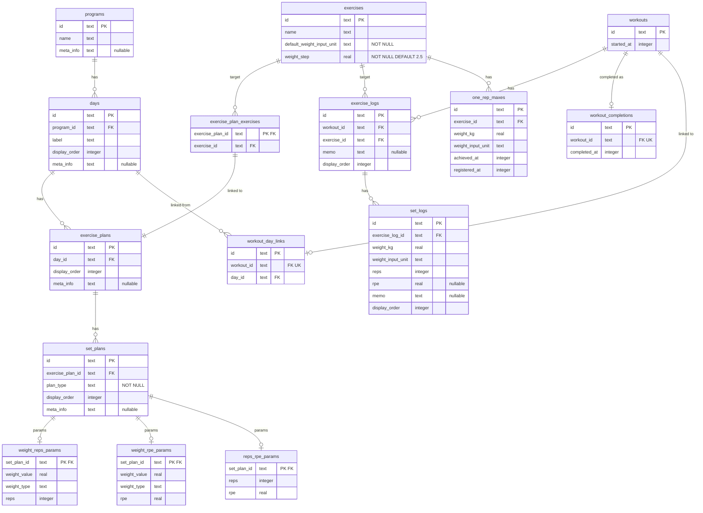

# ERDスキーマ定義

## Mermaid ERD

## テーブル分類

| カテゴリ | テーブル | 説明 |
|---------|---------|------|
| 計画系 | programs | トレーニング計画の単位 |
| | days | プログラム内の1日分の計画単位 |
| | exercise_plans | Day内の1種目分の計画枠。種目未確定のプレースホルダーも可 |
| | exercise_plan_exercises | exercise_plansとexercisesのリンク。行あり=種目確定、行なし=プレースホルダー |
| | set_plans | 1セット分のパラメータの基底テーブル。plan_typeで3パターンを区別 |
| | weight_reps_params | セット計画パラメータ（重量+回数） |
| | weight_rpe_params | セット計画パラメータ（重量+RPE） |
| | reps_rpe_params | セット計画パラメータ（回数+RPE） |
| 記録系 | workouts | ジム1回分の実行記録 |
| | workout_day_links | workoutsとdaysのリンク。行あり=Day準拠、行なし=フリーワークアウト |
| | workout_completions | ワークアウト完了イベント。行あり=完了、行なし=進行中 |
| | exercise_logs | ワークアウト内の1種目分の記録 |
| | set_logs | 1セット分の実績 |
| マスタ系 | exercises | トレーニングで行う動作の種類 |
| | one_rep_maxes | 種目ごとの1RM記録。INSERT only（イベント化）。最新レコードが現在の1RM |

## リレーションシップ

| 関係 | 多重度 | 説明 |
|------|--------|------|
| programs → days | 1:0..n | 0はプログラム作成途中の状態 |
| days → exercise_plans | 1:0..n | 種目未配置のDayは作成途中で正当 |
| exercise_plans → set_plans | 1:0..n | セット設定前の途中保存を許容 |
| set_plans → パラメータテーブル | 1:0..1（排他） | plan_typeに応じて3テーブルのうち0または1行存在。0行=値未入力状態（新規作成直後など）。1行存在する場合はplan_typeに対応するテーブルのみ |
| exercise_plans → exercise_plan_exercises | 1:0..1 | 行なし=プレースホルダー枠 |
| exercises → exercise_plan_exercises | 1:0..n | 同一種目が複数の計画枠に使用可 |
| exercises → exercise_logs | 1:0..n | 記録のない種目が正当 |
| exercises → one_rep_maxes | 1:0..n | 1RM未設定の種目が正当。イベント化で複数行 |
| workouts → exercise_logs | 1:0..n | ワークアウト開始直後の状態を許容 |
| exercise_logs → set_logs | 1:0..n | 種目追加直後の状態を許容 |
| workouts → workout_completions | 1:0..1 | 行なし=進行中、行あり=完了 |
| workouts → workout_day_links | 1:0..1 | 行なし=フリーワークアウト |
| days → workout_day_links | 1:0..n | 同じDayを複数回実施可能 |

## カラム設計の補足

### 重量関連

- **weight_kg**: 常にkg単位で保存。lbs入力時もkgに変換して格納
- **weight_input_unit**: 実績記録時の入力単位（"kg" / "lbs"）。`set_logs` / `one_rep_maxes` のみに存在。「ユーザーが当時どの単位で入力したか」という不変の事実を保持
- **default_weight_input_unit**: 種目ごとの入力単位プリセット（"kg" / "lbs"）。`exercises` のみに存在し、新規入力フォームの初期値として使用。NOT NULL DEFAULT `'kg'`。詳細はADR-027
- **weight_value**: セット計画の重量指定値。weight_typeが"kg"ならkg値、"percent_1rm"なら%値
- **weight_type**: 重量指定の種類。"kg"=絶対重量、"percent_1rm"=1RMに対する相対指定。「単位」ではなく「種類」の区分
- **weight_step**: 種目ごとの重量微調整UIの刻み量（kg基準）。`exercises` のみに存在。バーベル系=2.5kg/ダンベル系=1kg or 0.5kg/ケトルベル=4kg と種目ごとに異なるためスキーマで保持。NOT NULL DEFAULT `2.5`（バーベル系の標準刻み）。CHECK `> 0`。詳細はER設計判断 #33

### タイムスタンプ

全てinteger型、ms精度。汎用名（created_at/updated_at）ではなくドメインの事実に即した名前:

- **started_at**: ワークアウト開始日時
- **completed_at**: ワークアウト完了日時
- **achieved_at**: 1RM達成日時（ユーザー入力。推移グラフのX軸）
- **registered_at**: 1RMレコード登録日時（システム自動設定）

### plan_type

set_plansのplan_typeは3値: "weight_reps" / "weight_rpe" / "reps_rpe"。対応するパラメータテーブルに**0または1行**存在する（設計判断#32）。

- params行あり: plan_typeに対応するテーブルに1行存在し、値が入力済み
- params行なし: 値未入力状態（新規作成直後にアプリ層が`set_plans`行のみ生成するシナリオ）。この場合plan_typeの解釈は保留（ユーザーが値を入力したタイミングで対応するparamsテーブルに行を作成）

排他制御はアプリ側。

### nullable カラム（7件）

| テーブル | カラム | 意味 |
|---------|--------|------|
| programs | meta_info | 漸進ルール等のフリーテキスト |
| days | meta_info | Dayの補足（「上半身の日」等） |
| exercise_plans | meta_info | プレースホルダー枠の説明（「スクワット系アクセサリー」等） |
| set_plans | meta_info | セットの補足（「ウォームアップ」「AMRAP」等） |
| exercise_logs | memo | 種目に対するメモ |
| set_logs | rpe | 主観的運動強度（任意入力） |
| set_logs | memo | セットに対するメモ |
