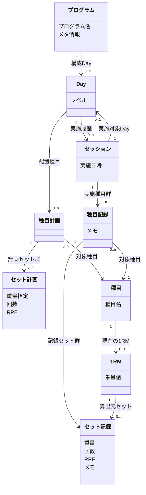

# Next Lift UI設計

## ステータス

- 現在のフェーズ: 3/6（コンテンツ構造設計完了）
- ユースケース数: 27
- Feature数: 5
- Function数: 25
- 概念オブジェクト数: 9
- 次のアクション: フェーズ4 コンセプト定義・フレーム構造

## 要件サマリー

- システム名: Next Lift
- 対象プラットフォーム: iOS（React Native / Expo）、Web（Next.js）
- 対象フォームファクタ: モバイル（iOS）+ デスクトップ/レスポンシブ（Web）
- 入力資料:
  - ペルソナモデル: docs/project/001-persona-model.md
  - 行動シナリオ: docs/project/002-behavioral-scenarios.md
  - プロジェクト概要: docs/project/overview.md
- 外部サービス依存: Turso（Per-User Database）、Better Auth（認証）
- コードベース調査結果:
  - ADR-014: Intent UI（React Aria Componentsベース）を採用。アクセシビリティとAI Agent操作を重視。copy-and-ownモデル
  - ADR-015: Tailwind CSS v4を採用。Intent UIと組み合わせ使用
  - ADR-001: React Native（Expo）でiOSアプリを開発
  - UIコンポーネントは packages/react-components/ に共通化

## Phase 1: ユースケース一覧

### A. プログラム作成

| ID | 名前 | ユースケース | 優先度 |
|----|------|-------------|--------|
| UC_A_1 | プログラム新規作成 | トレーニーが新しいプログラムをゼロから作成できる | 高 |
| UC_A_2 | プログラム複製 | トレーニーが既存のプログラムをコピーして新しいプログラムを作成できる | 高 |
| UC_A_3 | メソサイクル構造定義 | トレーニーがプログラムの期間（週数）・Day数・各Dayのラベルを定義できる | 高 |
| UC_A_4 | 種目配置 | トレーニーがDayに種目を配置し、セット数・レップ数・重量（kgまたは%1RM）・RPEを設定できる | 高 |
| UC_A_5 | メタ情報記録 | トレーニーがプログラムのメタ情報（漸進ルールなど）をフリーテキストで記録できる | 中 |
| UC_A_6 | プログラム編集 | トレーニーがプログラムをいつでも編集できる | 高 |
| UC_A_7 | プログラム削除 | トレーニーがプログラムを削除できる | 中 |
| UC_A_8 | 種目一覧閲覧 | トレーニーが登録済みの種目を一覧で確認できる | 中 |
| UC_A_9 | 種目名編集 | トレーニーが種目の名称を変更できる | 中 |
| UC_A_10 | 種目登録 | トレーニーが新しい種目を登録できる | 中 |
| UC_A_11 | 種目削除 | トレーニーが種目を削除できる | 中 |

### B. トレーニング記録

| ID | 名前 | ユースケース | 優先度 |
|----|------|-------------|--------|
| UC_B_1 | プログラム選択 | トレーニーがプログラム一覧から今日やるプログラムを選択できる | 高 |
| UC_B_2 | セット記録 | トレーニーがプリフィルされた計画値をもとに各セットを記録できる | 高 |
| UC_B_3 | 記録値修正 | トレーニーが計画値と実績が異なる場合に重量やレップを修正して記録できる | 高 |
| UC_B_4 | RPE・メモ追加 | トレーニーがセットにRPEやメモを任意で追加できる | 低 |
| UC_B_5 | セッション完了 | トレーニーが全種目の記録を完了してセッションを終了できる | 高 |
| UC_B_6 | セッション削除 | トレーニーが記録したセッションを削除できる | 中 |
| UC_B_7 | セッション事後修正 | トレーニーが完了したセッションの記録を修正できる | 中 |

### C. 振り返り

| ID | 名前 | ユースケース | 優先度 |
|----|------|-------------|--------|
| UC_C_1 | 計画実績比較 | トレーニーがプログラムの計画と実績の乖離を確認できる | 中 |
| UC_C_2 | 強度・ボリューム推移確認 | トレーニーが種目ごとの強度（e1RM・%1RM・使用重量）とボリュームの推移を確認できる | 中 |

### D. 1RM

| ID | 名前 | ユースケース | 優先度 |
|----|------|-------------|--------|
| UC_D_1 | 1RM登録更新 | トレーニーが種目ごとの1RM（実測値）を登録・更新できる | 高 |
| UC_D_2 | e1RM採用 | トレーニーがe1RM（推定値）を1RM（実測値）として明示的に採用できる | 中 |
| UC_D_3 | 1RM削除 | トレーニーが種目の1RMをクリアできる | 低 |

### E. システム

| ID | 名前 | ユースケース | 優先度 |
|----|------|-------------|--------|
| UC_E_1 | e1RM自動算出 | システムがトレーニング記録からe1RM（推定値）を自動算出できる | 中 |
| UC_E_2 | 計画値プリフィル | システムがプログラムの次のDayの計画値をセッション開始時にプリフィルできる | 高 |
| UC_E_3 | 直近プログラムサジェスト | システムが直近使用したプログラムをプログラム一覧の上位に表示できる | 低 |
| UC_E_4 | 推移データ表示 | システムがプログラム設計時に種目の強度・ボリューム推移を表示できる | 中 |

## Phase 2: タスク表

### Feature一覧

| Feature | 説明 | 含まれるFunction数 |
|---------|------|-------------------|
| プログラム | トレーニング計画の作成・編集・削除 | 8 |
| セッション記録 | ジムでのトレーニング実行と記録 | 9 |
| 振り返り | 計画と実績の比較・推移分析 | 2 |
| 1RM | 種目ごとの最大挙上重量の管理 | 4 |
| 種目マスタ | 種目の登録・一覧確認・名称変更・削除 | 4 |

### タスク表

#### プログラム

| Function | ユーザー | システム | CRUD | 関連UC |
|----------|---------|---------|------|--------|
| プログラム新規作成 | 新しいプログラムを作成する | プログラムを保存する | C | UC_A_1 |
| プログラム複製 | 既存のプログラムを選択してコピーする | 選択されたプログラムを複製して新規保存する | C | UC_A_2 |
| メソサイクル構造定義 | 期間（週数）・Day数・各Dayのラベルを定義する | 構造をプログラムに反映する | U | UC_A_3 |
| 種目配置 | Dayに種目を配置し、セット数・レップ数・重量・RPEを設定する | 配置情報をプログラムに反映する | U | UC_A_4 |
| メタ情報記録 | プログラムのメタ情報（漸進ルールなど）をフリーテキストで入力する | メタ情報をプログラムに保存する | U | UC_A_5 |
| プログラム編集 | プログラムの内容を変更する | 変更をプログラムに反映する | U | UC_A_6 |
| プログラム削除 | プログラムを削除する | プログラムを削除する | D | UC_A_7 |
| 推移データ表示 | - | プログラム設計時に種目の強度・ボリューム推移を表示する | R | UC_E_4 |

#### セッション記録

| Function | ユーザー | システム | CRUD | 関連UC |
|----------|---------|---------|------|--------|
| プログラム選択 | プログラム一覧から今日やるプログラムを選択する | - | - | UC_B_1 |
| 計画値プリフィル | - | プログラムの次のDayの計画値をセッション開始時にプリフィルする | R | UC_E_2 |
| セット記録 | プリフィルされた計画値をもとに各セットを記録する | セットの実績を保存する | C | UC_B_2 |
| 記録値修正 | 計画値と実績が異なる場合に重量やレップを修正して記録する | 修正された実績を保存する | U | UC_B_3 |
| RPE・メモ追加 | セットにRPEやメモを追加する | RPE・メモをセットに保存する | U | UC_B_4 |
| セッション完了 | 全種目の記録を完了してセッションを終了する | セッションを完了状態にする | U | UC_B_5 |
| セッション削除 | 記録したセッションを削除する | セッションと関連するセットの記録を削除する | D | UC_B_6 |
| セッション事後修正 | 完了したセッションの記録を修正する | 修正された記録を保存する | U | UC_B_7 |
| 直近プログラムサジェスト | - | 直近使用したプログラムをプログラム一覧の上位に表示する | R | UC_E_3 |

#### 振り返り

| Function | ユーザー | システム | CRUD | 関連UC |
|----------|---------|---------|------|--------|
| 計画実績比較 | プログラムの計画と実績の乖離を確認する | 計画値と実績値を対比表示する | R | UC_C_1 |
| 強度・ボリューム推移確認 | 種目ごとの強度・ボリュームの推移を確認する | 強度（e1RM・%1RM・使用重量）とボリュームの推移データを集計・表示する | R | UC_C_2 |

#### 1RM

| Function | ユーザー | システム | CRUD | 関連UC |
|----------|---------|---------|------|--------|
| 1RM登録 | 種目ごとの1RM（実測値）を登録する | 1RMを保存する | C | UC_D_1 |
| 1RM更新 | 種目ごとの1RM（実測値）を更新する | 更新された1RMを保存する | U | UC_D_1 |
| e1RM自動算出 | - | トレーニング記録からe1RM（推定値）を自動算出する | C | UC_E_1 |
| e1RM採用 | e1RM（推定値）を1RM（実測値）として明示的に採用する | 採用されたe1RMで1RMを更新する | U | UC_D_2 |
| 1RM削除 | 種目の1RMをクリアする | 1RMを削除し未設定状態にする | D | UC_D_3 |

#### 種目マスタ

| Function | ユーザー | システム | CRUD | 関連UC |
|----------|---------|---------|------|--------|
| 種目登録 | 新しい種目を登録する | 種目を保存する | C | UC_A_10 |
| 種目一覧閲覧 | 登録済みの種目を一覧で確認する | 種目一覧を表示する | R | UC_A_8 |
| 種目名編集 | 種目の名称を変更する | 変更された種目名を保存する | U | UC_A_9 |
| 種目削除 | 種目を削除する | 種目を削除する | D | UC_A_11 |

## Phase 3: コンテンツ構造

### 概念オブジェクト一覧

| 名前 | 説明 | 一覧 | 詳細 | 空表示 | 主なプロパティ |
|------|------|------|------|--------|--------------|
| プログラム | トレーニング計画の単位 | 要 | 要 | 要 | プログラム名、メタ情報（任意） |
| Day | プログラム内の1日分の計画単位 | 要 | 要 | 要 | ラベル（必須、デフォルト値あり） |
| 種目計画 | Day内の1種目分のセット群（計画側） | 要 | - | 要 | - |
| セット計画 | 種目計画内の1セット分のパラメータ | 要 | - | 要 | 下記パラメータ指定パターン参照 |
| セッション | トレーニング1回分の実行記録（ジム1回分） | 要 | 要 | 要 | 実施日時 |
| 種目記録 | セッション内の1種目分のセット群（記録側） | 要 | - | 要（種目起点） | メモ（任意） |
| セット記録 | 種目記録内の1セット分の実績 | 要 | - | - | 重量(kg)、回数、RPE（任意）、メモ（任意） |
| 種目 | トレーニングで行う動作の種類 | 要 | - | 要 | 種目名 |
| 1RM | 種目ごとの最大挙上重量（実測値または採用値） | - | 要 | 要 | 重量値 |

#### セット計画のパラメータ指定パターン

セット計画は以下の3パターンのいずれかで指定する（3つのパラメータのうち2つを指定）:

| パターン | 指定するパラメータ | 用途 |
|---------|-------------------|------|
| 重量 + 回数 | 重量指定（kg or %1RM）、回数 | 標準的な計画（例: 100kg × 5回） |
| 重量 + RPE | 重量指定（kg or %1RM）、RPE | RPEベースで回数を調整（例: 100kg × RPE8） |
| 回数 + RPE | 回数、RPE | RPEベースで重量を調整（例: 5回 × RPE8） |

重量指定はkgまたは%1RMのいずれか。%1RM指定時は種目の1RMから実際の重量を算出する。

#### 命名規則

計画側と記録側で対称的な命名パターン `{対象}{計画or記録}` を採用:

| 計画側 | 記録側 | 対象 |
|-------|-------|------|
| 種目計画 | 種目記録 | 1種目分のセット群 |
| セット計画 | セット記録 | 1セット分のパラメータ/実績 |

### 除外した候補

| 候補 | 除外理由 |
|------|---------|
| メソサイクル | プログラムと1:1の関係。プログラムの構造はDay配列で表現 |
| 期間（週数） | プログラムのプロパティとしても不要。期間が不定のプログラム（例: 10/8/5プログラム）が存在する。メソサイクル構造はDay名で表現可能（例: "W1-D2"）。必要ならメタ情報にフリーテキストで記録 |
| Day番号 | ラベルが必須のためDayの識別子として機能する。順序は配列内の位置で保持 |
| メタ情報 | フリーテキスト1件。プログラムのプロパティとして扱う |
| RPE / レップ数 / 重量 / メモ | プリミティブ値。セット計画・セット記録のプロパティとして扱う |
| 漸進ルール | メタ情報（フリーテキスト）の一部 |

#### 導出ビュー（概念オブジェクトではない）

以下は記録データから算出される導出値であり、概念オブジェクトとしてモデル化しない:

| ビュー | 算出元 | 説明 | 関連UC |
|-------|-------|------|--------|
| 強度（e1RM） | セット記録の重量×回数 | Epley等の公式で算出。セット/種目/セッション/Day各レベルで算出可能 | UC_E_1, UC_C_2, UC_D_2, UC_E_4 |
| 強度（%1RM） | セット記録の重量 ÷ 種目の1RM | 1RM比での強度表現 | UC_C_2, UC_E_4 |
| ボリューム | セット記録の重量×回数（トネージ）またはセット数×回数 | セット/種目/セッション/Day各レベルで集計可能 | UC_C_2, UC_E_4 |
| 計画実績比較 | セット計画 vs セット記録の対比 | 種目計画/種目記録の対称構造を利用して導出 | UC_C_1 |
| 重量推移 | 種目+セット記録の時系列集計 | 種目ごとの使用重量の推移 | UC_C_2 |

### コンテンツ構造図

### 関連の補足

| 関連 | 方向 | 多重度 | 説明 |
|------|------|--------|------|
| プログラム → Day | 順方向 | 1 → 0..n | Dayは順序付き配列。0はプログラム作成途中の状態 |
| Day → 種目計画 | 順方向 | 1 → 0..n | Day内の種目配置。0は作成途中の状態 |
| 種目計画 → 種目 | 順方向 | 0..n → 1 | 種目計画は必ず1つの種目に対応。同じ種目が複数のDayや同じDay内に複数回登場しうる |
| 種目計画 → セット計画 | 順方向 | 1 → 0..n | 種目計画内のセット群。配列の長さ＝セット数。0は作成途中の状態 |
| セット計画: パラメータ指定 | 制約 | - | 重量指定（kg/%1RM）・回数・RPEのうち2つを指定する。重量指定がkgの場合は絶対値、%1RMの場合は種目の1RMからの割合値として解釈される |
| セッション → Day | 順方向 | 1 → 0..1 | 0: アドホックなトレーニング（計画と無関係）。1: 計画Dayに沿ったトレーニング |
| Day → セッション | 逆方向 | 1 → 0..n | 同じDayを複数回実施可能（メソサイクルの繰り返し） |
| セッション → 種目記録 | 順方向 | 1 → 1..n | セッションは最低1種目の記録を持つ |
| 種目記録 → 種目 | 順方向 | 0..n → 1 | 種目記録は必ず1つの種目に対応 |
| 種目記録 → セット記録 | 順方向 | 1 → 1..n | 種目記録は最低1セットの記録を持つ。配列の長さ＝セット数 |
| 種目 → 1RM | 順方向 | 1 → 0..1 | 種目ごとに0または1つの1RM。未設定の状態がある |
| 1RM → セット記録 | 順方向 | 0..1 → 0..1 | 1RMの算出元セット（任意）。0: アプリ外での申告値。1: アプリ内で記録したセットで達成、またはe1RM採用時の算出元セット |

### パーキングロット対応

#### 種目削除時の影響（⚠️ 要確認）

種目を削除すると、その種目を参照する種目計画・種目記録・1RMが影響を受ける。

暫定判断: 種目削除は「アーカイブ」として扱う。既存のプログラム・記録では種目名が引き続き表示されるが、新規の種目計画作成時には選択肢に表示しない。

- Pros: 過去データの整合性を保てる。ユーザーが「削除したい」意図（もう使わない種目を選択肢から消す）を満たせる
- Cons: 完全削除ではないため、データ上は残り続ける。「削除したのに見える」という混乱の可能性がある

コンテンツ構造上の影響: 種目に「アーカイブ状態」のプロパティが必要になりうるが、Phase 3ではプロパティの過剰定義を避け、この判断はPhase 4以降で具体化する。

#### セッション削除時のe1RM影響 → 解消

e1RMを概念オブジェクトから導出ビューに変更したことで、セッション削除時の連動削除問題は自動的に解消された。e1RMは保存されず、セット記録から都度算出されるため、セッション（およびそのセット記録）が削除されれば対応するe1RM算出も消える。

#### 1RM削除と%1RMセット計画への影響（⚠️ 要確認）

1RM削除（未設定に戻す）後、%1RM指定のセット計画はkg換算ができなくなる。

暫定判断: セット計画の%1RM指定はそのまま保持し、1RMが未設定の場合はUI上で「1RMが未設定のため計算できません」と表示してユーザーに再設定を促す。

- Pros: 計画データを壊さない。%1RMの値自体は有効（1RMを再設定すれば計算可能に戻る）
- Cons: %1RM計画を持つ種目の1RMを削除するケースがどの程度あるか不明。警告UIの実装が必要

#### 1RM参照先のセッション削除時の影響 → Phase 4以降で検討

1RMが参照するセット記録の親セッションが削除された場合、1RMの参照先が消滅する。1RMの重量値自体は有効だが、算出元の追跡ができなくなる。参照をnullにして重量値は保持する方針が妥当と思われるが、Phase 4以降で具体化する。

## Phase 4: コンセプト定義・フレーム構造

### コンセプト定義

- 提供したいユーザー体験:
- 設計思想:
- 製品の提供価値:

### メンタルモデル

（アウトライン形式）

### フレーム構造

（ビュー構成・ペイン構造の説明）

## Phase 5: ナビゲーション構造

### ナビゲーション構造図

（Mermaid flowchart をここに記述）

### ボトムアップ設計メモ

### トップダウン設計メモ

### 挟み込み統合結果

## Phase 6: レビュー結果

### Critical

### Improvement

### Note

## 設計判断ログ

| # | フェーズ | 判断内容 | 選択肢 | 決定 | 理由 |
|---|---------|---------|--------|------|------|
| 1 | P1 | プログラム作成のユースケース粒度 | (a) 「プログラムを作成できる」で1つにまとめる (b) 作成方法・構造定義・種目配置を分割する | (b) 分割 | Pros: 各ステップが独立した操作として成立し、後続フェーズでのタスク・UI導出が容易。Cons: ユースケース数が増える。ただしシナリオ上も別ステップとして記述されており、粒度は適切と判断 |
| 2 | P1 | AI対話によるプログラム作成をユースケースに含めるか | (a) 初期スコープに含める (b) スコープ外として除外する | (b) 除外 | Pros: 初期スコープを小さく保てる。行動シナリオの「初期スコープ外」に「AIによるプログラム提案・サジェスト」が明記されている。Cons: 作成方法の選択肢が減る。ただしゼロから作成+コピーで最低限のニーズはカバー可能 |
| 3 | P1 | Dayスキップ・順序変更を独立ユースケースにするか | (a) 独立ユースケースにする (b) 既存ユースケースの範囲に含める | (b) 含める | Pros: 補足に「Dayのスキップ、順序変更、途中中断はすべて許容」とあるが、これはUI制約の解除（モードレス）であり独立した用途ではない。Cons: 明示されないと見落とすリスクがあるが、フレーム構造設計時に考慮すれば十分 |
| 4 | P1 | 動作主体の表記 | (a) ペルソナ名を使う (b) 「ユーザー」で統一する (c) ドメイン用語「トレーニー」を使う | (c) 「トレーニー」 | ユーザー確認済み: Better Authの`user`テーブルと区別するため、ドメイン層の動作主体を「トレーニー」（trainee）と呼ぶ。認証基盤のユーザーとドメインのプロフィールを分離する設計意図に合致 |
| 5 | P1 | 種目の登録・編集をユースケースに含めるか | (a) 種目CRUD用のユースケースを追加する (b) 含めない | (a) 一覧閲覧と名称変更を追加（UC_A_8, UC_A_9） | ユーザー確認済み: 種目名は人により呼び方が異なる（例: スモウデッドリフト vs ワイドデッドリフト）ため、プログラム作成と独立して種目名を変更したい場面がある。変更対象を選ぶために一覧も必要 |
| 6 | P1 | RPEを計画時の指定項目に含めるか | (a) 計画時にも指定可能にする (b) 記録時オプションのまま | (a) 計画時にも追加 | ユーザー確認済み: RPEベースのプログラム（重量固定×RPEで回数決定、回数固定×RPEで重量決定）を組むために、計画時にもRPEを指定できる必要がある |
| 7 | P2 | Feature分類の粒度 | (a) 行動シナリオの大区分（4つ）をそのままFeatureにする (b) 種目マスタを独立Featureに分離して5つにする | (b) 5つに分離 | Pros: UC_A_8/UC_A_9はプログラム作成と独立した文脈（種目名の呼び方変更など）で使われるため、独立Featureの方がタスクの関心事が明確になる。Cons: Feature数が増えるが、Functionが2つだけの小さなFeatureなので管理コストは低い |
| 8 | P2 | UC_D_1（1RM登録更新）を1つのFunctionにするか分割するか | (a) 「1RM登録更新」として1Function (b) 「1RM登録」(C)と「1RM更新」(U)に分割 | (b) 分割 | Pros: CRUDが異なる操作を1Functionにまとめると、後続フェーズでUIパターンの導出が曖昧になる。初回登録（C）と値の更新（U）はユーザーの意図が異なる。Cons: Function数が増えるが、CRUD分類の正確性を優先 |
| 9 | P2 | 振り返りのReadタスクをタスク表に含めるか | (a) Rは原則除外のルールに従い除外する (b) 明示的な分析・比較表示として含める | (b) 含める | Pros: 振り返りFeatureのタスクはすべてR（分析・比較表示）だが、単なる「データ表示」ではなく、集計・対比・推移計算を伴う明示的な分析タスクであるため除外すべきでない。除外すると振り返りFeature全体が消滅する。Cons: Rタスクが増えるが、これらは暗黙的な表示ではなく能動的な分析操作 |
| 10 | P2 | プログラム選択（UC_B_1）のCRUD分類 | (a) R（プログラムを読み込む） (b) CRUD対象外（選択行為自体はデータ操作ではない） | (b) CRUD対象外 | Pros: プログラム選択はデータのC/R/U/Dいずれでもなく、ユーザーがセッション記録の対象を指定するUI上の操作。CRUDを無理に割り当てると意味が曖昧になる。Cons: CRUD列が空になるが、全タスクがCRUDに分類される必要はない |
| 11 | P2 | メソサイクル構造定義・種目配置をプログラム編集と統合するか | (a) 統合して「プログラム編集」に含める (b) 独立Functionとして残す | (b) 独立 | Pros: UC_A_3/UC_A_4/UC_A_6はそれぞれ異なる操作対象（構造・種目・全体）を持ち、後続フェーズで異なるUIパターンに導出される可能性がある。独立していた方がタスク→UI対応が明確。Cons: 実際のUIでは「プログラム編集」の中にまとめられる可能性があるが、タスク整理段階ではFunction粒度を保つ方が安全 |
| 12 | P1/P2 | ユーザー作成データのCRUD網羅性 | (a) 行動シナリオに明示されたもののみ (b) 「ユーザーのデータはユーザーのもの」原則で全データにU/Dを保証 | (b) 原則適用 | ユーザー確認済み: ユーザーが登録したデータはすべて自由に編集・削除できるべき。セッション削除(UC_B_6)・事後修正(UC_B_7)・1RM削除(UC_D_3)・種目登録(UC_A_10)・種目削除(UC_A_11)を追加 |
| 13 | P3 | 概念モデルに作成途中の状態を含めるか | (a) 含める（全関連を0始まりに統一） (b) 完成状態のみ表現する | (a) 含める | ユーザー確認済み: Day→計画セットで「作成途中」を理由に0..nとしていたのに、プログラム→Dayは1..nとしていた不整合を解消。全ての親子関連で作成途中の状態（0）を許容する方針に統一 |
| 14 | P3 | 期間（週数）をプログラムのプロパティとして持つか | (a) 持つ (b) 削除してDay名で表現 | (b) 削除 | ユーザー確認済み: 10/8/5プログラムのように期間が不定のプログラムが存在する。メソサイクル構造はDay名（例: "W1-D2"）で表現可能。必要ならメタ情報にフリーテキストで記録 |
| 15 | P3 | Day番号を持つかラベルを必須にするか | (a) Day番号を持つ（ラベルは任意） (b) ラベル必須にしてDay番号を削除 | (b) ラベル必須 | ユーザー確認済み: ラベルが必須なら識別子として機能する。デフォルト値（"Day 1"等）をシステムが提供し、ユーザーが採用or変更。順序は配列位置で保持 |
| 16 | P3 | 種目ごとのグルーピング層を導入するか | (a) Day→セット計画を直結 (b) 種目計画/種目記録を中間層として追加 | (b) 追加 | ユーザー確認済み: セット数が配列長で自然に表現される。種目ごとのメモ配置が可能になる。計画/記録の対称構造が振り返り（計画実績比較）を容易にする |
| 17 | P3 | 命名パターンの統一 | (a) 計画セット/記録セット（計画or記録が先） (b) セット計画/セット記録（{対象}{計画or記録}で統一） | (b) 統一 | ユーザー確認済み: 種目計画/種目記録、セット計画/セット記録で一貫した命名パターン |
| 18 | P3 | セット計画のパラメータ指定パターン | (a) 4プロパティ並列（レップ数, 重量, 重量指定方法, RPE） (b) 3つのうち2つを指定（{重量+回数}, {重量+RPE}, {回数+RPE}） | (b) 3つのうち2つ | ユーザー確認済み: ドメインルール「3つのうち2つを指定」を明示的に表現。重量指定はkg/%1RMの区別を含む |
| 19 | P3 | e1RMを概念オブジェクトとするか導出ビューとするか | (a) 概念オブジェクト (b) 導出ビュー | (b) 導出ビュー | ユーザー確認済み: e1RMはセット記録から純粋に算出可能な導出値。強度はe1RMだけでなく%1RMや単純な重量でも表現される。ボリュームも同種の導出値。保存不要で、セッション削除時の連動削除問題も解消 |
| 20 | P3 | セッション→Dayの多重度 | (a) 1→1（必須） (b) 1→0..1（任意） | (b) 任意 | ユーザー確認済み: 計画と紐づかないアドホックなトレーニング（マシンが空いていない等）に対応。0: アドホック、1: 計画Day準拠 |
| 21 | P3 | セッション→プログラムの直接関連 | (a) 残す (b) 削除（Day経由で導出） | (b) 削除 | ユーザー確認済み: セッション→Day→プログラムで導出可能。Dayなし（アドホック）のセッションはプログラムにも属さない。冗長な関連を排除 |
| 22 | P3 | 1RMにセット記録への参照を持たせるか | (a) 重量値のみ (b) セット記録への参照を追加（0..1） | (b) 追加 | ユーザー確認済み: 1RMの出どころ（実測 or e1RM採用）を追跡可能。アプリ外での申告値は参照なし（0） |
| 23 | P1/P3 | UC_C_2（重量推移確認）とUC_C_3（e1RM確認）を統合するか | (a) 個別UCのまま残す (b) 「強度・ボリューム推移確認」として統合しUC_C_3を削除 | (b) 統合 | ユーザー確認済み: Phase 3でe1RMを導出ビューに変更し、強度（e1RM・%1RM・重量）とボリュームを同じ導出ビュー群として整理した。ユースケースもこの分類に合わせて統合。重量推移もe1RMも強度の一側面であり、個別UCにする粒度ではない |
| 24 | P1/P3 | プログラム設計時の推移データ表示をユースケースに追加するか | (a) 追加しない（振り返りUCでカバー） (b) システムUCとしてUC_E_4を追加 | (b) 追加 | ユーザー確認済み: 振り返り（過去を振り返る）とプログラム設計時の参照（これから組む計画を調整する）はユーザーの目的が異なる。データは同じ導出ビューだが、操作コンテキストが異なるため別UC。UC_E_2（計画値プリフィル）と同類のシステム支援機能 |

## パーキングロット

- 種目削除時、その種目を使用しているプログラムや記録への影響の扱い → Phase 3で暫定判断済み（アーカイブ方式、⚠️ 要確認）
- ~~セッション削除時、e1RM自動算出への影響の扱い~~ → Phase 3で解消（e1RMを導出ビューに変更）
- 1RM削除の意味（未設定に戻す）が%1RM指定のセット計画に与える影響 → Phase 3で暫定判断済み（%1RM指定保持+UI警告、⚠️ 要確認）
- 1RM参照先のセット記録の親セッションが削除された場合の参照の扱い → Phase 4以降で検討
