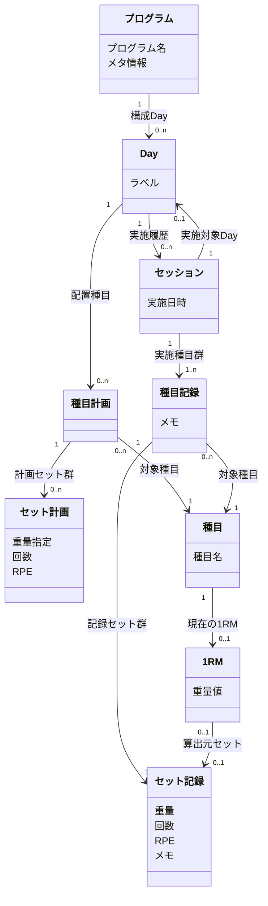

# Next Lift UI設計

## ステータス

- 現在のフェーズ: 4/6（コンセプト定義・フレーム構造設計完了）
- ユースケース数: 27
- Feature数: 5
- Function数: 25
- 概念オブジェクト数: 9
- 単位ビュー数: 15
- 次のアクション: Phase 4 フィードバック反映完了 → Phase 5 ナビゲーション構造設計へ

## 要件サマリー

- システム名: Next Lift
- 対象プラットフォーム: iOS（React Native / Expo）、Web（Next.js）
- 対象フォームファクタ: モバイル（iOS）+ デスクトップ/レスポンシブ（Web）
- 入力資料:
  - ペルソナモデル: docs/project/001-persona-model.md
  - 行動シナリオ: docs/project/002-behavioral-scenarios.md
  - プロジェクト概要: docs/project/overview.md
- 外部サービス依存: Turso（Per-User Database）、Better Auth（認証）
- コードベース調査結果:
  - ADR-014: Intent UI（React Aria Componentsベース）を採用。アクセシビリティとAI Agent操作を重視。copy-and-ownモデル
  - ADR-015: Tailwind CSS v4を採用。Intent UIと組み合わせ使用
  - ADR-001: React Native（Expo）でiOSアプリを開発
  - UIコンポーネントは packages/react-components/ に共通化

## Phase 1: ユースケース一覧

### A. プログラム作成

| ID | 名前 | ユースケース | 優先度 |
|----|------|-------------|--------|
| UC_A_1 | プログラム新規作成 | トレーニーが新しいプログラムをゼロから作成できる | 高 |
| UC_A_2 | プログラム複製 | トレーニーが既存のプログラムをコピーして新しいプログラムを作成できる | 高 |
| UC_A_3 | Day構成編集 | トレーニーがプログラムの期間（週数）・Day数・各Dayのラベルを定義できる | 高 |
| UC_A_4 | 種目配置 | トレーニーがDayに種目を配置し、セット数・レップ数・重量（kgまたは%1RM）・RPEを設定できる | 高 |
| UC_A_5 | メタ情報記録 | トレーニーがプログラムのメタ情報（漸進ルールなど）をフリーテキストで記録できる | 中 |
| UC_A_6 | プログラム編集 | トレーニーがプログラムをいつでも編集できる | 高 |
| UC_A_7 | プログラム削除 | トレーニーがプログラムを削除できる | 中 |
| UC_A_8 | 種目一覧閲覧 | トレーニーが登録済みの種目を一覧で確認できる | 中 |
| UC_A_9 | 種目名編集 | トレーニーが種目の名称を変更できる | 中 |
| UC_A_10 | 種目登録 | トレーニーが新しい種目を登録できる | 中 |
| UC_A_11 | 種目削除 | トレーニーが種目を削除できる | 中 |

### B. トレーニング記録

| ID | 名前 | ユースケース | 優先度 |
|----|------|-------------|--------|
| UC_B_1 | プログラム選択 | トレーニーがプログラム一覧から今日やるプログラムを選択できる | 高 |
| UC_B_2 | セット記録 | トレーニーがプリフィルされた計画値をもとに各セットを記録できる | 高 |
| UC_B_3 | 記録値修正 | トレーニーが計画値と実績が異なる場合に重量やレップを修正して記録できる | 高 |
| UC_B_4 | RPE・メモ追加 | トレーニーがセットにRPEやメモを任意で追加できる | 低 |
| UC_B_5 | セッション完了 | トレーニーが全種目の記録を完了してセッションを終了できる | 高 |
| UC_B_6 | セッション削除 | トレーニーが記録したセッションを削除できる | 中 |
| UC_B_7 | セッション事後修正 | トレーニーが完了したセッションの記録を修正できる | 中 |

### C. 振り返り

| ID | 名前 | ユースケース | 優先度 |
|----|------|-------------|--------|
| UC_C_1 | 計画実績比較 | トレーニーがプログラムの計画と実績の乖離を確認できる | 中 |
| UC_C_2 | 強度・ボリューム推移確認 | トレーニーが種目ごとの強度（e1RM・%1RM・使用重量）とボリュームの推移を確認できる | 中 |

### D. 1RM

| ID | 名前 | ユースケース | 優先度 |
|----|------|-------------|--------|
| UC_D_1 | 1RM登録更新 | トレーニーが種目ごとの1RM（実測値）を登録・更新できる | 高 |
| UC_D_2 | e1RM採用 | トレーニーがe1RM（推定値）を1RM（実測値）として明示的に採用できる | 中 |
| UC_D_3 | 1RM削除 | トレーニーが種目の1RMをクリアできる | 低 |

### E. システム

| ID | 名前 | ユースケース | 優先度 |
|----|------|-------------|--------|
| UC_E_1 | e1RM自動算出 | システムがトレーニング記録からe1RM（推定値）を自動算出できる | 中 |
| UC_E_2 | 計画値プリフィル | システムがプログラムの次のDayの計画値をセッション開始時にプリフィルできる | 高 |
| UC_E_3 | 直近プログラムサジェスト | システムが直近使用したプログラムをプログラム一覧の上位に表示できる | 低 |
| UC_E_4 | 推移データ表示 | システムがプログラム設計時に種目の強度・ボリューム推移を表示できる | 中 |

## Phase 2: タスク表

### Feature一覧

| Feature | 説明 | 含まれるFunction数 |
|---------|------|-------------------|
| プログラム | トレーニング計画の作成・編集・削除 | 8 |
| セッション記録 | ジムでのトレーニング実行と記録 | 9 |
| 振り返り | 計画と実績の比較・推移分析 | 2 |
| 1RM | 種目ごとの最大挙上重量の管理 | 4 |
| 種目マスタ | 種目の登録・一覧確認・名称変更・削除 | 4 |

### タスク表

#### プログラム

| Function | ユーザー | システム | CRUD | 関連UC |
|----------|---------|---------|------|--------|
| プログラム新規作成 | 新しいプログラムを作成する | プログラムを保存する | C | UC_A_1 |
| プログラム複製 | 既存のプログラムを選択してコピーする | 選択されたプログラムを複製して新規保存する | C | UC_A_2 |
| Day構成編集 | 期間（週数）・Day数・各Dayのラベルを定義する | 構造をプログラムに反映する | U | UC_A_3 |
| 種目配置 | Dayに種目を配置し、セット数・レップ数・重量・RPEを設定する | 配置情報をプログラムに反映する | U | UC_A_4 |
| メタ情報記録 | プログラムのメタ情報（漸進ルールなど）をフリーテキストで入力する | メタ情報をプログラムに保存する | U | UC_A_5 |
| プログラム編集 | プログラムの内容を変更する | 変更をプログラムに反映する | U | UC_A_6 |
| プログラム削除 | プログラムを削除する | プログラムを削除する | D | UC_A_7 |
| 推移データ表示 | - | プログラム設計時に種目の強度・ボリューム推移を表示する | R | UC_E_4 |

#### セッション記録

| Function | ユーザー | システム | CRUD | 関連UC |
|----------|---------|---------|------|--------|
| プログラム選択 | プログラム一覧から今日やるプログラムを選択する | - | - | UC_B_1 |
| 計画値プリフィル | - | プログラムの次のDayの計画値をセッション開始時にプリフィルする | R | UC_E_2 |
| セット記録 | プリフィルされた計画値をもとに各セットを記録する | セットの実績を保存する | C | UC_B_2 |
| 記録値修正 | 計画値と実績が異なる場合に重量やレップを修正して記録する | 修正された実績を保存する | U | UC_B_3 |
| RPE・メモ追加 | セットにRPEやメモを追加する | RPE・メモをセットに保存する | U | UC_B_4 |
| セッション完了 | 全種目の記録を完了してセッションを終了する | セッションを完了状態にする | U | UC_B_5 |
| セッション削除 | 記録したセッションを削除する | セッションと関連するセットの記録を削除する | D | UC_B_6 |
| セッション事後修正 | 完了したセッションの記録を修正する | 修正された記録を保存する | U | UC_B_7 |
| 直近プログラムサジェスト | - | 直近使用したプログラムをプログラム一覧の上位に表示する | R | UC_E_3 |

#### 振り返り

| Function | ユーザー | システム | CRUD | 関連UC |
|----------|---------|---------|------|--------|
| 計画実績比較 | プログラムの計画と実績の乖離を確認する | 計画値と実績値を対比表示する | R | UC_C_1 |
| 強度・ボリューム推移確認 | 種目ごとの強度・ボリュームの推移を確認する | 強度（e1RM・%1RM・使用重量）とボリュームの推移データを集計・表示する | R | UC_C_2 |

#### 1RM

| Function | ユーザー | システム | CRUD | 関連UC |
|----------|---------|---------|------|--------|
| 1RM登録 | 種目ごとの1RM（実測値）を登録する | 1RMを保存する | C | UC_D_1 |
| 1RM更新 | 種目ごとの1RM（実測値）を更新する | 更新された1RMを保存する | U | UC_D_1 |
| e1RM自動算出 | - | トレーニング記録からe1RM（推定値）を自動算出する | C | UC_E_1 |
| e1RM採用 | e1RM（推定値）を1RM（実測値）として明示的に採用する | 採用されたe1RMで1RMを更新する | U | UC_D_2 |
| 1RM削除 | 種目の1RMをクリアする | 1RMを削除し未設定状態にする | D | UC_D_3 |

#### 種目マスタ

| Function | ユーザー | システム | CRUD | 関連UC |
|----------|---------|---------|------|--------|
| 種目登録 | 新しい種目を登録する | 種目を保存する | C | UC_A_10 |
| 種目一覧閲覧 | 登録済みの種目を一覧で確認する | 種目一覧を表示する | R | UC_A_8 |
| 種目名編集 | 種目の名称を変更する | 変更された種目名を保存する | U | UC_A_9 |
| 種目削除 | 種目を削除する | 種目を削除する | D | UC_A_11 |

## Phase 3: コンテンツ構造

### 概念オブジェクト一覧

| 名前 | 説明 | 一覧 | 詳細 | 空表示 | 主なプロパティ |
|------|------|------|------|--------|--------------|
| プログラム | トレーニング計画の単位 | 要 | 要 | 要 | プログラム名、メタ情報（任意） |
| Day | プログラム内の1日分の計画単位 | 要 | 要 | 要 | ラベル（必須、デフォルト値あり） |
| 種目計画 | Day内の1種目分のセット群（計画側） | 要 | - | 要 | - |
| セット計画 | 種目計画内の1セット分のパラメータ | 要 | - | 要 | 下記パラメータ指定パターン参照 |
| セッション | トレーニング1回分の実行記録（ジム1回分） | 要 | 要 | 要 | 実施日時 |
| 種目記録 | セッション内の1種目分のセット群（記録側） | 要 | - | 要（種目起点） | メモ（任意） |
| セット記録 | 種目記録内の1セット分の実績 | 要 | - | - | 重量(kg)、回数、RPE（任意）、メモ（任意） |
| 種目 | トレーニングで行う動作の種類 | 要 | - | 要 | 種目名 |
| 1RM | 種目ごとの最大挙上重量（実測値または採用値） | - | 要 | 要 | 重量値 |

#### セット計画のパラメータ指定パターン

セット計画は以下の3パターンのいずれかで指定する（3つのパラメータのうち2つを指定）:

| パターン | 指定するパラメータ | 用途 |
|---------|-------------------|------|
| 重量 + 回数 | 重量指定（kg or %1RM）、回数 | 標準的な計画（例: 100kg × 5回） |
| 重量 + RPE | 重量指定（kg or %1RM）、RPE | RPEベースで回数を調整（例: 100kg × RPE8） |
| 回数 + RPE | 回数、RPE | RPEベースで重量を調整（例: 5回 × RPE8） |

重量指定はkgまたは%1RMのいずれか。%1RM指定時は種目の1RMから実際の重量を算出する。

#### 命名規則

計画側と記録側で対称的な命名パターン `{対象}{計画or記録}` を採用:

| 計画側 | 記録側 | 対象 |
|-------|-------|------|
| 種目計画 | 種目記録 | 1種目分のセット群 |
| セット計画 | セット記録 | 1セット分のパラメータ/実績 |

### 除外した候補

| 候補 | 除外理由 |
|------|---------|
| メソサイクル | プログラムと1:1の関係。プログラムの構造はDay配列で表現 |
| 期間（週数） | プログラムのプロパティとしても不要。期間が不定のプログラム（例: 10/8/5プログラム）が存在する。メソサイクル構造はDay名で表現可能（例: "W1-D2"）。必要ならメタ情報にフリーテキストで記録 |
| Day番号 | ラベルが必須のためDayの識別子として機能する。順序は配列内の位置で保持 |
| メタ情報 | フリーテキスト1件。プログラムのプロパティとして扱う |
| RPE / レップ数 / 重量 / メモ | プリミティブ値。セット計画・セット記録のプロパティとして扱う |
| 漸進ルール | メタ情報（フリーテキスト）の一部 |

#### 導出ビュー（概念オブジェクトではない）

以下は記録データから算出される導出値であり、概念オブジェクトとしてモデル化しない:

| ビュー | 算出元 | 説明 | 関連UC |
|-------|-------|------|--------|
| 強度（e1RM） | セット記録の重量×回数 | Epley等の公式で算出。セット/種目/セッション/Day各レベルで算出可能 | UC_E_1, UC_C_2, UC_D_2, UC_E_4 |
| 強度（%1RM） | セット記録の重量 ÷ 種目の1RM | 1RM比での強度表現 | UC_C_2, UC_E_4 |
| ボリューム | セット記録の重量×回数（トネージ）またはセット数×回数 | セット/種目/セッション/Day各レベルで集計可能 | UC_C_2, UC_E_4 |
| 計画実績比較 | セット計画 vs セット記録の対比 | 種目計画/種目記録の対称構造を利用して導出 | UC_C_1 |
| 重量推移 | 種目+セット記録の時系列集計 | 種目ごとの使用重量の推移 | UC_C_2 |

### コンテンツ構造図

### 関連の補足

| 関連 | 方向 | 多重度 | 説明 |
|------|------|--------|------|
| プログラム → Day | 順方向 | 1 → 0..n | Dayは順序付き配列。0はプログラム作成途中の状態 |
| Day → 種目計画 | 順方向 | 1 → 0..n | Day内の種目配置。0は作成途中の状態 |
| 種目計画 → 種目 | 順方向 | 0..n → 1 | 種目計画は必ず1つの種目に対応。同じ種目が複数のDayや同じDay内に複数回登場しうる |
| 種目計画 → セット計画 | 順方向 | 1 → 0..n | 種目計画内のセット群。配列の長さ＝セット数。0は作成途中の状態 |
| セット計画: パラメータ指定 | 制約 | - | 重量指定（kg/%1RM）・回数・RPEのうち2つを指定する。重量指定がkgの場合は絶対値、%1RMの場合は種目の1RMからの割合値として解釈される |
| セッション → Day | 順方向 | 1 → 0..1 | 0: アドホックなトレーニング（計画と無関係）。1: 計画Dayに沿ったトレーニング |
| Day → セッション | 逆方向 | 1 → 0..n | 同じDayを複数回実施可能（メソサイクルの繰り返し） |
| セッション → 種目記録 | 順方向 | 1 → 1..n | セッションは最低1種目の記録を持つ |
| 種目記録 → 種目 | 順方向 | 0..n → 1 | 種目記録は必ず1つの種目に対応 |
| 種目記録 → セット記録 | 順方向 | 1 → 1..n | 種目記録は最低1セットの記録を持つ。配列の長さ＝セット数 |
| 種目 → 1RM | 順方向 | 1 → 0..1 | 種目ごとに0または1つの1RM。未設定の状態がある |
| 1RM → セット記録 | 順方向 | 0..1 → 0..1 | 1RMの算出元セット（任意）。0: アプリ外での申告値。1: アプリ内で記録したセットで達成、またはe1RM採用時の算出元セット |

### パーキングロット対応

#### 種目削除時の影響 → Phase 4で確定

種目を削除すると、その種目を参照する種目計画・種目記録・1RMが影響を受ける。

決定: アーカイブ不採用。完全削除 + 削除時に影響範囲を警告するUIで対応する。削除された種目を参照する種目計画・種目記録は、種目名を「（削除済み）」等で表示する。種目の「アーカイブ状態」プロパティは不要。

- Pros: 「削除」の操作が明快。アーカイブという追加概念が不要でユーザーの学習コストが低い
- Cons: 完全削除のため取り消しが効かない。ただし削除時の警告ダイアログで確認を求めることでリスクを軽減する

#### セッション削除時のe1RM影響 → 解消

e1RMを概念オブジェクトから導出ビューに変更したことで、セッション削除時の連動削除問題は自動的に解消された。e1RMは保存されず、セット記録から都度算出されるため、セッション（およびそのセット記録）が削除されれば対応するe1RM算出も消える。

#### 1RM削除と%1RMセット計画への影響（⚠️ 要確認）

1RM削除（未設定に戻す）後、%1RM指定のセット計画はkg換算ができなくなる。

暫定判断: セット計画の%1RM指定はそのまま保持し、1RMが未設定の場合はUI上で「1RMが未設定のため計算できません」と表示してユーザーに再設定を促す。

- Pros: 計画データを壊さない。%1RMの値自体は有効（1RMを再設定すれば計算可能に戻る）
- Cons: %1RM計画を持つ種目の1RMを削除するケースがどの程度あるか不明。警告UIの実装が必要

#### 1RM参照先のセッション削除時の影響 → Phase 4で確定

1RMが参照するセット記録の親セッションが削除された場合、1RMの参照先が消滅する。参照をnullにして重量値は保持する。セッション削除時に1RM参照先が含まれる場合は警告ダイアログを表示する。

## Phase 4: コンセプト定義・フレーム構造

### コンセプト定義

#### 提供したいユーザー体験

- 計画時: アプリの存在を忘れて計画の内容に没入できるようになって欲しい
  - 見た目の調整、ツール固有の知識、ネットワーク待ち、操作結果の不確実性で思考が中断されない
- トレーニング時: スマホに触らずトレーニングに集中できるようになって欲しい
  - 触る必要がある場合は最小限の操作で完結する
- 振り返り時: 能動的に振り返ったとき、見たい情報に迷わずたどり着き、グラフなどの視覚的表現で直感的に変化に気づけるようになって欲しい

#### 設計思想

- **速度優先 + 即時修正**: 速く操作して、間違えたらすぐ戻す。「すぐ戻せるから大丈夫」という安心感
- **適応的シンプルさ**: ユーザーの操作パターンを記憶して頻用パターンを前面に。他の選択肢は控えめに見せる（隠さない）
- **コンテキスト依存の設計**: 計画時（大画面・俯瞰・高密度・即座の反応）と記録時（小画面・ゆったり・フィードバック豊か）で設計方針を切り替える
- **安心の設計**: undo/redo、自動保存で「壊れない」。取り返しのつかない操作は結果を明示

#### 製品の提供価値

- プログラムを組む
- トレーニングを記録する
- トレーニングを振り返る

→ このサイクルで「計画的に記録を伸ばす」「なんとなくでトレーニングするのをやめる」を実現。1RM管理はサイクルを支える裏方機能

#### コンセプトイメージ

- **トーン: 抑制と信頼**
  - 普段は寡黙に、データと構造で語る。一貫性のある設計でユーザーの発見を促す。必要なときだけ的確に伝える。触れば安心してわかる存在
  - アプリのUI層は抑制的（記録係）。AI対話の層は別のトーンを持てる
- **言葉遣い**: 記録係。事実を淡々と表示し、感情を挟まない。数字とグラフが語る
- **カラー**: ライト/ダークはデバイス設定に従う。彩度はコンテキスト依存（計画時: 低彩度で目の負担軽減、記録時: 高彩度で視認性確保）
- **タイポグラフィ**: コンテキスト依存（計画時: 細く端正に情報を整然と並べる、記録時: 数字を太く大きく）
- **インタラクション**: 計画時はパキッと即座に反応（アニメーション控えめ）、記録時はアニメーション＋ハプティクスで操作フィードバックを明確に
- **空状態**: 初回はサンプルコンテンツで「触って発見」させる。空になったら構造とラベルで導く
- **発見の設計**: 教えるのではなく発見させる。一貫性のある設計で「1,2,3がわかれば4を予測できる」状態を作る。失敗の心理的障壁を下げておく（undo、安心の設計）
- **デザインの性格**: 大胆な取捨選択 / 目的達成への一直線 / 要素のメリハリ / 細部の気配り

### メンタルモデル

#### ★ プログラムを組む（最重要）

| タスク | 関連する概念オブジェクト |
|-------|----------------------|
| （コンセプト全体） | プログラム, Day, 種目計画, セット計画, 種目 |
| プログラム新規作成 | プログラム |
| プログラム複製 | プログラム |
| Day構成編集 | プログラム, Day |
| 種目配置 | Day, 種目計画, セット計画, 種目 |
| メタ情報記録 | プログラム |
| プログラム編集 | プログラム, Day, 種目計画, セット計画 |
| プログラム削除 | プログラム |
| 推移データ表示 | 種目, セット記録 |

#### トレーニングを記録する

| タスク | 関連する概念オブジェクト |
|-------|----------------------|
| （コンセプト全体） | セッション, 種目記録, セット記録, Day |
| プログラム選択 | プログラム, Day |
| 計画値プリフィル | Day, セット計画, セッション |
| セット記録 | セット記録, 種目記録 |
| 記録値修正 | セット記録 |
| RPE・メモ追加 | セット記録 |
| セッション完了 | セッション |
| セッション削除 | セッション, 種目記録, セット記録 |
| セッション事後修正 | セッション, セット記録 |
| 直近プログラムサジェスト | プログラム |

#### トレーニングを振り返る

| タスク | 関連する概念オブジェクト |
|-------|----------------------|
| （コンセプト全体） | セッション, 種目記録, セット記録, プログラム |
| 計画実績比較 | セット計画, セット記録, 種目計画, 種目記録 |
| 強度・ボリューム推移確認 | 種目, セット記録, 1RM |

#### （補助）種目を管理する

| タスク | 関連する概念オブジェクト |
|-------|----------------------|
| （コンセプト全体） | 種目 |
| 種目登録 | 種目 |
| 種目一覧閲覧 | 種目 |
| 種目名編集 | 種目 |
| 種目削除 | 種目 |

#### （補助）1RMを管理する

| タスク | 関連する概念オブジェクト |
|-------|----------------------|
| （コンセプト全体） | 種目, 1RM, セット記録 |
| 1RM登録 | 1RM, 種目 |
| 1RM更新 | 1RM |
| e1RM自動算出 | セット記録, 1RM |
| e1RM採用 | 1RM, セット記録 |
| 1RM削除 | 1RM |

#### 最重要の選定理由

★は「プログラムを組む」に付与。理由:

- Next Liftの核心価値は「計画的に記録を伸ばす」「なんとなくでトレーニングするのをやめる」であり、計画がなければ記録・振り返りのサイクルが成立しない
- プログラム設計は最も操作の幅が広く（構造定義、種目配置、セット計画など）、UIの設計難易度が最も高い
- 記録や振り返りはプログラムの存在を前提にしており、プログラムがハブとして機能する

#### メンタルモデルの補足

- 「種目を管理する」「1RMを管理する」を補助として分離した理由: これらはプログラム・記録・振り返りのサイクルを支える裏方機能であり、独立した提供価値ではない。ただし種目と1RMはサイクル全体で横断的に参照されるため、独立したアクセス手段が必要
- 種目は計画時（種目配置）、記録時（種目記録）、振り返り時（推移確認）のすべてで登場するが、種目マスタ自体の管理は独立した関心事
- 1RM管理は%1RM指定のセット計画と振り返りの強度計算に影響するが、ユーザーが能動的に操作する頻度は低い

### フレーム構造

#### 1. コンテンツ構造からのビュー表現

| 概念オブジェクト | 特徴 | ビュー表現 |
|----------------|------|-----------|
| プログラム | 0..n件存在、名前で識別 | リストビュー（カード形式） |
| Day | プログラム内に0..n件、順序付き、ラベルで識別 | タブまたは横スクロールリスト |
| 種目計画 | Day内に0..n件、種目名+セット群 | リストビュー（種目名をヘッダとしたセクション） |
| セット計画 | 種目計画内に0..n件、パラメータ2〜3個 | コンパクト行（重量×回数の1行表示） |
| セッション | 0..n件、日時で識別 | リストビュー（日付順） |
| 種目記録 | セッション内に1..n件 | リストビュー（種目名をヘッダとしたセクション） |
| セット記録 | 種目記録内に1..n件、数値3〜4個 | コンパクト行（重量×回数の1行表示） |
| 種目 | 0..n件、名前で識別 | リストビュー |
| 1RM | 種目ごとに0..1件、数値1個 | 種目に付随するインライン表示 |

#### 2. ユースケース/コンセプトからのビュー表現

- **プログラム一覧**: ファーストビューにプログラム（名詞）を配置。直近使用順でサジェスト
- **プログラム詳細/編集**: Dayをタブ状に並べ、各Day内の種目計画・セット計画を一覧表示。計画時は情報密度を高く、俯瞰できる構成
- **セッション記録**: プログラム選択→Day選択→セット記録の流れ。記録時は1セットずつ大きく表示し、最小タップで記録完了
- **振り返り**: 計画実績比較は計画/記録の対比表示。推移確認はグラフビュー（時系列チャート）
- **種目一覧**: 種目マスタの閲覧・管理。1RMはここでインライン表示
- **検索**: ユーザーは自分が登録した種目名を知っている（能動的）ため、種目一覧内のフィルターで十分。グローバル検索は不要

#### 3. 恒常領域

**iOS（小画面）:**

| 領域 | 配置 | 内容 |
|------|------|------|
| ナビゲーションバー | 画面上部固定 | 画面タイトル + アカウントアイコン（右上） |
| ボトムタブバー | 画面下部固定 | グローバルナビゲーション（計画 / 記録） |
| ステータスバー | OS標準 | 時刻、バッテリー等（OS管理） |

**Web（大画面）:**

| 領域 | 配置 | 内容 |
|------|------|------|
| サイドバー | 左端固定 | グローバルナビゲーション（計画 / 記録）+ アカウントアイコン |
| ヘッダー | 上部固定 | コンテキスト情報（現在のプログラム名等） |

#### 4. グローバルナビゲーション方針

**構造: オブジェクトベースの2タブ + ナビゲーションバーのアカウントアイコン（1つ）**

概念オブジェクト（プログラム、セッション）をナビゲーション項目の起点とする構成:

**ボトムタブ（iOS）/ サイドバー（Web）:**

| ナビ項目 | 対応する概念オブジェクト | 到達先 |
|---------|----------------------|--------|
| 計画 | プログラム | プログラム一覧 |
| 記録 | セッション | セッション開始/一覧 |

**ナビゲーションバーのアカウントアイコン（iOS: 右上 / Web: サイドバー内）:**

| 項目 | 到達先 |
|------|--------|
| 種目 | 種目一覧（1RM付き） |
| サインアウト | サインアウト処理 |
| アカウント削除 | アカウント削除処理 |

**各タブ内のサブビュー:**

計画実績比較（V10）と推移グラフ（V11）は独立した「振り返り」ではなく、各親オブジェクトの文脈で到達するサブビュー:

| サブビュー | 親の文脈 | 説明 |
|-----------|---------|------|
| 計画実績比較（V10） | プログラム詳細 / セッション詳細 | 計画の中で「計画と実績がどうだったか」を確認する |
| 推移グラフ（V11） | 種目詳細（V13） | 種目の記録の中で「この種目の推移はどうか」を確認する |

**種目への到達経路:**

種目はプログラム・セッション・アカウントのどこからでも参照されるオブジェクトであり、参照元から直接到達できる:

| 到達元 | 操作 | 到達先 |
|--------|------|--------|
| 計画（プログラム内） | 種目計画の種目名をタップ | 種目詳細（V13） |
| 記録（セッション内） | 種目記録の種目名をタップ | 種目詳細（V13） |
| アカウント | 種目一覧（V12）から選択 | 種目詳細（V13） |

ナビゲーション項目名の「計画」「記録」は概念オブジェクト名（プログラム、セッション）ではなく、ユーザーが認知しやすい日本語名称を採用した。ドメインの概念オブジェクト名自体は変更しない。

#### 5. レイアウトの基本方針

**iOS（小画面）:**
- シングルペイン構成。画面全体が1つのコンテンツ領域
- 階層間はプッシュ遷移（一覧→詳細）
- セッション記録中もタブバーを表示したまま（自動保存により誤遷移リスクを吸収。2タブ構成でタブバーの画面圧迫も最小限）

**Web（大画面）:**
- サイドバー + コンテンツエリアの2ペイン構成
- プログラム編集時は、Day一覧（サブナビ）+ Day詳細の構成でマルチペイン的に使う
- 振り返り時は、種目選択 + グラフ表示の2カラム構成

**コンテキスト依存の設計方針（コンセプト定義より）:**

| 観点 | 計画時（Web中心） | 記録時（iOS中心） |
|------|------------------|------------------|
| 情報密度 | 高密度・俯瞰。1画面に多くの情報 | 低密度・1セットにフォーカス |
| フィードバック | 即座に反映、アニメーション控えめ | アニメーション+ハプティクスで明確に |
| 操作 | キーボード+マウスでの効率的入力 | タップ/スワイプの最小操作 |

#### 6. 単位ビュー一覧

| # | 単位ビュー名 | 含む概念オブジェクト | 主なユースケース | プラットフォーム |
|---|-------------|--------------------|--------------------|-----------------|
| V1 | プログラム一覧 | プログラム | UC_A_1, UC_A_2, UC_A_7, UC_B_1, UC_E_3 | iOS / Web |
| V2 | プログラム詳細 | プログラム, Day | UC_A_3, UC_A_5, UC_A_6 | iOS / Web |
| V3 | Day詳細 | Day, 種目計画, セット計画 | UC_A_4, UC_A_6, UC_E_4 | iOS / Web |
| V4 | 種目選択 | 種目 | UC_A_4（種目配置時） | iOS / Web |
| V5 | セッション開始 | プログラム, Day | UC_B_1, UC_E_2 | iOS / Web |
| V6 | セット記録 | セット記録, 種目記録 | UC_B_2, UC_B_3, UC_B_4, UC_B_5 | iOS / Web |
| V7 | セッション完了サマリー | セッション, 種目記録, セット記録 | UC_B_5 | iOS / Web |
| V8 | セッション履歴 | セッション | UC_B_6, UC_B_7 | iOS / Web |
| V9 | セッション詳細 | セッション, 種目記録, セット記録 | UC_B_7 | iOS / Web |
| V10 | 計画実績比較 | セット計画, セット記録, 種目計画, 種目記録 | UC_C_1 | iOS / Web |
| V11 | 推移グラフ | 種目, セット記録, 1RM | UC_C_2 | iOS / Web |
| V12 | 種目一覧 | 種目, 1RM | UC_A_8, UC_A_10, UC_A_11 | iOS / Web |
| V13 | 種目詳細 | 種目, 1RM | UC_A_9, UC_D_1, UC_D_2, UC_D_3, UC_C_2 | iOS / Web |
| V14 | プログラム作成 | プログラム | UC_A_1 | iOS / Web |
| V15 | Day種目推移オーバーレイ | 種目, セット記録 | UC_E_4 | Web |

#### 7. アクション配置

| 単位ビュー | アクション | 操作対象 | CRUD | 配置方針 |
|-----------|-----------|---------|------|---------|
| V1 プログラム一覧 | 新規作成 | プログラム | C | ビュー内のアクションボタン（FABまたはヘッダー） |
| V1 プログラム一覧 | 複製 | プログラム | C | 各プログラムのコンテキストメニュー |
| V1 プログラム一覧 | 削除 | プログラム | D | 各プログラムのコンテキストメニュー（iOS: スワイプ削除も可） |
| V2 プログラム詳細 | Day追加 | Day | C | ビュー内のアクションボタン |
| V2 プログラム詳細 | メタ情報編集 | プログラム | U | インライン編集 |
| V2 プログラム詳細 | プログラム名変更 | プログラム | U | インライン編集 |
| V3 Day詳細 | 種目追加 | 種目計画 | C | ビュー内のアクションボタン |
| V3 Day詳細 | セット追加 | セット計画 | C | 種目計画セクション内のアクションボタン |
| V3 Day詳細 | セット計画編集 | セット計画 | U | インライン編集（タップで数値変更） |
| V3 Day詳細 | 種目計画削除 | 種目計画 | D | コンテキストメニューまたはスワイプ |
| V3 Day詳細 | セット計画削除 | セット計画 | D | コンテキストメニューまたはスワイプ |
| V3 Day詳細 | Day削除 | Day | D | ビューのコンテキストメニュー |
| V3 Day詳細 | Dayラベル変更 | Day | U | インライン編集 |
| V6 セット記録 | セット記録 | セット記録 | C | メインアクションボタン（大きく配置） |
| V6 セット記録 | 記録値修正 | セット記録 | U | インライン編集（数値タップで変更） |
| V6 セット記録 | RPE・メモ追加 | セット記録 | U | 補助入力エリア（セット記録の下部） |
| V6 セット記録 | セッション完了 | セッション | U | ビュー上部またはフッターのアクションボタン |
| V8 セッション履歴 | セッション削除 | セッション | D | コンテキストメニューまたはスワイプ |
| V9 セッション詳細 | 事後修正 | セット記録 | U | インライン編集 |
| V12 種目一覧 | 種目登録 | 種目 | C | ビュー内のアクションボタン |
| V12 種目一覧 | 種目削除 | 種目 | D | コンテキストメニューまたはスワイプ |
| V13 種目詳細 | 種目名編集 | 種目 | U | インライン編集 |
| V13 種目詳細 | 1RM登録/更新 | 1RM | C/U | インライン編集 |
| V13 種目詳細 | e1RM採用 | 1RM | U | e1RM表示横のアクションボタン |
| V13 種目詳細 | 1RM削除 | 1RM | D | コンテキストメニュー |
| V13 種目詳細 | 推移グラフ表示 | 種目 | R | ビュー内の導線（推移グラフ V11 への遷移） |
| V14 プログラム作成 | プログラム名入力 | プログラム | C | フォーム入力 |

#### パーキングロット対応

##### 1RM参照先のセッション削除時の影響 → 確定

1RMが参照するセット記録の親セッションが削除された場合の扱い。

決定: 1RMの重量値は保持し、参照先をnullにする。追加要件として、セッション削除時に1RM参照先が含まれる場合は警告ダイアログを表示する。

- Pros: 1RMの重量値自体は有効であり、ユーザーが明示的に設定した値を消すべきではない。ユーザーは1RMを手動で削除・再設定する手段がある（UC_D_1, UC_D_3）。警告ダイアログで意図しない影響を事前に通知できる
- Cons: 算出元の追跡ができなくなるが、1RMの主目的は現在の最大挙上重量を知ることであり、出どころ追跡は補助的

##### 種目詳細ビュー（V13）の必要性 → 確定

決定: 種目詳細ビュー（V13）を設ける。振り返り（推移グラフ V11）への導線もここに配置する。

- Pros: 種目名編集、1RM管理（登録/更新/e1RM採用/削除）を1箇所に集約できる。推移グラフへの自然な導線を提供する。種目に関する操作が増えた場合の拡張ポイントになる
- Cons: ビュー数が増えるが、種目起点の操作と振り返りの集約地点として機能するため妥当

##### 種目削除時のUI方針 → 確定

決定: アーカイブ不採用。完全削除 + 削除時に影響を警告するUIに変更する。

- V12（種目一覧）/ V13（種目詳細）: 種目の完全削除を実行する。削除時に影響範囲（その種目を使用しているプログラム・記録）を警告ダイアログで表示する
- 既存のプログラム・記録内: 削除された種目を参照する種目計画・種目記録は、種目名を「（削除済み）」等で表示する

- Pros: 「削除」の操作が明快。アーカイブという追加概念が不要でユーザーの学習コストが低い。警告ダイアログで意図しない影響を事前に通知できる
- Cons: 完全削除のため取り消しが効かない。ただし警告ダイアログで確認を求めることでリスクを軽減する

##### ~~セッション記録中のフルスクリーンモード~~ → 廃止

~~セッション記録中（V6）はボトムタブバーを非表示にし、フルスクリーンで表示する。~~

→ フルスクリーンモードを廃止。タブバーを表示したまま記録する方針に変更。自動保存により誤遷移リスクは吸収可能。2タブ構成でタブバーの画面圧迫も最小限。モードレス原則にも合致する。

## Phase 5: ナビゲーション構造

### ナビゲーション構造図

（Mermaid flowchart をここに記述）

### ボトムアップ設計メモ

### トップダウン設計メモ

### 挟み込み統合結果

## Phase 6: レビュー結果

### Critical

### Improvement

### Note

## 設計判断ログ

| # | フェーズ | 判断内容 | 選択肢 | 決定 | 理由 |
|---|---------|---------|--------|------|------|
| 1 | P1 | プログラム作成のユースケース粒度 | (a) 「プログラムを作成できる」で1つにまとめる (b) 作成方法・構造定義・種目配置を分割する | (b) 分割 | Pros: 各ステップが独立した操作として成立し、後続フェーズでのタスク・UI導出が容易。Cons: ユースケース数が増える。ただしシナリオ上も別ステップとして記述されており、粒度は適切と判断 |
| 2 | P1 | AI対話によるプログラム作成をユースケースに含めるか | (a) 初期スコープに含める (b) スコープ外として除外する | (b) 除外 | Pros: 初期スコープを小さく保てる。行動シナリオの「初期スコープ外」に「AIによるプログラム提案・サジェスト」が明記されている。Cons: 作成方法の選択肢が減る。ただしゼロから作成+コピーで最低限のニーズはカバー可能 |
| 3 | P1 | Dayスキップ・順序変更を独立ユースケースにするか | (a) 独立ユースケースにする (b) 既存ユースケースの範囲に含める | (b) 含める | Pros: 補足に「Dayのスキップ、順序変更、途中中断はすべて許容」とあるが、これはUI制約の解除（モードレス）であり独立した用途ではない。Cons: 明示されないと見落とすリスクがあるが、フレーム構造設計時に考慮すれば十分 |
| 4 | P1 | 動作主体の表記 | (a) ペルソナ名を使う (b) 「ユーザー」で統一する (c) ドメイン用語「トレーニー」を使う | (c) 「トレーニー」 | ユーザー確認済み: Better Authの`user`テーブルと区別するため、ドメイン層の動作主体を「トレーニー」（trainee）と呼ぶ。認証基盤のユーザーとドメインのプロフィールを分離する設計意図に合致 |
| 5 | P1 | 種目の登録・編集をユースケースに含めるか | (a) 種目CRUD用のユースケースを追加する (b) 含めない | (a) 一覧閲覧と名称変更を追加（UC_A_8, UC_A_9） | ユーザー確認済み: 種目名は人により呼び方が異なる（例: スモウデッドリフト vs ワイドデッドリフト）ため、プログラム作成と独立して種目名を変更したい場面がある。変更対象を選ぶために一覧も必要 |
| 6 | P1 | RPEを計画時の指定項目に含めるか | (a) 計画時にも指定可能にする (b) 記録時オプションのまま | (a) 計画時にも追加 | ユーザー確認済み: RPEベースのプログラム（重量固定×RPEで回数決定、回数固定×RPEで重量決定）を組むために、計画時にもRPEを指定できる必要がある |
| 7 | P2 | Feature分類の粒度 | (a) 行動シナリオの大区分（4つ）をそのままFeatureにする (b) 種目マスタを独立Featureに分離して5つにする | (b) 5つに分離 | Pros: UC_A_8/UC_A_9はプログラム作成と独立した文脈（種目名の呼び方変更など）で使われるため、独立Featureの方がタスクの関心事が明確になる。Cons: Feature数が増えるが、Functionが2つだけの小さなFeatureなので管理コストは低い |
| 8 | P2 | UC_D_1（1RM登録更新）を1つのFunctionにするか分割するか | (a) 「1RM登録更新」として1Function (b) 「1RM登録」(C)と「1RM更新」(U)に分割 | (b) 分割 | Pros: CRUDが異なる操作を1Functionにまとめると、後続フェーズでUIパターンの導出が曖昧になる。初回登録（C）と値の更新（U）はユーザーの意図が異なる。Cons: Function数が増えるが、CRUD分類の正確性を優先 |
| 9 | P2 | 振り返りのReadタスクをタスク表に含めるか | (a) Rは原則除外のルールに従い除外する (b) 明示的な分析・比較表示として含める | (b) 含める | Pros: 振り返りFeatureのタスクはすべてR（分析・比較表示）だが、単なる「データ表示」ではなく、集計・対比・推移計算を伴う明示的な分析タスクであるため除外すべきでない。除外すると振り返りFeature全体が消滅する。Cons: Rタスクが増えるが、これらは暗黙的な表示ではなく能動的な分析操作 |
| 10 | P2 | プログラム選択（UC_B_1）のCRUD分類 | (a) R（プログラムを読み込む） (b) CRUD対象外（選択行為自体はデータ操作ではない） | (b) CRUD対象外 | Pros: プログラム選択はデータのC/R/U/Dいずれでもなく、ユーザーがセッション記録の対象を指定するUI上の操作。CRUDを無理に割り当てると意味が曖昧になる。Cons: CRUD列が空になるが、全タスクがCRUDに分類される必要はない |
| 11 | P2 | Day構成編集・種目配置をプログラム編集と統合するか | (a) 統合して「プログラム編集」に含める (b) 独立Functionとして残す | (b) 独立 | Pros: UC_A_3/UC_A_4/UC_A_6はそれぞれ異なる操作対象（構造・種目・全体）を持ち、後続フェーズで異なるUIパターンに導出される可能性がある。独立していた方がタスク→UI対応が明確。Cons: 実際のUIでは「プログラム編集」の中にまとめられる可能性があるが、タスク整理段階ではFunction粒度を保つ方が安全 |
| 12 | P1/P2 | ユーザー作成データのCRUD網羅性 | (a) 行動シナリオに明示されたもののみ (b) 「ユーザーのデータはユーザーのもの」原則で全データにU/Dを保証 | (b) 原則適用 | ユーザー確認済み: ユーザーが登録したデータはすべて自由に編集・削除できるべき。セッション削除(UC_B_6)・事後修正(UC_B_7)・1RM削除(UC_D_3)・種目登録(UC_A_10)・種目削除(UC_A_11)を追加 |
| 13 | P3 | 概念モデルに作成途中の状態を含めるか | (a) 含める（全関連を0始まりに統一） (b) 完成状態のみ表現する | (a) 含める | ユーザー確認済み: Day→計画セットで「作成途中」を理由に0..nとしていたのに、プログラム→Dayは1..nとしていた不整合を解消。全ての親子関連で作成途中の状態（0）を許容する方針に統一 |
| 14 | P3 | 期間（週数）をプログラムのプロパティとして持つか | (a) 持つ (b) 削除してDay名で表現 | (b) 削除 | ユーザー確認済み: 10/8/5プログラムのように期間が不定のプログラムが存在する。メソサイクル構造はDay名（例: "W1-D2"）で表現可能。必要ならメタ情報にフリーテキストで記録 |
| 15 | P3 | Day番号を持つかラベルを必須にするか | (a) Day番号を持つ（ラベルは任意） (b) ラベル必須にしてDay番号を削除 | (b) ラベル必須 | ユーザー確認済み: ラベルが必須なら識別子として機能する。デフォルト値（"Day 1"等）をシステムが提供し、ユーザーが採用or変更。順序は配列位置で保持 |
| 16 | P3 | 種目ごとのグルーピング層を導入するか | (a) Day→セット計画を直結 (b) 種目計画/種目記録を中間層として追加 | (b) 追加 | ユーザー確認済み: セット数が配列長で自然に表現される。種目ごとのメモ配置が可能になる。計画/記録の対称構造が振り返り（計画実績比較）を容易にする |
| 17 | P3 | 命名パターンの統一 | (a) 計画セット/記録セット（計画or記録が先） (b) セット計画/セット記録（{対象}{計画or記録}で統一） | (b) 統一 | ユーザー確認済み: 種目計画/種目記録、セット計画/セット記録で一貫した命名パターン |
| 18 | P3 | セット計画のパラメータ指定パターン | (a) 4プロパティ並列（レップ数, 重量, 重量指定方法, RPE） (b) 3つのうち2つを指定（{重量+回数}, {重量+RPE}, {回数+RPE}） | (b) 3つのうち2つ | ユーザー確認済み: ドメインルール「3つのうち2つを指定」を明示的に表現。重量指定はkg/%1RMの区別を含む |
| 19 | P3 | e1RMを概念オブジェクトとするか導出ビューとするか | (a) 概念オブジェクト (b) 導出ビュー | (b) 導出ビュー | ユーザー確認済み: e1RMはセット記録から純粋に算出可能な導出値。強度はe1RMだけでなく%1RMや単純な重量でも表現される。ボリュームも同種の導出値。保存不要で、セッション削除時の連動削除問題も解消 |
| 20 | P3 | セッション→Dayの多重度 | (a) 1→1（必須） (b) 1→0..1（任意） | (b) 任意 | ユーザー確認済み: 計画と紐づかないアドホックなトレーニング（マシンが空いていない等）に対応。0: アドホック、1: 計画Day準拠 |
| 21 | P3 | セッション→プログラムの直接関連 | (a) 残す (b) 削除（Day経由で導出） | (b) 削除 | ユーザー確認済み: セッション→Day→プログラムで導出可能。Dayなし（アドホック）のセッションはプログラムにも属さない。冗長な関連を排除 |
| 22 | P3 | 1RMにセット記録への参照を持たせるか | (a) 重量値のみ (b) セット記録への参照を追加（0..1） | (b) 追加 | ユーザー確認済み: 1RMの出どころ（実測 or e1RM採用）を追跡可能。アプリ外での申告値は参照なし（0） |
| 23 | P1/P3 | UC_C_2（重量推移確認）とUC_C_3（e1RM確認）を統合するか | (a) 個別UCのまま残す (b) 「強度・ボリューム推移確認」として統合しUC_C_3を削除 | (b) 統合 | ユーザー確認済み: Phase 3でe1RMを導出ビューに変更し、強度（e1RM・%1RM・重量）とボリュームを同じ導出ビュー群として整理した。ユースケースもこの分類に合わせて統合。重量推移もe1RMも強度の一側面であり、個別UCにする粒度ではない |
| 24 | P1/P3 | プログラム設計時の推移データ表示をユースケースに追加するか | (a) 追加しない（振り返りUCでカバー） (b) システムUCとしてUC_E_4を追加 | (b) 追加 | ユーザー確認済み: 振り返り（過去を振り返る）とプログラム設計時の参照（これから組む計画を調整する）はユーザーの目的が異なる。データは同じ導出ビューだが、操作コンテキストが異なるため別UC。UC_E_2（計画値プリフィル）と同類のシステム支援機能 |
| 25 | P4 | 最重要コンセプトの選定 | (a) プログラムを組む (b) トレーニングを記録する (c) トレーニングを振り返る | (a) プログラムを組む | Pros: 計画がなければ記録・振り返りのサイクルが成立しない。操作の幅が最も広くUI設計の難易度が最も高い。Cons: ユーザーが最も頻繁に使うのは記録（日常操作）だが、頻度と重要度は異なる。計画が存在して初めて記録・振り返りが意味を持つ |
| 26 | P4 | 種目マスタ・1RM管理のメンタルモデル上の位置づけ | (a) 提供価値と同列に並べる (b) 補助機能として分離する | (b) 補助として分離 | Pros: メインのサイクル（計画→記録→振り返り）と明確に区別でき、ナビゲーション設計時の優先度判断が容易になる。Cons: 補助と位置づけることでアクセス動線が深くなるリスクがあるが、ナビゲーション項目として独立させれば解消可能 |
| 27 | P4 | グローバルナビゲーション構造 | (a) タスクベース（計画する/記録する/振り返る/管理する） (b) オブジェクトベースの4タブ（プログラム/セッション/振り返り/種目） (c) オブジェクトベースの2タブ + アカウントアイコン | (c) 2タブ + アカウントアイコン | Pros: OOUI原則に基づき、タスク指向の「振り返り」を独立タブから削除。振り返りはオブジェクト（プログラム・セッション・種目）から到達可能。種目管理・1RM管理はアカウントアイコンから到達。タブ数が最小限で画面圧迫が少ない。Cons: 振り返りや種目管理への到達に1ステップ追加が必要だが、使用頻度を考慮すると妥当 |
| 28 | P4 | iOS/Webのレイアウト戦略 | (a) 統一レイアウト（レスポンシブ） (b) プラットフォーム別に最適化 | (b) 別最適化 | Pros: コンセプト定義の「コンテキスト依存の設計」に合致。計画時（Web）は高密度・俯瞰、記録時（iOS）は低密度・集中。同じレイアウトでは両方の要件を満たせない。Cons: 設計・実装コストが増える。ただしReact Native（iOS）とNext.js（Web）で技術スタックが分かれており、レイアウト共有の利点が薄い |
| 29 | P4 | ナビゲーション項目数 | (a) 2タブ（計画/記録）+ アカウントアイコン (b) 4タブ（プログラム/セッション/振り返り/種目） (c) 3タブ（計画/記録/種目） | (a) 2タブ + アカウントアイコン | Pros: タブはコアサイクル（計画・記録）に集中。振り返りはオブジェクト（プログラム・セッション・種目）経由で到達。種目管理・1RM管理・アカウント操作はアカウントアイコンから。粒度の異なるものを別導線に分離できる。Cons: 振り返りや種目管理への直接アクセスが失われるが、使用頻度を考慮すると適切 |
| 30 | P4 | 1RM参照先のセッション削除時の扱い | (a) 1RMごと削除 (b) 参照をnullにして重量値は保持 | (b) 参照null、値保持 | Pros: 1RMの重量値自体は有効であり、ユーザーが明示的に設定した値を消すべきではない。手動で削除・再設定する手段がある（UC_D_1, UC_D_3）。Cons: 算出元の追跡ができなくなるが、1RMの主目的は現在の最大挙上重量を知ることであり、出どころ追跡は補助的 |
| 31 | P4 | グローバル検索の必要性 | (a) グローバル検索を設ける (b) 設けない（各一覧内のフィルターで対応） | (b) 設けない | Pros: ユーザーは自分が登録した種目名・プログラム名を知っている（能動的なユーザー）。データ量もパーソナルユースのため少ない。各一覧内のフィルターで十分。Cons: データ量が増えた場合にスケールしない可能性があるが、パーソナルアプリのため現実的な上限は低い |
| 32 | P4 | 種目詳細ビューの独立性 | (a) 種目一覧にインライン展開 (b) 独立した種目詳細ビューを設ける | (b) 独立ビュー | Pros: 種目名編集 + 1RM管理4操作を集約でき、拡張ポイントになる。推移グラフへの導線も配置可能。Cons: ビュー数が増えるが、種目起点の操作集約地点として妥当 |
| 33 | P4 | セッション記録中のフルスクリーンモード | (a) ボトムタブバーを表示したまま (b) ボトムタブバーを非表示にしてフルスクリーン | (a) タブバー表示のまま | Pros: モードレス原則に合致。自動保存により誤遷移してもデータが失われない。2タブ構成でタブバーの画面圧迫が最小限。Cons: 画面領域がやや狭くなるが、2タブなら影響は軽微 |
| 34 | P4 | 種目削除時のUI方針 | (a) 完全削除 + 削除時警告 (b) アーカイブ（非表示+フィルターで再表示可） | (a) 完全削除 + 削除時警告 | Pros: 「削除」の操作が明快。アーカイブという追加概念が不要でユーザーの学習コストが低い。警告ダイアログで意図しない影響を事前に通知できる。Cons: 完全削除のため取り消しが効かないが、警告ダイアログで確認を求めることでリスクを軽減 |
| 35 | P4 | 振り返りタブの削除 | (a) 振り返りを独立タブとして残す (b) 振り返りタブを削除し、オブジェクト経由で到達 | (b) タブ削除 | Pros: OOUI原則に基づき、タスク指向の「振り返り」を削除。計画実績比較はプログラム/セッション経由、推移は種目詳細経由で到達可能。オブジェクト中心のナビゲーションに統一される。Cons: 振り返りへの直接アクセスが失われるが、振り返りは必ず何らかのオブジェクト（プログラム・セッション・種目）を起点とするため、オブジェクト経由の到達が自然 |
| 36 | P4 | プラットフォーム配分方針 | (a) セッション記録をiOS限定にする (b) 基本操作はWeb/iOS両対応、デバイス依存体験のみ限定 | (b) 両対応 | Pros: 基本操作（プログラム作成・セッション記録・振り返り）をWeb/iOS両方で可能にすることで、プラットフォームに依存しない体験を提供。Cons: 設計・実装コストが増えるが、コンテキスト依存の設計方針（計画時: 大画面、記録時: 小画面）に沿ったプラットフォームごとの体験差は維持する。デバイス依存体験（カメラ、ハプティクス等）はiOSのみ、広画面必須ビューはWebのみ |
| 37 | P4 | ナビゲーション項目の命名 | (a) 概念オブジェクト名をそのまま使う（プログラム/セッション） (b) ユーザーが認知しやすい日本語名称を使う（計画/記録） | (b) 日本語名称 | Pros: 「計画」「記録」は操作の目的を端的に表現し、ユーザーが直感的に理解できる。ドメインの概念オブジェクト名（プログラム、セッション）自体は変更しない。日本語で統一。Cons: ナビゲーション項目名と概念オブジェクト名が異なるが、それぞれの文脈で使い分ける |
| 38 | P4 | アカウント管理の配置 | (a) 独立タブとして配置 (b) ナビゲーションバーのアカウントアイコンから到達 | (b) アカウントアイコン | Pros: ボトムタブとは粒度が異なる操作（種目管理・1RM管理・サインアウト・アカウント削除）を別導線に分離できる。タブ数を最小限に保てる。Cons: 種目管理・1RM管理への到達が1ステップ増えるが、使用頻度を考慮すると適切 |
| 39 | P4 | UC_A_3の名称変更 | (a) 「メソサイクル構造定義」のまま (b) 「Day構成編集」に変更 | (b) Day構成編集 | Pros: 操作の実態（Dayの追加・削除・ラベル変更）に合った名前で、ユーザーにとって直感的。「メソサイクル」はドメイン用語としてやや専門的。Cons: ユースケース名を変更するため、関連ドキュメントの全箇所を更新する必要がある |

## パーキングロット

- ~~種目削除時、その種目を使用しているプログラムや記録への影響の扱い~~ → Phase 4で確定（完全削除 + 削除時警告）
- ~~セッション削除時、e1RM自動算出への影響の扱い~~ → Phase 3で解消（e1RMを導出ビューに変更）
- 1RM削除の意味（未設定に戻す）が%1RM指定のセット計画に与える影響 → Phase 3で暫定判断済み（%1RM指定保持+UI警告、⚠️ 要確認）
- ~~1RM参照先のセット記録の親セッションが削除された場合の参照の扱い~~ → Phase 4で確定（参照null、値保持 + 削除時警告）
