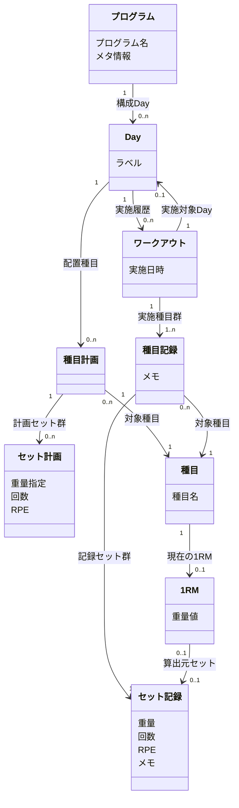

# ドメインモデル

## ユースケース一覧

### A. プログラム作成

| ID | 名前 | ユースケース | 優先度 |
|----|------|-------------|--------|
| UC_A_1 | プログラム新規作成 | トレーニーが新しいプログラムをゼロから作成できる | 高 |
| UC_A_2 | プログラム複製 | トレーニーが既存のプログラムをコピーして新しいプログラムを作成できる | 高 |
| UC_A_3 | Day構成編集 | トレーニーがプログラムのDay数・各Dayのラベルを定義できる | 高 |
| UC_A_4 | 種目配置 | トレーニーがDayに種目を配置し、セット数・レップ数・重量（kgまたは%1RM）・RPEを設定できる | 高 |
| UC_A_5 | メタ情報記録 | トレーニーがプログラムのメタ情報（漸進ルールなど）をフリーテキストで記録できる | 中 |
| UC_A_6 | プログラム編集 | トレーニーがプログラムをいつでも編集できる | 高 |
| UC_A_7 | プログラム削除 | トレーニーがプログラムを削除できる | 中 |
| UC_A_8 | 種目一覧閲覧 | トレーニーが登録済みの種目を一覧で確認できる | 中 |
| UC_A_9 | 種目名編集 | トレーニーが種目の名称を変更できる | 中 |
| UC_A_10 | 種目登録 | トレーニーが新しい種目を登録できる | 中 |
| UC_A_11 | 種目削除 | トレーニーが種目を削除できる | 中 |

### B. トレーニング記録

| ID | 名前 | ユースケース | 優先度 |
|----|------|-------------|--------|
| UC_B_1 | プログラム選択 | トレーニーがプログラム一覧から今日やるプログラムを選択できる | 高 |
| UC_B_2 | セット記録 | トレーニーがプリフィルされた計画値をもとに各セットを記録できる | 高 |
| UC_B_3 | 記録値修正 | トレーニーが計画値と実績が異なる場合に重量やレップを修正して記録できる | 高 |
| UC_B_4 | RPE・メモ追加 | トレーニーがセットにRPEやメモを任意で追加できる | 低 |
| UC_B_5 | ワークアウト完了 | トレーニーが全種目の記録を完了してワークアウトを終了できる | 高 |
| UC_B_6 | ワークアウト削除 | トレーニーが記録したワークアウトを削除できる | 中 |
| UC_B_7 | ワークアウト事後修正 | トレーニーが完了したワークアウトの記録を修正できる | 中 |

### C. 振り返り

| ID | 名前 | ユースケース | 優先度 |
|----|------|-------------|--------|
| UC_C_1 | 計画実績比較 | トレーニーがプログラムの計画と実績の乖離を確認できる | 中 |
| UC_C_2 | 強度・ボリューム推移確認 | トレーニーが種目ごとの強度（e1RM・%1RM・使用重量）とボリュームの推移を確認できる | 中 |

### D. 1RM

| ID | 名前 | ユースケース | 優先度 |
|----|------|-------------|--------|
| UC_D_1 | 1RM登録更新 | トレーニーが種目ごとの1RM（実測値）を登録・更新できる | 高 |
| UC_D_2 | e1RM採用 | トレーニーがe1RM（推定値）を1RM（実測値）として明示的に採用できる | 中 |
| UC_D_3 | 1RM削除 | トレーニーが種目の1RMをクリアできる | 低 |

### E. システム

| ID | 名前 | ユースケース | 優先度 |
|----|------|-------------|--------|
| UC_E_1 | e1RM自動算出 | システムがトレーニング記録からe1RM（推定値）を自動算出できる | 中 |
| UC_E_2 | 計画値プリフィル | システムがプログラムの次のDayの計画値をワークアウト開始時にプリフィルできる | 高 |
| UC_E_3 | 直近プログラムサジェスト | システムが直近使用したプログラムをプログラム一覧の上位に表示できる | 低 |
| UC_E_4 | 推移データ表示 | システムがプログラム設計時に種目の強度・ボリューム推移を表示できる | 中 |

## タスク表

### Feature一覧

| Feature | 説明 | 含まれるFunction数 |
|---------|------|-------------------|
| プログラム | トレーニング計画の作成・編集・削除 | 8 |
| ワークアウト | ジムでのトレーニング実行と記録 | 9 |
| 振り返り | 計画と実績の比較・推移分析 | 2 |
| 1RM | 種目ごとの最大挙上重量の管理 | 5 |
| 種目マスタ | 種目の登録・一覧確認・名称変更・削除 | 4 |

### プログラム

| Function | ユーザー | システム | CRUD | 関連UC |
|----------|---------|---------|------|--------|
| プログラム新規作成 | 新しいプログラムを作成する | プログラムを保存する | C | UC_A_1 |
| プログラム複製 | 既存のプログラムを選択してコピーする | 選択されたプログラムを複製して新規保存する | C | UC_A_2 |
| Day構成編集 | Day数・各Dayのラベルを定義する | 構造をプログラムに反映する | U | UC_A_3 |
| 種目配置 | Dayに種目を配置し、セット数・レップ数・重量・RPEを設定する | 配置情報をプログラムに反映する | U | UC_A_4 |
| メタ情報記録 | プログラムのメタ情報（漸進ルールなど）をフリーテキストで入力する | メタ情報をプログラムに保存する | U | UC_A_5 |
| プログラム編集 | プログラムの内容を変更する | 変更をプログラムに反映する | U | UC_A_6 |
| プログラム削除 | プログラムを削除する | プログラムを削除する | D | UC_A_7 |
| 推移データ表示 | - | プログラム設計時に種目の強度・ボリューム推移を表示する | R | UC_E_4 |

### ワークアウト

| Function | ユーザー | システム | CRUD | 関連UC |
|----------|---------|---------|------|--------|
| プログラム選択 | プログラム一覧から今日やるプログラムを選択する | - | - | UC_B_1 |
| 計画値プリフィル | - | プログラムの次のDayの計画値をワークアウト開始時にプリフィルする | R | UC_E_2 |
| セット記録 | プリフィルされた計画値をもとに各セットを記録する | セットの実績を保存する | C | UC_B_2 |
| 記録値修正 | 計画値と実績が異なる場合に重量やレップを修正して記録する | 修正された実績を保存する | U | UC_B_3 |
| RPE・メモ追加 | セットにRPEやメモを追加する | RPE・メモをセットに保存する | U | UC_B_4 |
| ワークアウト完了 | 全種目の記録を完了してワークアウトを終了する | ワークアウトを完了状態にする | U | UC_B_5 |
| ワークアウト削除 | 記録したワークアウトを削除する | ワークアウトと関連するセットの記録を削除する | D | UC_B_6 |
| ワークアウト事後修正 | 完了したワークアウトの記録を修正する | 修正された記録を保存する | U | UC_B_7 |
| 直近プログラムサジェスト | - | 直近使用したプログラムをプログラム一覧の上位に表示する | R | UC_E_3 |

### 振り返り

| Function | ユーザー | システム | CRUD | 関連UC |
|----------|---------|---------|------|--------|
| 計画実績比較 | プログラムの計画と実績の乖離を確認する | 計画値と実績値を対比表示する | R | UC_C_1 |
| 強度・ボリューム推移確認 | 種目ごとの強度・ボリュームの推移を確認する | 強度（e1RM・%1RM・使用重量）とボリュームの推移データを集計・表示する | R | UC_C_2 |

### 1RM

| Function | ユーザー | システム | CRUD | 関連UC |
|----------|---------|---------|------|--------|
| 1RM登録 | 種目ごとの1RM（実測値）を登録する | 1RMを保存する | C | UC_D_1 |
| 1RM更新 | 種目ごとの1RM（実測値）を更新する | 更新された1RMを保存する | U | UC_D_1 |
| e1RM自動算出 | - | トレーニング記録からe1RM（推定値）を自動算出する | R | UC_E_1 |
| e1RM採用 | e1RM（推定値）を1RM（実測値）として明示的に採用する | 採用されたe1RMで1RMを更新する | U | UC_D_2 |
| 1RM削除 | 種目の1RMをクリアする | 1RMを削除し未設定状態にする | D | UC_D_3 |

### 種目マスタ

| Function | ユーザー | システム | CRUD | 関連UC |
|----------|---------|---------|------|--------|
| 種目登録 | 新しい種目を登録する | 種目を保存する | C | UC_A_10 |
| 種目一覧閲覧 | 登録済みの種目を一覧で確認する | 種目一覧を表示する | R | UC_A_8 |
| 種目名編集 | 種目の名称を変更する | 変更された種目名を保存する | U | UC_A_9 |
| 種目削除 | 種目を削除する | 種目を削除する | D | UC_A_11 |

## コンテンツ構造

### 概念オブジェクト一覧

| 名前 | 説明 | 一覧 | 詳細 | 空表示 | 主なプロパティ |
|------|------|------|------|--------|--------------|
| プログラム | トレーニング計画の単位 | 要 | 要 | 要 | プログラム名、メタ情報（任意） |
| Day | プログラム内の1日分の計画単位 | 要 | 要 | 要 | ラベル（必須、デフォルト値あり） |
| 種目計画 | Day内の1種目分のセット群（計画側） | 要 | - | 要 | - |
| セット計画 | 種目計画内の1セット分のパラメータ | 要 | - | 要 | 下記パラメータ指定パターン参照 |
| ワークアウト | トレーニング1回分の実行記録（ジム1回分） | 要 | 要 | 要 | 実施日時 |
| 種目記録 | ワークアウト内の1種目分のセット群（記録側） | 要 | - | 要（種目起点） | メモ（任意） |
| セット記録 | 種目記録内の1セット分の実績 | 要 | - | - | 重量(kg)、回数、RPE（任意）、メモ（任意） |
| 種目 | トレーニングで行う動作の種類 | 要 | - | 要 | 種目名 |
| 1RM | 種目ごとの最大挙上重量（実測値または採用値） | - | 要 | 要 | 重量値 |

### セット計画のパラメータ指定パターン

セット計画は以下の3パターンのいずれかで指定する（3つのパラメータのうち2つを指定）:

| パターン | 指定するパラメータ | 用途 |
|---------|-------------------|------|
| 重量 + 回数 | 重量指定（kg or %1RM）、回数 | 標準的な計画（例: 100kg × 5回） |
| 重量 + RPE | 重量指定（kg or %1RM）、RPE | RPEベースで回数を調整（例: 100kg × RPE8） |
| 回数 + RPE | 回数、RPE | RPEベースで重量を調整（例: 5回 × RPE8） |

重量指定はkgまたは%1RMのいずれか。%1RM指定時は種目の1RMから実際の重量を算出する。

### 命名規則

計画側と記録側で対称的な命名パターン `{対象}{計画or記録}` を採用:

| 計画側 | 記録側 | 対象 |
|-------|-------|------|
| 種目計画 | 種目記録 | 1種目分のセット群 |
| セット計画 | セット記録 | 1セット分のパラメータ/実績 |

### 導出ビュー（概念オブジェクトではない）

以下は記録データから算出される導出値であり、概念オブジェクトとしてモデル化しない:

| ビュー | 算出元 | 説明 | 関連UC |
|-------|-------|------|--------|
| 強度（e1RM） | セット記録の重量×回数 | Epley等の公式で算出。セット/種目/ワークアウト/Day各レベルで算出可能 | UC_E_1, UC_C_2, UC_D_2, UC_E_4 |
| 強度（%1RM） | セット記録の重量 ÷ 種目の1RM | 1RM比での強度表現 | UC_C_2, UC_E_4 |
| ボリューム | セット記録の重量×回数（トネージ）またはセット数×回数 | セット/種目/ワークアウト/Day各レベルで集計可能 | UC_C_2, UC_E_4 |
| 計画実績比較 | セット計画 vs セット記録の対比 | 種目計画/種目記録の対称構造を利用して導出 | UC_C_1 |
| 重量推移 | 種目+セット記録の時系列集計 | 種目ごとの使用重量の推移 | UC_C_2 |

### コンテンツ構造図

### 関連の補足

| 関連 | 方向 | 多重度 | 説明 |
|------|------|--------|------|
| プログラム → Day | 順方向 | 1 → 0..n | Dayは順序付き配列。0はプログラム作成途中の状態 |
| Day → 種目計画 | 順方向 | 1 → 0..n | Day内の種目配置。0は作成途中の状態 |
| 種目計画 → 種目 | 順方向 | 0..n → 1 | 種目計画は必ず1つの種目に対応。同じ種目が複数のDayや同じDay内に複数回登場しうる |
| 種目計画 → セット計画 | 順方向 | 1 → 0..n | 種目計画内のセット群。配列の長さ＝セット数。0は作成途中の状態 |
| セット計画: パラメータ指定 | 制約 | - | 重量指定（kg/%1RM）・回数・RPEのうち2つを指定する。重量指定がkgの場合は絶対値、%1RMの場合は種目の1RMからの割合値として解釈される |
| ワークアウト → Day | 順方向 | 1 → 0..1 | 0: アドホックなトレーニング（計画と無関係）。1: 計画Dayに沿ったトレーニング |
| Day → ワークアウト | 逆方向 | 1 → 0..n | 同じDayを複数回実施可能（メソサイクルの繰り返し） |
| ワークアウト → 種目記録 | 順方向 | 1 → 1..n | ワークアウトは最低1種目の記録を持つ |
| 種目記録 → 種目 | 順方向 | 0..n → 1 | 種目記録は必ず1つの種目に対応 |
| 種目記録 → セット記録 | 順方向 | 1 → 1..n | 種目記録は最低1セットの記録を持つ。配列の長さ＝セット数 |
| 種目 → 1RM | 順方向 | 1 → 0..1 | 種目ごとに0または1つの1RM。未設定の状態がある |
| 1RM → セット記録 | 順方向 | 0..1 → 0..1 | 1RMの算出元セット（任意）。0: アプリ外での申告値。1: アプリ内で記録したセットで達成、またはe1RM採用時の算出元セット |
