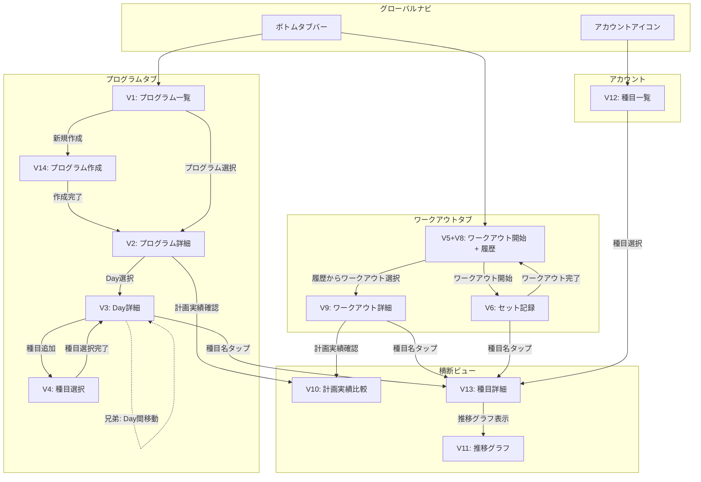
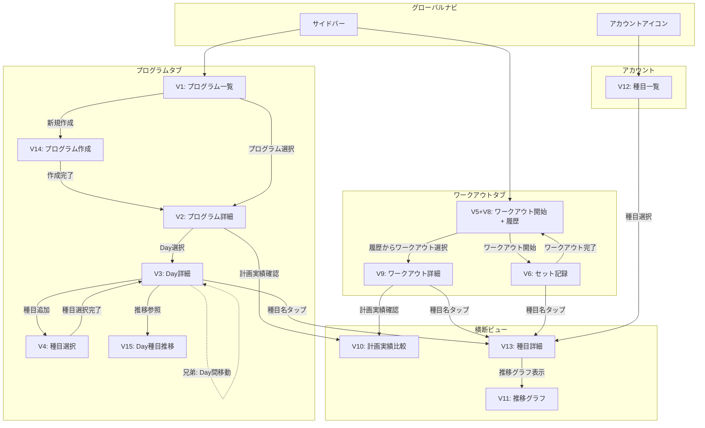

# ビューとナビゲーション

## フレーム構造

### コンテンツ構造からのビュー表現

| 概念オブジェクト | 特徴 | ビュー表現 |
|----------------|------|-----------|
| プログラム | 0..n件存在、名前で識別 | リストビュー（カード形式） |
| Day | プログラム内に0..n件、順序付き、ラベルで識別 | タブまたは横スクロールリスト |
| 種目計画 | Day内に0..n件、種目名+セット群 | リストビュー（種目名をヘッダとしたセクション） |
| セット計画 | 種目計画内に0..n件、パラメータ2〜3個 | コンパクト行（重量×回数の1行表示） |
| ワークアウト | 0..n件、日時で識別 | リストビュー（日付順） |
| 種目記録 | ワークアウト内に1..n件 | リストビュー（種目名をヘッダとしたセクション） |
| セット記録 | 種目記録内に1..n件、数値3〜4個 | コンパクト行（重量×回数の1行表示） |
| 種目 | 0..n件、名前で識別 | リストビュー |
| 1RM | 種目ごとに0..1件、数値1個 | 種目に付随するインライン表示 |

### ユースケース/コンセプトからのビュー表現

- **プログラム一覧**: ファーストビューにプログラム（名詞）を配置。直近使用順でサジェスト
- **プログラム詳細/編集**: Dayをタブ状に並べ、各Day内の種目計画・セット計画を一覧表示。計画時は情報密度を高く、俯瞰できる構成
- **ワークアウト**: プログラム選択→Day選択→セット記録の流れ。記録時は1セットずつ大きく表示し、最小タップで記録完了
- **振り返り**: 計画実績比較は計画/記録の対比表示。推移確認はグラフビュー（時系列チャート）
- **種目一覧**: 種目マスタの閲覧・管理。1RMはここでインライン表示
- **検索**: ユーザーは自分が登録した種目名を知っている（能動的）ため、種目一覧内のフィルターで十分。グローバル検索は不要

### 恒常領域

**iOS（小画面）:**

| 領域 | 配置 | 内容 |
|------|------|------|
| ナビゲーションバー | 画面上部固定 | 画面タイトル + アカウントアイコン（右上） |
| ボトムタブバー | 画面下部固定 | グローバルナビゲーション（プログラム / ワークアウト） |
| ステータスバー | OS標準 | 時刻、バッテリー等（OS管理） |

**Web（大画面）:**

| 領域 | 配置 | 内容 |
|------|------|------|
| サイドバー | 左端固定 | グローバルナビゲーション（プログラム / ワークアウト）+ アカウントアイコン |
| ヘッダー | 上部固定 | コンテキスト情報（現在のプログラム名等） |

### グローバルナビゲーション方針

**構造: オブジェクトベースの2タブ + ナビゲーションバーのアカウントアイコン（1つ）**

概念オブジェクト（プログラム、ワークアウト）をナビゲーション項目の起点とする構成:

**ボトムタブ（iOS）/ サイドバー（Web）:**

| ナビ項目 | 対応する概念オブジェクト | 到達先 |
|---------|----------------------|--------|
| プログラム | プログラム | プログラム一覧 |
| ワークアウト | ワークアウト | ワークアウト開始/一覧 |

**ナビゲーションバーのアカウントアイコン（iOS: 右上 / Web: サイドバー内）:**

| 項目 | 到達先 |
|------|--------|
| 種目 | 種目一覧（1RM付き） |
| サインアウト | サインアウト処理 |
| アカウント削除 | アカウント削除処理 |

**各タブ内のサブビュー:**

計画実績比較（V10）と推移グラフ（V11）は独立した「振り返り」ではなく、各親オブジェクトの文脈で到達するサブビュー:

| サブビュー | 親の文脈 | 説明 |
|-----------|---------|------|
| 計画実績比較（V10） | プログラム詳細 / ワークアウト詳細 | 計画の中で「計画と実績がどうだったか」を確認する |
| 推移グラフ（V11） | 種目詳細（V13） | 種目の記録の中で「この種目の推移はどうか」を確認する |

**種目への到達経路:**

種目はプログラム・ワークアウト・アカウントのどこからでも参照されるオブジェクトであり、参照元から直接到達できる:

| 到達元 | 操作 | 到達先 |
|--------|------|--------|
| 計画（プログラム内） | 種目計画の種目名をタップ | 種目詳細（V13） |
| 記録（ワークアウト内） | 種目記録の種目名をタップ | 種目詳細（V13） |
| アカウント | 種目一覧（V12）から選択 | 種目詳細（V13） |

ナビゲーション項目名は概念オブジェクト名と統一する。タブ名「プログラム」「ワークアウト」は概念オブジェクト名そのものであり、UI・設計・コード（program/workout）の全レイヤーで同じ用語を使う。対象ユーザー（中級・上級トレーニー）にとってドメイン用語は馴染みがあり、ユーザー言語として適切と判断した（設計判断#50, #51）。

### レイアウトの基本方針

**iOS（小画面）:**
- シングルペイン構成。画面全体が1つのコンテンツ領域
- 階層間はプッシュ遷移（一覧→詳細）
- ワークアウト記録中もタブバーを表示したまま（自動保存により誤遷移リスクを吸収。2タブ構成でタブバーの画面圧迫も最小限）

**Web（大画面）:**
- サイドバー + コンテンツエリアの2ペイン構成
- プログラム編集時は、Day一覧（サブナビ）+ Day詳細の構成でマルチペイン的に使う
- 振り返り時は、種目選択 + グラフ表示の2カラム構成

**コンテキスト依存の設計方針（コンセプト定義より）:**

| 観点 | 計画時（Web中心） | 記録時（iOS中心） |
|------|------------------|------------------|
| 情報密度 | 高密度・俯瞰。1画面に多くの情報 | 低密度・1セットにフォーカス |
| フィードバック | 即座に反映、アニメーション控えめ | アニメーション+ハプティクスで明確に |
| 操作 | キーボード+マウスでの効率的入力 | タップ/スワイプの最小操作 |

### 単位ビュー一覧

| # | 単位ビュー名 | 含む概念オブジェクト | 主なユースケース | プラットフォーム |
|---|-------------|--------------------|--------------------|-----------------|
| V1 | プログラム一覧 | プログラム | UC_A_1, UC_A_2, UC_A_7, UC_B_1, UC_E_3 | iOS / Web |
| V2 | プログラム詳細 | プログラム, Day | UC_A_3, UC_A_5, UC_A_6 | iOS / Web |
| V3 | Day詳細 | Day, 種目計画, セット計画 | UC_A_4, UC_A_6, UC_E_4 | iOS / Web |
| V4 | 種目選択 | 種目 | UC_A_4（種目配置時） | iOS / Web |
| V5 | ワークアウト開始 | プログラム, Day | UC_B_1, UC_E_2 | iOS / Web |
| V6 | セット記録 | セット記録, 種目記録 | UC_B_2, UC_B_3, UC_B_4, UC_B_5 | iOS / Web |
| V8 | ワークアウト履歴 | ワークアウト | UC_B_6, UC_B_7 | iOS / Web |
| V9 | ワークアウト詳細 | ワークアウト, 種目記録, セット記録 | UC_B_7 | iOS / Web |
| V10 | 計画実績比較 | セット計画, セット記録, 種目計画, 種目記録 | UC_C_1 | iOS / Web |
| V11 | 推移グラフ | 種目, セット記録, 1RM | UC_C_2 | iOS / Web |
| V12 | 種目一覧 | 種目, 1RM | UC_A_8, UC_A_10, UC_A_11 | iOS / Web |
| V13 | 種目詳細 | 種目, 1RM | UC_A_9, UC_D_1, UC_D_2, UC_D_3, UC_C_2 | iOS / Web |
| V14 | プログラム作成 | プログラム | UC_A_1 | iOS / Web |
| V15 | Day種目推移 | 種目, セット記録 | UC_E_4 | Web |

### アクション配置

| 単位ビュー | アクション | 操作対象 | CRUD | 配置方針 |
|-----------|-----------|---------|------|---------|
| V1 プログラム一覧 | 新規作成 | プログラム | C | ビュー内のアクションボタン（FABまたはヘッダー） |
| V1 プログラム一覧 | 複製 | プログラム | C | 各プログラムのコンテキストメニュー |
| V1 プログラム一覧 | 削除 | プログラム | D | 各プログラムのコンテキストメニュー（iOS: スワイプ削除も可） |
| V2 プログラム詳細 | Day追加 | Day | C | ビュー内のアクションボタン |
| V2 プログラム詳細 | メタ情報編集 | プログラム | U | インライン編集 |
| V2 プログラム詳細 | プログラム名変更 | プログラム | U | インライン編集 |
| V3 Day詳細 | 種目追加 | 種目計画 | C | ビュー内のアクションボタン |
| V3 Day詳細 | セット追加 | セット計画 | C | 種目計画セクション内のアクションボタン |
| V3 Day詳細 | セット計画編集 | セット計画 | U | インライン編集（タップで数値変更） |
| V3 Day詳細 | 種目計画削除 | 種目計画 | D | コンテキストメニューまたはスワイプ |
| V3 Day詳細 | セット計画削除 | セット計画 | D | コンテキストメニューまたはスワイプ |
| V3 Day詳細 | Day削除 | Day | D | ビューのコンテキストメニュー |
| V3 Day詳細 | Dayラベル変更 | Day | U | インライン編集 |
| V6 セット記録 | セット記録 | セット記録 | C | メインアクションボタン（大きく配置） |
| V6 セット記録 | 記録値修正 | セット記録 | U | インライン編集（数値タップで変更） |
| V6 セット記録 | RPE・メモ追加 | セット記録 | U | 補助入力エリア（セット記録の下部） |
| V6 セット記録 | ワークアウト完了 | ワークアウト | U | ビュー上部またはフッターのアクションボタン |
| V8 ワークアウト履歴 | ワークアウト削除 | ワークアウト | D | コンテキストメニューまたはスワイプ |
| V9 ワークアウト詳細 | 事後修正 | セット記録 | U | インライン編集 |
| V12 種目一覧 | 種目登録 | 種目 | C | ビュー内のアクションボタン |
| V12 種目一覧 | 種目削除 | 種目 | D | コンテキストメニューまたはスワイプ |
| V13 種目詳細 | 種目名編集 | 種目 | U | インライン編集 |
| V13 種目詳細 | 1RM登録/更新 | 1RM | C/U | インライン編集 |
| V13 種目詳細 | e1RM採用 | 1RM | U | e1RM表示横のアクションボタン |
| V13 種目詳細 | 1RM削除 | 1RM | D | コンテキストメニュー |
| V13 種目詳細 | 推移グラフ表示 | 種目 | R | ビュー内の導線（推移グラフ V11 への遷移） |
| V14 プログラム作成 | プログラム名入力 | プログラム | C | フォーム入力 |

※ 削除系アクション（確認ダイアログを伴うモーダルコマンド）は、実装時にコマンド名の末尾に「…」を付与する（例: 「削除…」）。モードレス原則に基づき、別タスク（確認ダイアログ）があることをユーザーに示唆する。

## ナビゲーション構造

### 多重度からのベースパターン導出

| 関連 | 多重度 | 導出パターン | 空表示 |
|------|--------|-------------|--------|
| プログラム（ルート） | 0..n | 概要一覧 | 要（初回起動・全削除後） |
| プログラム → Day | 1 → 0..n | 概要一覧（タブ/横スクロール） | 要（作成途中） |
| Day → 種目計画 | 1 → 0..n | リスト表示 | 要（作成途中） |
| 種目計画 → セット計画 | 1 → 0..n | コンパクト行リスト | 要（作成途中） |
| ワークアウト（ルート） | 0..n | 概要一覧 | 要（初回・記録なし） |
| ワークアウト → 種目記録 | 1 → 1..n | リスト表示 | 不要（最低1件保証） |
| 種目記録 → セット記録 | 1 → 1..n | コンパクト行リスト | 不要（最低1件保証） |
| 種目（ルート） | 0..n | 概要一覧 | 要（初回・全削除後） |
| 種目 → 1RM | 1 → 0..1 | インライン詳細表示 | 要（未設定） |
| ワークアウト → Day | 1 → 0..1 | 詳細表示（任意紐づけ） | 要（アドホックワークアウト） |

### 挟み込み統合結果

#### 共通部分（両方向で一致）

- プログラムタブ → V1 → V2 → V3 の階層構造
- V3 → V4（種目選択）、V3 → V13（種目詳細への横断）
- ワークアウトタブ → V5 → V6 → V5+V8（完了後トースト通知）のワークアウト記録フロー
- V8 → V9 → V10 のワークアウト履歴・振り返り
- アカウント → V12 → V13 → V11 の種目管理・推移グラフ
- V13 への複数到達経路（V3, V9/V6, V12 から）
- V10 への複数到達経路（V2, V9 から）

#### 差異と解消

**差異1: ワークアウトタブのランディング構成**

ボトムアップではV5（ワークアウト開始）とV8（ワークアウト履歴）を別の到達先としたが、トップダウンではワークアウトタブの1つの到達先としてまとめた。

解消: ワークアウト開始とワークアウト履歴を**1つのビュー内のセクション構成**で統合する。上部にワークアウト開始（プログラム選択+Day選択）、下部にワークアウト履歴を配置する。直近プログラムサジェスト（UC_E_3）はワークアウト開始セクションで表現する。

- Pros: ワークアウトタブを開いた直後に「今日やること」と「過去の記録」の両方が見える。1タップでワークアウトを開始でき、過去の振り返りにもスクロールで到達可能
- Cons: ビューの情報量が多くなるが、ワークアウト開始は上部に大きく配置し、履歴は下部のリストで控えめに表示することで優先度を視覚的に表現できる

**~~差異2: ワークアウト完了サマリー（V7）からの戻り先~~** → V7廃止により解消（#46）

V7を独立ビューとして廃止し、V6完了後にV5+V8へ直接戻る方針に変更。トースト通知で「記録しました」+「詳細を確認する」ボタンを表示し、V9への導線を提供する。これにより差異自体が消滅した。

**差異3: プログラム作成（V14）後の遷移先**

ボトムアップでは明示していなかったが、トップダウンでV14完了後にV2への自動遷移が必要であることが判明。

解消: V14（プログラム名入力）完了後、作成されたプログラムのプログラム詳細（V2）に自動遷移する。

- Pros: プログラム名入力→すぐにDay構成・種目配置に移れる。作成の流れが自然
- Cons: 特になし。プログラム一覧に戻る必要はない

### 兄弟間ナビゲーション

正方向のナビゲーション完成後、回遊性を高める補完として以下を追加:

| 起点 | 兄弟移動先 | 操作 | 目的 |
|------|-----------|------|------|
| Day詳細（V3） | 隣接するDay詳細（V3） | タブ切り替え/スワイプ | プログラム内のDay間を素早く移動 |

Day間の兄弟移動はPhase 4のフレーム構造（Dayをタブ状に並べる）と整合する。ワークアウト間の兄弟移動は不要と判断した（ワークアウトは時系列で並ぶだけで構造的な親子関係がなく、同じプログラムに属する保証がない。ワークアウト間の比較は計画実績比較（V10）や推移グラフ（V11）で対応可能）。

種目詳細（V13）間の兄弟移動は、種目一覧（V12）からの到達時にはリスト内の前後移動が考えられるが、横断到達（V3やV9から）の場合は文脈が異なるため不自然。種目一覧経由の場合のみ検討の余地があるが、初期スコープでは不要と判断。

### 横断到達の視覚的優先度

V13（種目詳細）への横断到達は、呼び出し元ビューによって視覚的な優先度を変える:

| 呼び出し元 | 視覚的優先度 | 理由 |
|-----------|------------|------|
| V3: Day詳細 | 通常 | 計画中は種目情報の確認が自然な操作 |
| V9: ワークアウト詳細 | 通常 | 過去の記録閲覧中の種目参照は自然 |
| V12: 種目一覧 | 通常 | 種目管理の主導線 |
| V6: セット記録 | 控えめ | 記録中の集中を妨げないため、導線は維持するが視覚的に目立たせない |

V6では「集中を妨げない」コンセプトと「ユーザーの操作を妨げない」モードレス原則を両立するため、種目名タップの導線は存在するが控えめな表現にする。

### ナビゲーション構造図

#### iOS版

#### Web版

### ビュー到達経路サマリー

全ビューに入口が存在し、孤立ノードがないことを確認する。

| ビュー | 入口 | 戻り先 |
|--------|------|--------|
| V1: プログラム一覧 | プログラムタブ | - （タブのルート） |
| V2: プログラム詳細 | V1（選択）、V14（作成完了） | V1 |
| V3: Day詳細 | V2（Day選択） | V2 |
| V4: 種目選択 | V3（種目追加） | V3 |
| V5+V8: ワークアウト開始+履歴 | ワークアウトタブ | - （タブのルート） |
| V6: セット記録 | V5+V8（ワークアウト開始） | V5+V8（ワークアウト完了後、トースト通知でV9への導線を提供） |
| V9: ワークアウト詳細 | V5+V8（履歴選択）、トースト通知（V6完了後） | V5+V8 |
| V10: 計画実績比較 | V2（計画実績確認）、V9（計画実績確認） | V2 または V9（呼び出し元） |
| V11: 推移グラフ | V13（推移グラフ表示） | V13 |
| V12: 種目一覧 | アカウントアイコン | アカウントメニュー |
| V13: 種目詳細 | V12（選択）、V3（種目名タップ）、V9（種目名タップ）、V6（種目名タップ） | 呼び出し元（V12, V3, V9, V6） |
| V14: プログラム作成 | V1（新規作成） | V1（キャンセル時）、V2（作成完了） |
| V15: Day種目推移 | V3（推移参照、Web限定） | V3 |

※ V15はV3に付随する補助表示。表示形式（オーバーレイ、サイドパネル等）はプラットフォーム適合フェーズで確定する。
